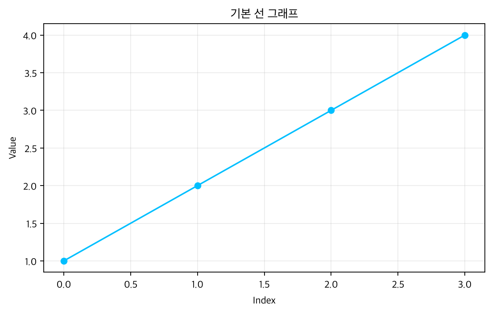
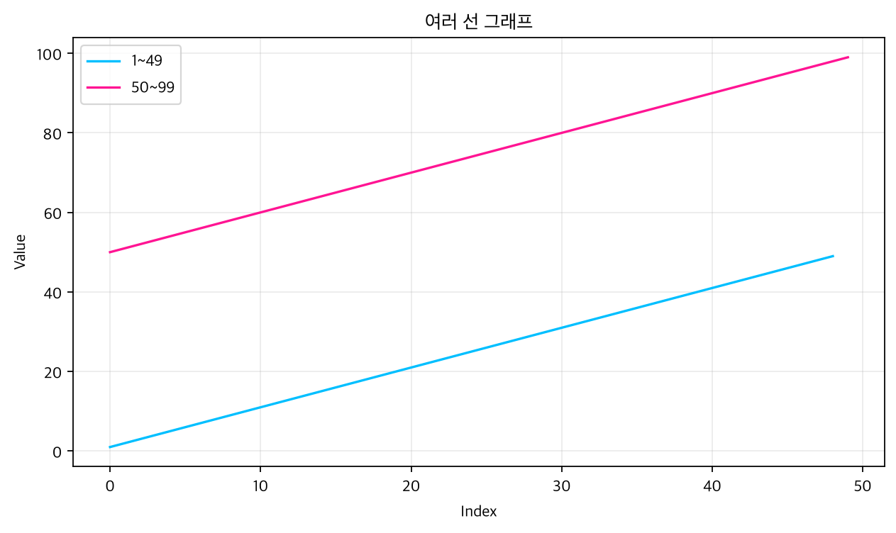
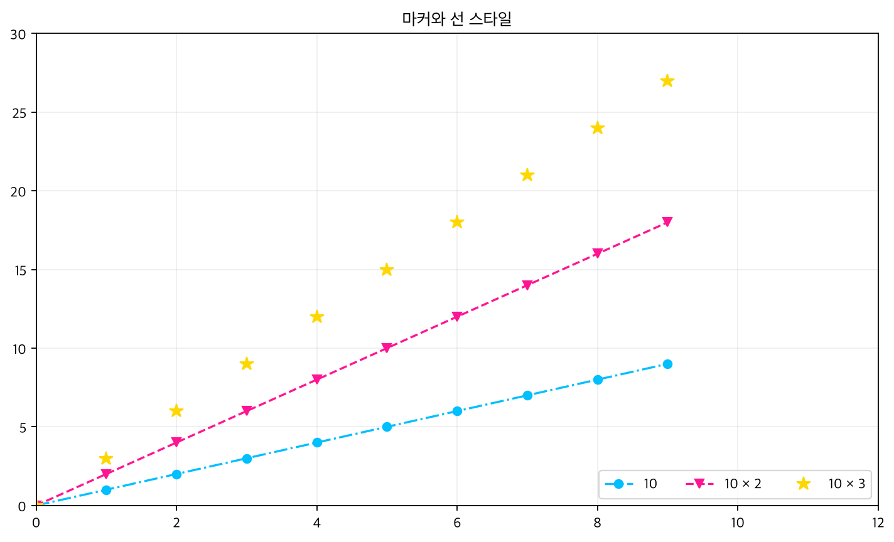
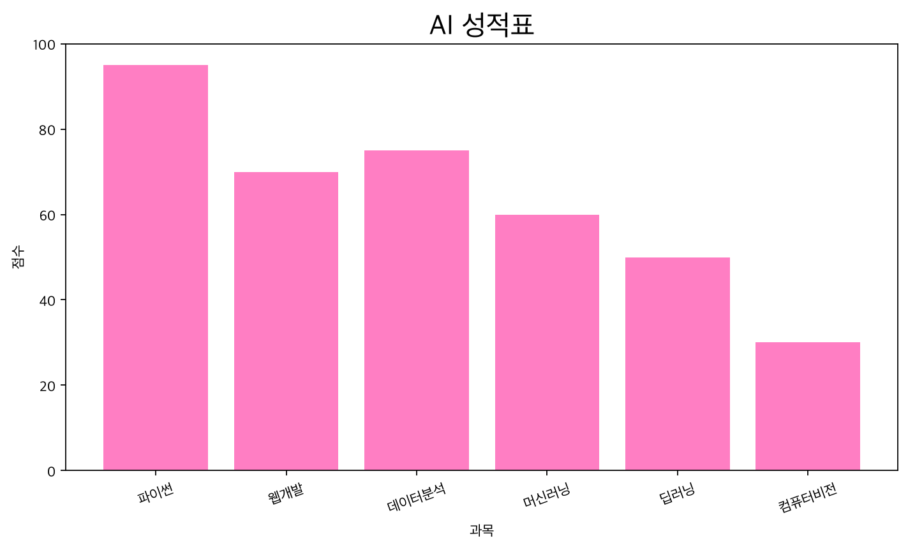
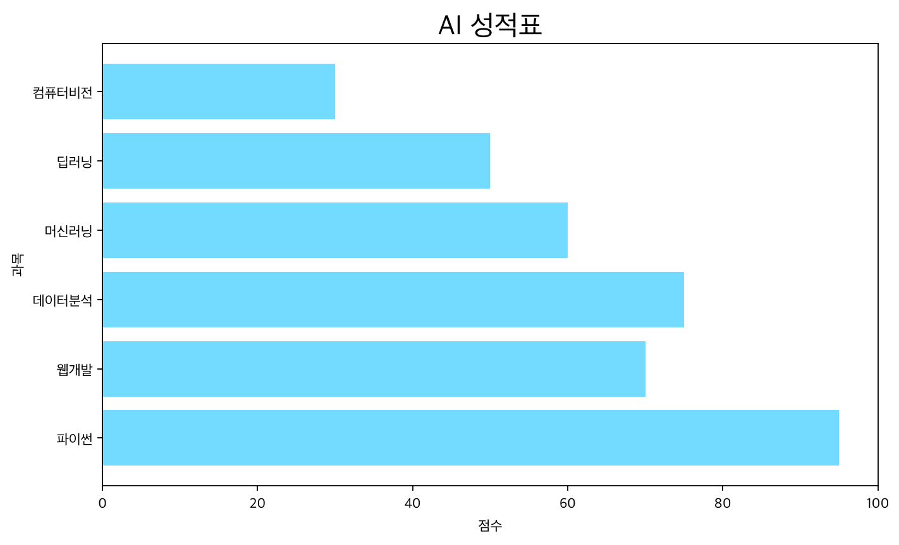
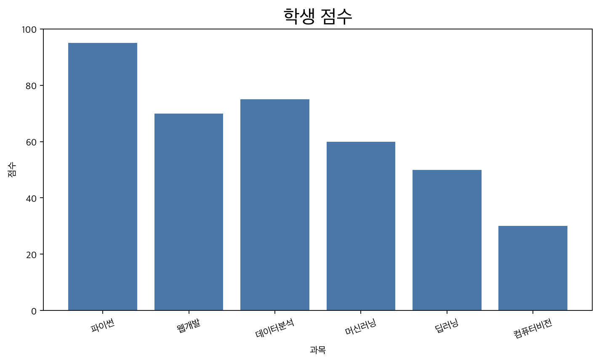
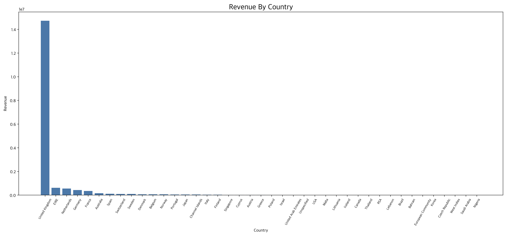
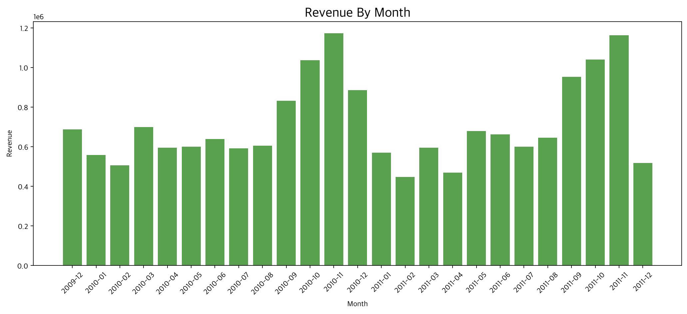
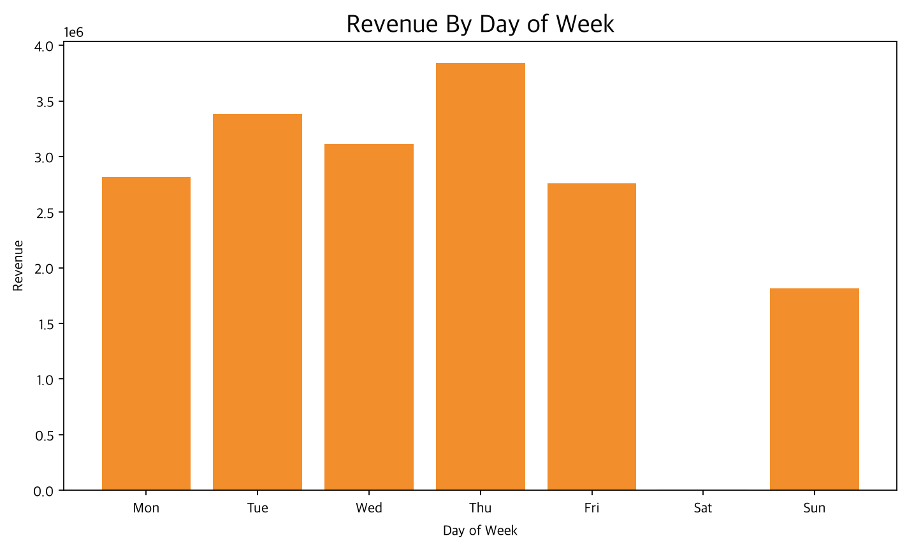
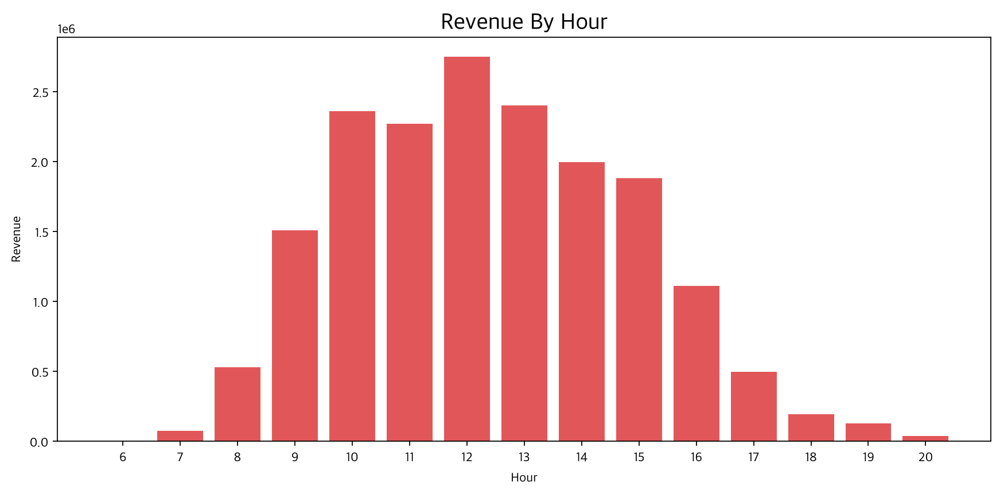

# [42일차] Matplotlib와 Online Retail 데이터 분석

## 1. 전체 흐름

이번 내용은 Matplotlib으로 기본 그래프를 그리고, Online Retail 데이터를 전처리한 뒤 매출을 분석하는 과정을 정리한다.

```text
데이터 불러오기
    ↓
데이터 구조와 결측치 확인
    ↓
분석에 필요한 데이터만 남기기
    ↓
매출 파생변수 생성
    ↓
국가·월·요일·시간대별 매출 집계
    ↓
Matplotlib으로 시각화
```

---

## 2. Matplotlib

Matplotlib은 Python에서 데이터를 그래프로 표현할 때 사용하는 시각화 라이브러리다. NumPy 배열과 Pandas 데이터프레임을 함께 사용할 수 있다.

```python
import matplotlib.pyplot as plt
```

### 기본 구성

| 구성 요소 | 의미 |
|---|---|
| `Figure` | 그래프 전체가 그려지는 도화지다. |
| `Axes` | Figure 안에 배치되는 하나의 그래프 영역이다. |
| `Axis` | x축이나 y축 자체를 의미한다. |

```text
Figure
┌──────────────────────────────┐
│  Axes                        │
│  ┌────────────────────────┐  │
│  │       그래프           │  │
│  │                        │  │
│  └────────────────────────┘  │
└──────────────────────────────┘
```

---

## 3. 선 그래프

`plt.plot()`은 값의 변화와 추세를 선으로 표현한다.

```python
import matplotlib.pyplot as plt

plt.plot([1, 2, 3, 4])
plt.show()
```



x값을 생략하면 Matplotlib이 `0, 1, 2, 3`을 자동으로 사용한다.

```python
plt.plot(
    [1, 2, 3, 4],
    [10, 20, 15, 30],
)
plt.show()
```

NumPy 배열도 사용할 수 있다.

```python
import numpy as np

data = np.arange(1, 100)

plt.plot(data)
plt.show()
```

한 Axes에 여러 그래프를 연속해서 그릴 수도 있다.

```python
data1 = np.arange(1, 50)
data2 = np.arange(50, 100)

plt.plot(data1)
plt.plot(data2)
plt.show()
```



---

## 4. 주요 그래프

| 그래프 | 함수 | 주요 용도 |
|---|---|---|
| 선 그래프 | `plt.plot()` | 연속적인 값의 추세 |
| 막대 그래프 | `plt.bar()` | 범주별 값 비교 |
| 수평 막대 그래프 | `plt.barh()` | 범주명이 길 때 값 비교 |
| 산점도 | `plt.scatter()` | 두 변수의 관계 |
| 히스토그램 | `plt.hist()` | 값의 분포 |
| 파이 차트 | `plt.pie()` | 전체에서 각 항목이 차지하는 비율 |

---

## 5. 한글 폰트 설정

macOS에서는 다음처럼 한글 폰트를 설정할 수 있다.

```python
plt.rcParams["font.family"] = "Apple SD Gothic Neo"
plt.rcParams["axes.unicode_minus"] = False
```

`axes.unicode_minus`를 `False`로 설정하면 그래프의 음수 기호가 깨지는 문제를 방지할 수 있다.

---

## 6. 그래프 스타일

```python
plt.figure(figsize=(8, 5))

plt.plot(
    np.arange(10),
    np.arange(10),
    color="deepskyblue",
    marker="o",
    linestyle="-.",
)

plt.title("마커 설정", fontsize=20)
plt.xlabel("X축")
plt.ylabel("Y축")
plt.xlim(0, 12)
plt.ylim(0, 12)
plt.legend(["데이터"], loc="lower right")
plt.tight_layout()
plt.show()
```



| 옵션 | 역할 |
|---|---|
| `figsize=(가로, 세로)` | Figure 크기를 인치 단위로 지정한다. |
| `color` | 선이나 막대의 색상을 지정한다. |
| `marker` | 각 데이터 위치에 표시할 모양을 정한다. |
| `linestyle` | 실선, 점선 등 선 모양을 정한다. |
| `ms` | 마커 크기를 지정한다. |
| `alpha` | 투명도를 지정한다. |
| `xlim()`, `ylim()` | 축의 표시 범위를 지정한다. |
| `legend()` | 범례를 표시한다. |
| `tight_layout()` | 제목과 축 글자가 잘리지 않도록 여백을 조정한다. |

그래프를 이미지로 저장할 때는 `show()`보다 먼저 `savefig()`를 호출하는 것이 안전하다.

```python
plt.tight_layout()
plt.savefig("my_plot.png")
plt.show()
```

`plt.show()` 뒤에 `savefig()`를 호출하면 환경에 따라 빈 이미지가 저장될 수 있다.

---

## 7. 막대 그래프

```python
x = ["파이썬", "웹개발", "데이터분석", "머신러닝", "딥러닝"]
y = [95, 70, 75, 60, 50]

plt.figure(figsize=(8, 5))
plt.title("AI 성적표", fontsize=20)
plt.ylabel("점수")
plt.bar(x, y, color="deeppink", alpha=0.5)
plt.tight_layout()
plt.show()
```



수평 막대 그래프는 `barh()`를 사용한다.

```python
plt.figure(figsize=(8, 5))
plt.xlabel("점수")
plt.barh(x, y, color="deepskyblue", alpha=0.5)
plt.tight_layout()
plt.show()
```



---

## 8. 객체 지향 방식

그래프를 세밀하게 제어할 때는 `fig`와 `ax`를 직접 생성하는 방식이 편리하다.

```python
import pandas as pd

df = pd.DataFrame({
    "과목": ["파이썬", "웹개발", "데이터분석"],
    "점수": [95, 70, 75],
})

fig, ax = plt.subplots(figsize=(6, 4))

ax.bar(df["과목"], df["점수"])
ax.set_xlabel("과목")
ax.set_ylabel("점수")
ax.set_title("학생 점수")

plt.tight_layout()
plt.show()
```



```text
plt.subplots()
    ↓
Figure와 Axes 생성
    ↓
ax.bar()로 그래프 작성
    ↓
ax.set_*()로 제목과 축 설정
    ↓
plt.show()로 출력
```

---

## 9. Online Retail 데이터셋

Online Retail 데이터는 온라인 소매점의 주문 내역을 담고 있다.

| 컬럼 | 의미 |
|---|---|
| `Invoice` | 주문 번호 |
| `StockCode` | 상품 코드 |
| `Description` | 상품 설명 |
| `Quantity` | 주문 수량 |
| `InvoiceDate` | 주문 날짜와 시간 |
| `Price` | 상품 한 개의 가격 |
| `Customer ID` | 고객 식별 번호 |
| `Country` | 고객 국가 |

데이터를 불러온다.

```python
import pandas as pd

retail = pd.read_csv("./data/online_retail_II.csv")
```

원본 데이터의 크기는 다음과 같다.

```text
1,067,371행 × 8열
```

---

## 10. 데이터 확인

### 구조 확인

```python
retail.info()
```

`info()`를 통해 행 개수, 컬럼, 결측치, 자료형, 메모리 사용량을 확인할 수 있다.

### 기술 통계 확인

```python
retail.describe()
```

`describe()`는 수치형 컬럼의 개수, 평균, 표준편차, 최솟값, 사분위수, 최댓값을 보여준다.

수량과 가격의 최솟값이 음수이므로 반품, 주문 취소 또는 이상 데이터가 포함되어 있다는 사실을 확인할 수 있다.

---

## 11. 결측치 확인

컬럼별 결측치 개수는 다음과 같이 확인한다.

```python
retail.isnull().sum()
```

```text
Description       4,382
Customer ID     243,007
```

결측치 비율은 `mean()`으로 계산할 수 있다.

```python
retail.isnull().mean()
```

`Customer ID`의 결측치 비율은 약 `22.77%`다.

고객별 분석을 위해 고객 ID가 있는 데이터만 남긴다.

```python
retail = retail[pd.notnull(retail["Customer ID"])]
```

```text
1,067,371행
    ↓
824,364행
```

고객 ID가 없는 이유를 데이터만으로 비회원, 탈퇴 회원, 휴면 회원이라고 확정할 수는 없다. 이 단계는 **고객을 식별할 수 있는 거래만 분석하기 위한 처리**로 이해하는 것이 정확하다.

---

## 12. 수량과 가격 정제

수량이 0 이하인 데이터에는 주문 취소나 반품 데이터가 포함될 수 있다.

```python
retail[retail["Quantity"] <= 0]
```

구매 매출 분석에서는 수량이 1 이상인 데이터만 남긴다.

```python
retail = retail[retail["Quantity"] >= 1]
```

```text
824,364행
    ↓
805,620행
```

가격도 0보다 큰 데이터만 남긴다.

```python
retail = retail[retail["Price"] > 0]
```

```text
805,620행
    ↓
805,549행
```

최종 정제 과정은 다음과 같다.

```text
원본 데이터                 1,067,371행
Customer ID 결측치 제거       824,364행
Quantity가 1 이상             805,620행
Price가 0보다 큼              805,549행
```

반품을 포함한 순매출을 분석하려면 음수 수량을 무조건 제거하지 않고 반품 거래를 별도로 분석해야 한다. 현재 정제 방식은 정상 구매 매출에 초점을 맞춘 방식이다.

---

## 13. 매출 파생변수

각 거래 행의 매출은 가격과 수량을 곱해 계산한다.

```python
retail["CheckoutPrice"] = (
    retail["Price"] * retail["Quantity"]
)
```

```text
CheckoutPrice = Price × Quantity
```

예를 들어 가격이 `6.95`이고 수량이 `12`라면 다음과 같다.

```text
6.95 × 12 = 83.40
```

---

## 14. 날짜 자료형 변환

CSV에서 읽은 `InvoiceDate`는 문자열이므로 날짜 분석을 위해 `datetime`으로 변환한다.

```python
retail["InvoiceDate"] = pd.to_datetime(
    retail["InvoiceDate"]
)
```

변환하면 다음 속성을 사용할 수 있다.

```python
retail["InvoiceDate"].dt.year
retail["InvoiceDate"].dt.month
retail["InvoiceDate"].dt.dayofweek
retail["InvoiceDate"].dt.hour
```

---

## 15. 전체 매출

```python
total_revenue = retail["CheckoutPrice"].sum()
```

분석 결과는 다음과 같다.

```text
전체 매출: 약 17,743,429.18
```

화면에 보기 좋게 출력하려면 다음처럼 작성할 수 있다.

```python
print(f"{total_revenue:,.2f}")
```

---

## 16. 국가별 분석

### 국가별 구매 기록 수

```python
retail["Country"].value_counts()
```

`value_counts()`는 국가별로 존재하는 거래 행의 개수를 계산한다.

주의할 점은 이것이 고유 주문 수나 구매 고객 수가 아니라는 것이다. 한 주문에 여러 상품이 있으면 같은 주문 번호가 여러 행에 나타날 수 있다.

### 국가별 매출

```python
revenue_by_country = (
    retail
    .groupby("Country")["CheckoutPrice"]
    .sum()
    .sort_values()
)
```

```text
Country로 그룹 생성
    ↓
CheckoutPrice 합계 계산
    ↓
매출 순으로 정렬
```

국가별 매출을 시각화한다.

```python
fig, ax = plt.subplots(figsize=(20, 10))

ax.bar(
    revenue_by_country.index,
    revenue_by_country.values,
)

ax.set_xlabel("Country")
ax.set_ylabel("Revenue")
ax.set_title("Revenue By Country")
ax.tick_params(axis="x", rotation=45)

plt.tight_layout()
plt.show()
```



영국 매출 비율은 다음처럼 계산한다.

```python
revenue_ratio = revenue_by_country / total_revenue
```

분석 결과 영국은 전체 매출의 약 `82.98%`를 차지한다. 따라서 전체 매출 변화가 영국 거래에 크게 영향을 받을 수 있다.

---

## 17. 월별 매출

노트북에서는 날짜에서 `연도 + 월` 형태의 값을 만드는 함수를 사용한다.

```python
def extract_month(date):
    month = str(date.month)

    if date.month < 10:
        month = "0" + month

    return str(date.year) + month
```

월별 매출을 계산한다.

```python
revenue_by_month = (
    retail
    .set_index("InvoiceDate")
    .groupby(extract_month)["CheckoutPrice"]
    .sum()
)
```

Pandas의 날짜 기능을 사용하면 더 간단하게 작성할 수도 있다.

```python
revenue_by_month = (
    retail
    .groupby(retail["InvoiceDate"].dt.to_period("M"))
    ["CheckoutPrice"]
    .sum()
)
```

분석 결과 2010년과 2011년 모두 10월과 11월 매출이 높은 편이다. 2011년 12월 데이터는 12월 9일까지만 존재하므로 다른 월과 단순 비교하면 안 된다.



---

## 18. 요일별 매출

`dayofweek`는 월요일부터 일요일을 `0`부터 `6`까지의 숫자로 반환한다.

```python
revenue_by_day = (
    retail
    .set_index("InvoiceDate")
    .groupby(lambda date: date.dayofweek)
    ["CheckoutPrice"]
    .sum()
)
```

요일 이름으로 변경한다.

```python
import numpy as np

DAY_OF_WEEK = np.array([
    "Mon",
    "Tue",
    "Wed",
    "Thu",
    "Fri",
    "Sat",
    "Sun",
])

revenue_by_day.index = (
    DAY_OF_WEEK[revenue_by_day.index]
)
```

노트북의 `"Web"`은 수요일을 의미하는 `"Wed"`로 수정해야 한다.

분석 결과 목요일 매출이 가장 높고 토요일 매출은 매우 낮게 나타난다.



---

## 19. 시간대별 매출

```python
revenue_by_hour = (
    retail
    .set_index("InvoiceDate")
    .groupby(lambda date: date.hour)
    ["CheckoutPrice"]
    .sum()
)
```

분석 결과 매출은 오전 10시부터 오후 3시 사이에 집중되어 있으며, 12시 매출이 가장 높게 나타난다.

```text
12시 매출: 약 2,750,224.63
13시 매출: 약 2,401,116.92
10시 매출: 약 2,360,784.82
```

이 결과를 활용하면 고객 활동이 많은 시간대에 맞춰 프로모션이나 운영 인력을 배치하는 전략을 생각할 수 있다.



---

## 20. 반복되는 그래프 함수 만들기

같은 형태의 막대 그래프를 반복해서 그린다면 함수로 분리할 수 있다.

```python
def plot_bar(
    series,
    xlabel,
    ylabel,
    title,
    figsize=(12, 6),
    rotation=45,
):
    fig, ax = plt.subplots(figsize=figsize)

    ax.bar(
        series.index.astype(str),
        series.values,
    )

    ax.set_xlabel(xlabel)
    ax.set_ylabel(ylabel)
    ax.set_title(title)
    ax.tick_params(
        axis="x",
        rotation=rotation,
    )

    plt.tight_layout()
    plt.show()
```

다음처럼 재사용할 수 있다.

```python
plot_bar(
    revenue_by_country,
    "Country",
    "Revenue",
    "Revenue By Country",
)

plot_bar(
    revenue_by_month,
    "Month",
    "Revenue",
    "Revenue By Month",
)

plot_bar(
    revenue_by_day,
    "Day of Week",
    "Revenue",
    "Revenue By Day",
)
```

---

## 21. 분석 결과 요약

| 항목 | 결과 |
|---|---|
| 원본 행 수 | 1,067,371행 |
| 정제 후 행 수 | 805,549행 |
| 전체 매출 | 약 17,743,429.18 |
| 영국 매출 비율 | 약 82.98% |
| 매출이 높은 월 | 주로 10월과 11월 |
| 매출이 가장 높은 요일 | 목요일 |
| 매출이 가장 높은 시간 | 12시 |

이 결과는 현재 적용한 정제 조건을 기준으로 한다. 결측 고객, 반품, 수량이 0 이하인 거래, 가격이 0 이하인 거래를 어떻게 처리하느냐에 따라 결과가 달라질 수 있다.

---

## 22. 주의할 부분

### `savefig()` 호출 순서

```python
plt.savefig("my_plot.png")
plt.show()
```

이미지 저장은 그래프를 화면에 출력하기 전에 실행하는 것이 안전하다.

### 거래 행 수와 주문 수

```python
retail["Country"].value_counts()
```

이 결과는 국가별 행 개수다. 국가별 실제 주문 수를 확인하려면 주문 번호의 고유 개수를 계산한다.

```python
order_count_by_country = (
    retail
    .groupby("Country")["Invoice"]
    .nunique()
)
```

### 고객 결측치의 의미

`Customer ID`가 없다는 사실만으로 고객의 상태를 확정할 수 없다. 분석 목적에 따라 제거 여부를 결정해야 한다.

### 반품 데이터

음수 수량을 제거하면 정상 구매 매출은 계산하기 쉬워지지만 반품률과 순매출은 분석할 수 없다. 반품 분석이 목적이라면 취소 주문을 별도로 분리해야 한다.

### 일부 기간 데이터

2011년 12월 데이터는 12월 9일까지만 존재한다. 완전한 한 달 데이터처럼 비교하면 잘못된 결론을 내릴 수 있다.

---

## 23. 핵심 정리

- Matplotlib은 Python의 대표적인 데이터 시각화 라이브러리다.
- `Figure`는 전체 도화지이고 `Axes`는 실제 그래프 영역이다.
- `plot()`, `bar()`, `barh()` 등을 목적에 맞게 사용한다.
- `fig, ax = plt.subplots()` 방식은 그래프를 세밀하게 제어하기 좋다.
- 데이터 분석 전에는 구조, 자료형, 결측치, 이상값을 먼저 확인한다.
- 매출은 `Price × Quantity`로 계산해 파생변수로 추가한다.
- 문자열 날짜는 `pd.to_datetime()`으로 변환해야 월·요일·시간 분석이 쉽다.
- `groupby()`와 `sum()`을 사용해 범주별 매출을 계산할 수 있다.
- 반복되는 그래프 코드는 함수로 만들어 재사용할 수 있다.
- 시각화 결과를 해석할 때는 데이터 정제 조건과 수집 기간을 함께 고려해야 한다.
