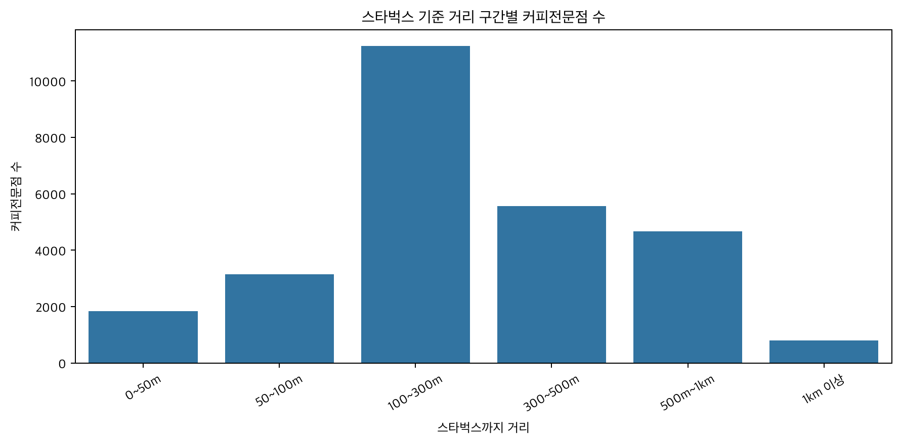
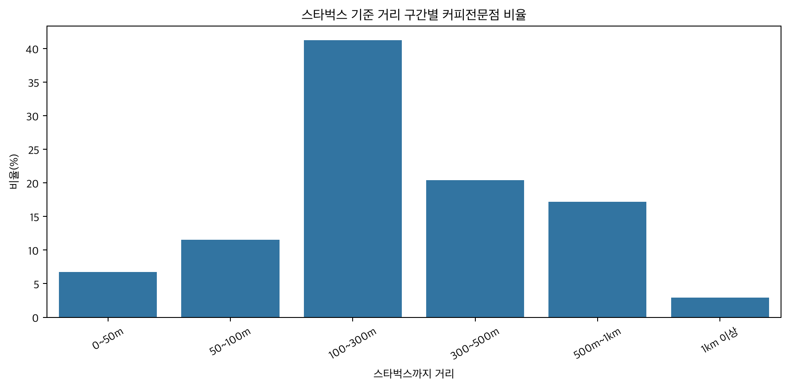
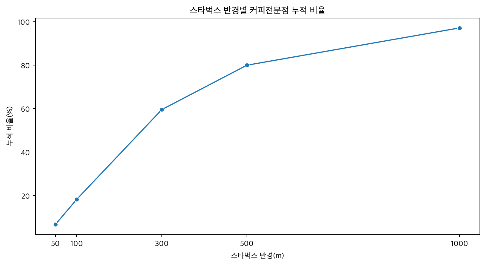

# [43일차] 프랜차이즈 입점 전략 분석

## 1. 분석 주제

서울의 스타벅스와 커피전문점 위치 데이터를 이용해 커피 매장이 스타벅스 주변에 얼마나 밀집되어 있는지 분석한다.

주요 질문은 다음과 같다.

- 스타벅스 주변에 커피전문점이 많이 분포하는가?
- 특정 프랜차이즈가 스타벅스 근처에 입점하는 경향이 있는가?
- 스타벅스와 커피전문점이 함께 밀집된 지역은 어디인가?
- 거리 구간별 분포에서 어떤 특징을 확인할 수 있는가?

이 분석은 두 매장의 위치가 가까운지를 확인하는 **상관관계 분석**이다. 개업일과 입점 순서가 없으므로 스타벅스가 다른 카페의 입점 원인이라는 인과관계까지 증명할 수는 없다.

---

## 2. 사용 데이터

| 데이터 | 크기 | 주요 컬럼 |
|---|---:|---|
| 서울 스타벅스 | 692행 | 지점명, 주소, 위도, 경도 |
| 서울 상가 정보 | 537,489행 | 상호명, 업종, 주소, 위도, 경도 |

```python
from pathlib import Path
import pandas as pd

BASE_DIR = Path.cwd()
DATA_DIR = BASE_DIR / "data"
OUTPUT_DIR = BASE_DIR / "output"

OUTPUT_DIR.mkdir(exist_ok=True)

starbucks = pd.read_csv(
    DATA_DIR / "starbucks_seoul.csv"
)

stores = pd.read_csv(
    DATA_DIR / "소상공인시장진흥공단_상가(상권)정보_서울_202603.csv",
    low_memory=False,
)
```

`pathlib.Path`를 사용하면 운영체제에 맞는 파일 경로를 편리하게 만들 수 있다.

---

## 3. 데이터 전처리

스타벅스 데이터는 분석하기 쉬운 이름으로 컬럼을 변경한다.

```python
starbucks = starbucks.iloc[:, :4].copy()

starbucks.columns = [
    "스타벅스지점명",
    "스타벅스주소",
    "스타벅스위도",
    "스타벅스경도",
]
```

위도와 경도를 숫자로 변환하고 결측치와 중복 데이터를 제거한다.

```python
starbucks["스타벅스위도"] = pd.to_numeric(
    starbucks["스타벅스위도"],
    errors="coerce",
)

starbucks["스타벅스경도"] = pd.to_numeric(
    starbucks["스타벅스경도"],
    errors="coerce",
)

starbucks = (
    starbucks
    .dropna(subset=["스타벅스위도", "스타벅스경도"])
    .drop_duplicates()
)
```

`errors="coerce"`는 숫자로 변환할 수 없는 값을 `NaN`으로 바꾼다.

상가 데이터에서는 분석에 필요한 컬럼만 선택한다.

```python
use_columns = [
    "상가업소번호",
    "상호명",
    "상권업종대분류명",
    "상권업종중분류명",
    "상권업종소분류명",
    "도로명주소",
    "위도",
    "경도",
]

stores = stores[use_columns].copy()
```

---

## 4. 커피전문점 추출

업종명과 상호명에 커피 관련 단어가 포함된 데이터를 찾는다.

```python
coffee_keywords = [
    "커피",
    "카페",
    "까페",
    "coffee",
    "cafe",
]

coffee_mask = (
    stores["상권업종중분류명"]
    .astype(str)
    .str.contains("커피|카페|음료", na=False)
    |
    stores["상권업종소분류명"]
    .astype(str)
    .str.contains("커피|카페|음료", na=False)
    |
    stores["상호명"]
    .astype(str)
    .str.contains(
        "|".join(coffee_keywords),
        case=False,
        na=False,
    )
)

cafes = stores[coffee_mask].copy()
```

추출 결과는 다음과 같다.

```text
커피 관련 매장: 27,250곳
```

키워드 범위가 넓기 때문에 스터디카페나 음료 소매점이 포함될 수 있다. 정확도를 높이려면 업종 코드와 제외 키워드를 함께 사용하는 것이 좋다.

---

## 5. 브랜드 분류

정규표현식을 사용해 상호명에서 프랜차이즈 브랜드를 분류한다.

```python
import re

brand_patterns = {
    "메가커피": r"메가\s*커피|메가\s*엠지씨|MEGA\s*MGC",
    "컴포즈커피": r"컴포즈\s*커피|COMPOSE\s*COFFEE",
    "빽다방": r"빽다방|PAIK",
    "이디야": r"이디야|EDIYA",
    "투썸플레이스": r"투썸|TWOSOME",
    "할리스": r"할리스|HOLLYS",
    "커피빈": r"커피빈|COFFEE\s*BEAN",
    "더벤티": r"더벤티|THE\s*VENTI",
    "매머드커피": r"매머드|MAMMOTH",
}


def extract_brand(name):
    name = str(name).upper()

    for brand, pattern in brand_patterns.items():
        if re.search(
            pattern,
            name,
            flags=re.IGNORECASE,
        ):
            return brand

    return "기타커피전문점"


cafes["브랜드명"] = (
    cafes["상호명"].apply(extract_brand)
)
```

주요 분류 결과는 다음과 같다.

| 브랜드 | 매장 수 |
|---|---:|
| 기타커피전문점 | 23,467 |
| 메가커피 | 979 |
| 컴포즈커피 | 458 |
| 매머드커피 | 450 |
| 이디야 | 436 |
| 투썸플레이스 | 376 |
| 빽다방 | 372 |

정규표현식으로 분류했기 때문에 상호명의 표기 방식에 따라 일부 매장이 누락되거나 잘못 분류될 수 있다.

---

## 6. 두 지점 사이의 거리

위도와 경도로 두 지점 사이의 거리를 계산할 때 하버사인 공식을 사용한다.

```python
import numpy as np


def haversine_distance(
    lat1,
    lon1,
    lat2,
    lon2,
):
    radius = 6_371_000

    lat1, lon1, lat2, lon2 = map(
        np.radians,
        [lat1, lon1, lat2, lon2],
    )

    dlat = lat2 - lat1
    dlon = lon2 - lon1

    value = (
        np.sin(dlat / 2) ** 2
        + np.cos(lat1)
        * np.cos(lat2)
        * np.sin(dlon / 2) ** 2
    )

    angle = 2 * np.arcsin(np.sqrt(value))

    return radius * angle
```

서울시청과 강남역의 직선거리를 계산하면 약 `8.79km`가 나온다.

하버사인 거리는 지구 표면의 직선에 가까운 거리이며 실제 도보 거리나 도로 이동 거리와는 다르다.

---

## 7. 가장 가까운 스타벅스 찾기

각 커피전문점과 모든 스타벅스 사이의 거리를 계산한 뒤 가장 작은 값을 찾는다.

```text
             스타벅스 A  스타벅스 B  스타벅스 C
카페 1          120m        250m        430m
카페 2          310m         80m        190m
카페 3          500m        420m        110m

각 행의 최솟값
카페 1 → 120m
카페 2 → 80m
카페 3 → 110m
```

전체 거리 행렬을 한 번에 만들면 메모리 사용량이 커질 수 있으므로 `chunk_size`만큼 나누어 처리한다.

```python
min_idx = distance_matrix.argmin(axis=1)
min_distance = distance_matrix.min(axis=1)
```

- `argmin(axis=1)`은 가장 가까운 스타벅스의 위치 인덱스를 반환한다.
- `min(axis=1)`은 실제 최소 거리값을 반환한다.

---

## 8. 원본 코드의 거리 계산 오류

노트북에는 다음 코드가 들어 있다.

```python
min_idx = dist_matrix.argmin(axis=1)
min_dist = dist_matrix.argmin(axis=1)
```

두 번째 줄도 `argmin()`을 사용해 실제 거리가 아니라 스타벅스 배열의 인덱스가 거리 컬럼에 저장된다.

```python
# 수정 코드
min_idx = dist_matrix.argmin(axis=1)
min_dist = dist_matrix.min(axis=1)
```

따라서 노트북에 출력된 기존 거리 구간 결과는 실제 미터 단위 결과로 사용할 수 없다. 아래 결과는 같은 데이터에 수정된 계산식을 적용해 다시 계산한 값이다.

---

## 9. 거리 구간 분석

```python
bins = [
    0,
    50,
    100,
    300,
    500,
    1000,
    np.inf,
]

labels = [
    "0~50m",
    "50~100m",
    "100~300m",
    "300~500m",
    "500m~1km",
    "1km 이상",
]

cafes["거리구간"] = pd.cut(
    cafes["스타벅스까지거리_m"],
    bins=bins,
    labels=labels,
    include_lowest=True,
)

distance_summary = (
    cafes["거리구간"]
    .value_counts()
    .reindex(labels)
    .reset_index()
)

distance_summary.columns = [
    "거리구간",
    "카페수",
]

distance_summary["비율(%)"] = (
    distance_summary["카페수"]
    / distance_summary["카페수"].sum()
    * 100
)
```

수정 계산 결과는 다음과 같다.

| 거리 구간 | 카페 수 | 비율 |
|---|---:|---:|
| 0~50m | 1,837 | 6.74% |
| 50~100m | 3,138 | 11.52% |
| 100~300m | 11,248 | 41.28% |
| 300~500m | 5,560 | 20.40% |
| 500m~1km | 4,675 | 17.16% |
| 1km 이상 | 792 | 2.91% |

가장 가까운 스타벅스까지의 중앙값은 약 `241.9m`, 평균은 약 `322.2m`다.

---

## 10. 반경별 누적 비율

거리 구간별 비율뿐 아니라 특정 반경 안에 포함되는 누적 비율도 계산할 수 있다.

```python
radius_list = [50, 100, 300, 500, 1000]

summary = []

for radius in radius_list:
    count = (
        cafes["스타벅스까지거리_m"]
        <= radius
    ).sum()

    ratio = count / len(cafes) * 100

    summary.append({
        "반경": f"{radius}m 이내",
        "반경_m": radius,
        "카페수": count,
        "비율(%)": ratio,
    })

radius_summary = pd.DataFrame(summary)
```

| 스타벅스 반경 | 카페 수 | 누적 비율 |
|---|---:|---:|
| 50m 이내 | 1,837 | 6.74% |
| 100m 이내 | 4,975 | 18.26% |
| 300m 이내 | 16,223 | 59.53% |
| 500m 이내 | 21,783 | 79.94% |
| 1km 이내 | 26,458 | 97.09% |

서울의 커피 관련 매장 중 약 `59.53%`가 스타벅스 300m 안에 있고 약 `79.94%`가 500m 안에 있다.

다만 스타벅스와 다른 카페가 모두 유동 인구가 많은 상권을 선호하기 때문에 나타난 결과일 수도 있다. 이 결과만으로 스타벅스가 주변 카페 입점을 유발했다고 해석하면 안 된다.

---

## 11. 시각화

### 11.1 거리 구간별 커피전문점 수

Seaborn의 막대 그래프로 거리 구간별 매장 수를 비교한다.

```python
import matplotlib.pyplot as plt
import seaborn as sns

plt.rcParams["font.family"] = (
    "Apple SD Gothic Neo"
)
plt.rcParams["axes.unicode_minus"] = False

plt.figure(figsize=(10, 5))

sns.barplot(
    data=distance_summary,
    x="거리구간",
    y="카페수",
)

plt.title(
    "스타벅스 기준 거리 구간별 커피전문점 수"
)
plt.xlabel("스타벅스까지 거리")
plt.ylabel("커피전문점 수")
plt.xticks(rotation=30)
plt.tight_layout()

plt.savefig(
    OUTPUT_DIR / "distance_bucket_count.png",
    dpi=150,
    bbox_inches="tight",
)

plt.show()
```

**실행 결과**



`100~300m` 구간에 있는 커피전문점이 `11,248곳`으로 가장 많다.

`savefig()`를 `show()`보다 먼저 실행하면 그래프가 빈 이미지로 저장되는 문제를 방지할 수 있다.

### 11.2 거리 구간별 커피전문점 비율

매장 수를 전체 커피전문점 수에 대한 비율로 변환해 비교한다.

```python
plt.figure(figsize=(10, 5))

sns.barplot(
    data=distance_summary,
    x="거리구간",
    y="비율(%)",
)

plt.title(
    "스타벅스 기준 거리 구간별 커피전문점 비율"
)
plt.xlabel("스타벅스까지 거리")
plt.ylabel("비율(%)")
plt.xticks(rotation=30)
plt.tight_layout()

plt.savefig(
    OUTPUT_DIR / "distance_bucket_ratio.png",
    dpi=150,
    bbox_inches="tight",
)

plt.show()
```

**실행 결과**



전체 커피전문점 중 `41.28%`가 스타벅스와 `100~300m` 떨어진 구간에 있다. `1km 이상` 떨어진 매장은 `2.91%`로 가장 적다.

### 11.3 반경별 누적 비율

누적 비율 선그래프를 사용하면 반경이 넓어질수록 포함되는 커피전문점의 비율이 어떻게 증가하는지 확인할 수 있다.

```python
plt.figure(figsize=(9, 5))

sns.lineplot(
    data=radius_summary,
    x="반경_m",
    y="비율(%)",
    marker="o",
)

plt.title(
    "스타벅스 반경별 커피전문점 누적 비율"
)
plt.xlabel("스타벅스 반경(m)")
plt.ylabel("누적 비율(%)")
plt.xticks(radius_list)
plt.tight_layout()

plt.savefig(
    OUTPUT_DIR / "radius_cumulative_ratio.png",
    dpi=150,
    bbox_inches="tight",
)

plt.show()
```

**실행 결과**



반경이 `300m`가 되면 전체 커피전문점의 `59.53%`, `500m`가 되면 `79.94%`가 포함된다. `1km` 반경에서는 전체의 `97.09%`가 포함된다.

---

## 12. 핵심 정리

- 서울 스타벅스 692곳과 상가 정보 537,489행을 사용했다.
- 업종과 상호명 키워드로 커피 관련 매장 27,250곳을 추출했다.
- 정규표현식을 사용해 주요 프랜차이즈 브랜드를 분류했다.
- 하버사인 공식으로 각 카페와 가장 가까운 스타벅스의 거리를 계산했다.
- 많은 좌표를 효율적으로 계산하기 위해 NumPy 브로드캐스팅과 청크 처리를 사용했다.
- 수정 계산 결과 카페의 약 59.53%가 스타벅스 300m 이내에 있다.
- 약 79.94%는 스타벅스 500m 이내에 있다.
- 가까운 위치는 상관관계를 보여주지만 입점 원인을 증명하지는 않는다.
- 기존 노트북의 `argmin()` 거리 저장 오류를 수정해야 거리 분석 결과를 사용할 수 있다.
