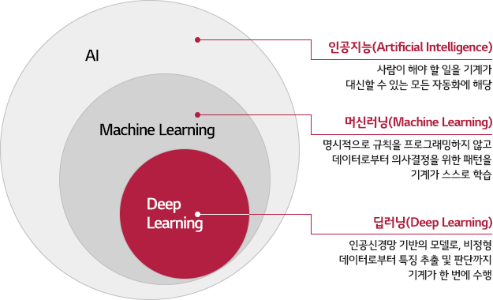
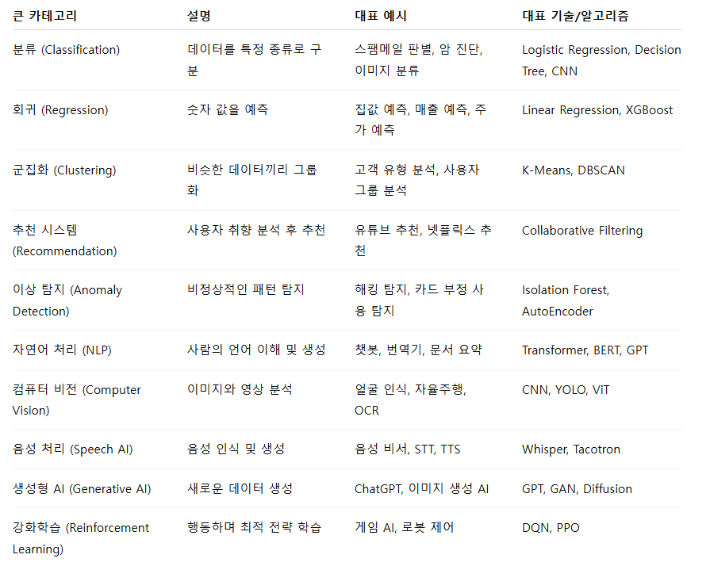

# [45일차] 머신러닝 기초

## 1. 인공지능, 머신러닝, 딥러닝

인공지능(AI, Artificial Intelligence)은 컴퓨터가 인간의 지능적인 작업을 수행하도록 만드는 넓은 기술 분야다. 데이터에서 규칙을 학습해 예측하거나, 사람이 만든 규칙에 따라 판단하거나, 환경과 상호작용하며 행동을 개선하는 방식이 모두 AI에 포함된다.

머신러닝과 딥러닝은 AI 안에 포함되는 개념이다.



| 구분 | 핵심 개념 | 예시 |
|---|---|---|
| 규칙 기반 알고리즘 | 사람이 조건과 규칙을 직접 작성한다. | `if 점수 >= 60: 합격` |
| 인공지능 | 지능적인 판단이나 문제 해결을 수행하는 기술 전체를 말한다. | 음성 비서, 경로 탐색, 추천 시스템 |
| 머신러닝 | 데이터를 바탕으로 패턴을 학습해 예측 또는 분류한다. | 스팸 메일 분류, 가격 예측 |
| 딥러닝 | 여러 층의 인공신경망으로 복잡한 패턴을 학습한다. | 이미지 인식, 음성 인식, 생성형 AI |

### 1.1 규칙 기반 알고리즘

규칙 기반 알고리즘은 사람이 미리 작성한 조건에 따라 동작한다. 결과를 설명하기 쉽고 단순한 업무에 빠르게 적용할 수 있지만, 규칙이 많아지거나 예외가 늘어나면 관리가 어려워진다.

```python
age = 20

if age >= 19:
    print("성인입니다.")
else:
    print("미성년자입니다.")
```

머신러닝은 사람이 모든 규칙을 직접 작성하는 대신, 입력 데이터와 정답 데이터에서 규칙을 찾도록 모델을 학습시킨다.

### 1.2 머신러닝

머신러닝(Machine Learning)은 데이터의 패턴을 학습한 모델로 새로운 데이터의 결과를 예측하거나 분류하는 기술이다. 예를 들어 과거 주택의 면적, 위치, 방 개수와 가격 데이터를 학습해 새로운 주택의 가격을 예측할 수 있다.

머신러닝의 핵심은 다음과 같다.

- 입력 데이터에서 예측에 사용할 정보를 `피처(feature)`라고 한다.
- 맞혀야 하는 정답이나 목표 값을 `타깃(target)` 또는 `레이블(label)`이라고 한다.
- 데이터로 패턴을 찾는 과정을 `학습(training)`이라고 한다.
- 학습이 끝난 모델로 새로운 데이터의 결과를 구하는 과정을 `추론(inference)`이라고 한다.

### 1.3 딥러닝

딥러닝(Deep Learning)은 여러 층으로 구성된 인공신경망을 이용하는 머신러닝 기법이다. 이미지, 음성, 텍스트처럼 구조가 복잡한 비정형 데이터를 처리하는 데 강점이 있다.

다만 딥러닝은 일반적으로 많은 데이터와 연산 자원을 필요로 하고, 학습 과정과 결과를 해석하기 어려운 경우가 있다. 데이터 규모가 작고 표 형태의 데이터가 중심이라면 선형 회귀, 결정 트리, 랜덤 포레스트 같은 전통적인 머신러닝 모델이 더 적합할 수 있다.

---

## 2. 머신러닝을 먼저 학습하는 이유

딥러닝은 머신러닝의 개념 위에서 동작한다. 따라서 먼저 머신러닝을 학습하면 딥러닝 모델의 결과를 해석하고 개선하는 데 필요한 기반을 만들 수 있다.

| 이유 | 설명 |
|---|---|
| 데이터 이해 | 피처, 타깃, 결측치, 이상치, 인코딩 같은 데이터 전처리 개념을 익힌다. |
| 평가 역량 | 과적합, 과소적합, 학습·검증·테스트 데이터 분리, 평가 지표를 이해한다. |
| 모델 선택 | 문제 유형에 따라 회귀, 분류, 군집화 모델을 선택하는 기준을 만든다. |
| 효율성 | 작은 표 데이터 문제는 복잡한 딥러닝 모델보다 전통적인 머신러닝이 빠르고 해석하기 쉽다. |

`딥러닝이 항상 더 좋은 모델`이라는 뜻은 아니다. 문제의 목적, 데이터의 크기와 형태, 해석 가능성, 운영 비용을 함께 고려해야 한다.

---

## 3. 머신러닝으로 할 수 있는 일



대표적인 활용 분야는 다음과 같다.

| 문제 유형 | 목표 | 예시 |
|---|---|---|
| 분류(Classification) | 정해진 범주 중 하나를 예측한다. | 스팸 메일 판별, 질병 여부 판별 |
| 회귀(Regression) | 연속된 숫자 값을 예측한다. | 집값, 매출, 수요 예측 |
| 군집화(Clustering) | 비슷한 데이터를 정답 없이 그룹으로 묶는다. | 고객 유형 세분화 |
| 추천(Recommendation) | 사용자 또는 상품의 유사성을 바탕으로 항목을 제안한다. | 영상, 음악, 상품 추천 |
| 이상 탐지(Anomaly Detection) | 일반적인 패턴에서 벗어난 데이터를 찾는다. | 거래 이상, 시스템 장애 탐지 |
| 자연어 처리(NLP) | 사람이 사용하는 언어를 분석하거나 생성한다. | 번역, 요약, 챗봇 |
| 컴퓨터 비전 | 이미지와 영상을 분석한다. | 객체 탐지, OCR, 품질 검사 |

분류와 회귀는 정답이 있는 지도학습 문제이며, 군집화는 정답 없이 구조를 찾는 비지도학습 문제다.

---

## 4. 머신러닝 학습 방법

### 4.1 지도학습

지도학습(Supervised Learning)은 입력 데이터와 정답 레이블을 함께 사용한다. 모델은 입력과 정답의 관계를 학습한 뒤, 처음 보는 입력의 정답을 예측한다.

```text
입력 데이터(피처) + 정답(레이블) -> 모델 학습 -> 새 데이터의 결과 예측
```

- 분류: 결과가 범주형이다. 예: 합격/불합격, 정상/이상
- 회귀: 결과가 수치형이다. 예: 가격, 매출, 온도

### 4.2 비지도학습

비지도학습(Unsupervised Learning)은 정답 레이블 없이 데이터 자체의 구조를 찾는다.

- 군집화: 비슷한 특성을 가진 데이터를 그룹으로 묶는다. 예: 구매 패턴이 비슷한 고객 그룹화
- 차원 축소: 많은 피처를 더 적은 차원으로 줄여 시각화하거나 연산을 단순화한다. 예: PCA

### 4.3 강화학습

강화학습(Reinforcement Learning)은 에이전트가 환경에서 행동하고 보상을 받으면서, 장기적인 보상을 크게 만드는 전략을 학습하는 방식이다.

```text
에이전트 -> 행동 -> 환경 -> 보상/상태 변화 -> 에이전트
```

게임 플레이, 로봇 제어, 자원 배분처럼 행동의 순서가 중요한 문제에 활용한다.

### 4.4 반지도학습과 자기지도학습

반지도학습(Semi-Supervised Learning)은 적은 양의 레이블 데이터와 많은 양의 비레이블 데이터를 함께 사용한다. 레이블을 만드는 비용이 큰 의료 영상이나 문서 분류 문제에서 유용하다.

자기지도학습(Self-Supervised Learning)은 데이터 일부를 가리거나 변형한 뒤, 원래 정보를 맞히도록 학습 신호를 데이터 내부에서 만든다. 대규모 언어 모델이 문맥을 이용해 다음 토큰을 예측하는 방식도 자기지도학습의 한 예다.

### 4.5 온라인 학습과 전이 학습

온라인 학습(Online Learning)은 데이터가 한 번에 모두 준비되지 않아도, 들어오는 데이터 단위로 모델을 계속 업데이트하는 방식이다. 실시간 로그나 스트리밍 데이터에 적합하다.

전이 학습(Transfer Learning)은 이미 대규모 데이터로 학습된 모델의 지식을 새로운 문제에 활용하는 방식이다. 적은 데이터로도 학습 시간을 줄이고 성능을 높이는 데 도움이 된다.

---

## 5. 머신러닝 프로젝트 프로세스

머신러닝 프로젝트는 모델을 학습하는 일만으로 끝나지 않는다. 좋은 모델을 만들려면 문제 정의와 데이터 품질 관리가 먼저 필요하다.

```text
문제 정의 -> 데이터 수집 -> 탐색 및 전처리 -> 데이터 분리
-> 모델 학습 -> 평가 및 개선 -> 배포와 모니터링
```

### 5.1 문제 정의

먼저 해결할 문제와 성공 기준을 명확히 정한다.

- 무엇을 예측하거나 분류할 것인가?
- 피처와 타깃은 무엇인가?
- 분류, 회귀, 군집화 중 어떤 문제인가?
- 정확도, F1 점수, RMSE 등 어떤 지표로 성과를 판단할 것인가?

예를 들어 고객 이탈 예측이라면 타깃은 `이탈 여부`이고, 목표는 이탈 가능성이 높은 고객을 놓치지 않는 것이다. 이 경우 단순 정확도보다 재현율이나 F1 점수가 더 중요할 수 있다.

### 5.2 데이터 수집과 탐색

데이터의 행 수, 컬럼의 자료형, 결측치, 이상치, 타깃 분포를 먼저 확인한다. 이 단계에서 데이터가 문제를 해결하기에 충분한지 판단한다.

### 5.3 데이터 전처리

원시 데이터는 바로 모델에 넣기 어려운 경우가 많다. 대표적인 전처리 작업은 다음과 같다.

- 결측치 처리: 제거하거나 평균, 중앙값, 최빈값 등으로 채운다.
- 이상치 처리: 입력 오류인지 실제로 드문 값인지 도메인 지식으로 확인한다.
- 범주형 데이터 인코딩: 문자열 카테고리를 숫자로 바꾼다.
- 스케일링: 피처의 범위를 맞춘다. 거리 기반 모델이나 경사 하강법 모델에서 특히 중요하다.
- 피처 선택 및 생성: 불필요한 컬럼을 줄이고, 문제 해결에 도움이 되는 새 피처를 만든다.

전처리 과정은 학습 데이터로 기준을 만들고 검증·테스트 데이터에 같은 기준을 적용해야 한다. 전체 데이터의 평균이나 최빈값을 먼저 계산하면 테스트 데이터의 정보가 학습에 섞이는 데이터 누수(data leakage)가 발생할 수 있다.

### 5.4 학습·검증·테스트 데이터 분리

모델이 처음 보는 데이터에서도 잘 동작하는지 확인하려면 데이터를 역할별로 나눈다.

| 데이터 | 역할 |
|---|---|
| 학습 데이터(Train) | 모델이 패턴을 학습하는 데 사용한다. |
| 검증 데이터(Validation) | 모델과 하이퍼파라미터를 비교하고 조정하는 데 사용한다. |
| 테스트 데이터(Test) | 최종 모델의 일반화 성능을 한 번 평가하는 데 사용한다. |

테스트 데이터는 모델 선택이나 반복적인 튜닝에 사용하지 않는 것이 원칙이다. 테스트 데이터까지 학습 과정에 반복해서 사용하면 실제 새로운 데이터에 대한 성능을 과대평가할 수 있다.

### 5.5 모델 학습과 평가

문제에 맞는 모델을 선택하고, 동일한 데이터 분할과 평가 지표로 여러 모델을 비교한다.

| 문제 | 대표 평가 지표 |
|---|---|
| 이진·다중 분류 | 정확도, 정밀도, 재현율, F1 점수, ROC-AUC |
| 회귀 | MAE, MSE, RMSE, R² |
| 군집화 | 실루엣 점수, 군집 해석 |

평가 결과가 좋지 않으면 데이터 품질, 피처, 모델, 하이퍼파라미터, 평가 방식 순서로 원인을 확인한다.

### 5.6 과적합과 과소적합

- 과적합(Overfitting): 학습 데이터에는 매우 잘 맞지만 새로운 데이터에서는 성능이 낮다.
- 과소적합(Underfitting): 학습 데이터의 패턴도 충분히 학습하지 못한다.

과적합을 줄이기 위해서는 데이터를 늘리거나, 모델 복잡도를 낮추거나, 규제를 적용하거나, 교차 검증을 사용한다. 과소적합은 더 유용한 피처를 추가하거나 모델의 표현력을 높이는 방법으로 개선할 수 있다.

---

## 6. 머신러닝 학습에 필요한 기반

### 6.1 수학과 통계

- 선형대수: 벡터와 행렬을 이용해 데이터를 표현하고 연산한다.
- 확률과 통계: 평균, 분산, 분포, 표본, 신뢰도 개념을 데이터 해석에 사용한다.
- 미분: 손실 함수를 줄이는 경사 하강법을 이해하는 데 필요하다.

처음부터 모든 수학을 깊게 공부해야 하는 것은 아니다. 모델을 사용하면서 필요한 개념을 예제와 함께 익히는 편이 이해하기 좋다.

### 6.2 Python과 주요 라이브러리

| 라이브러리 | 역할 |
|---|---|
| NumPy | 수치 연산과 배열 처리 |
| pandas | 표 형태 데이터 처리와 전처리 |
| Matplotlib, Seaborn | 데이터 시각화 |
| scikit-learn | 전처리, 모델 학습, 평가 |

### 6.3 데이터 해석과 도메인 지식

좋은 모델은 단순히 점수가 높은 모델이 아니다. 어떤 데이터가 실제 업무에서 의미 있는지, 이상치를 제거해도 되는지, 모델 결과가 특정 집단에 불리하지 않은지 판단하려면 도메인 지식이 필요하다.

### 6.4 윤리와 운영

개인정보를 다룰 때는 수집 목적과 접근 권한을 관리해야 한다. 또한 학습 데이터의 편향이 특정 사용자에게 불공정한 결과를 만들 수 있으므로, 데이터 구성과 모델 결과를 지속적으로 점검해야 한다.

모델을 배포한 뒤에도 실제 성능과 데이터 분포가 변하는지 모니터링해야 한다. 학습 당시와 실제 서비스 환경의 데이터가 달라지는 현상을 데이터 드리프트(data drift)라고 한다.

---

## 7. 핵심 정리

- AI는 지능적인 작업을 수행하는 기술 전체이며, 머신러닝과 딥러닝은 AI에 포함된다.
- 머신러닝은 데이터에서 패턴을 학습해 새로운 데이터의 결과를 예측하거나 분류한다.
- 지도학습은 정답이 필요하고, 비지도학습은 정답 없이 데이터의 구조를 찾는다.
- 프로젝트의 성패는 모델 선택뿐 아니라 문제 정의, 데이터 품질, 전처리, 평가 방법에 크게 좌우된다.
- 학습·검증·테스트 데이터를 구분하고, 데이터 누수를 막아야 실제 성능을 올바르게 평가할 수 있다.
- 딥러닝은 강력한 도구지만, 모든 문제의 기본 해답은 아니다.
