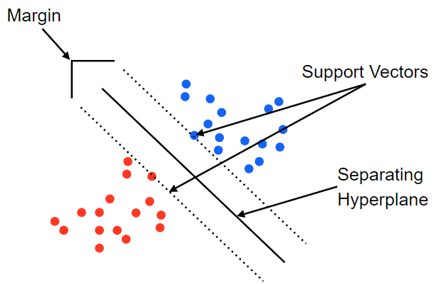
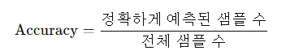
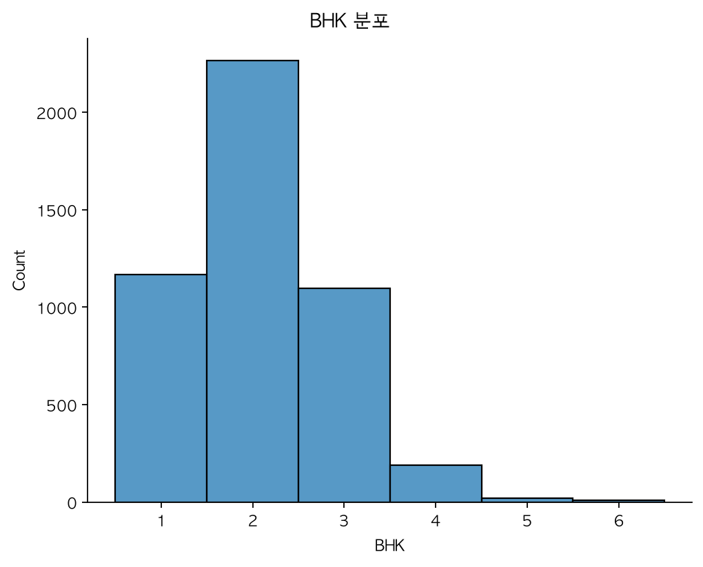
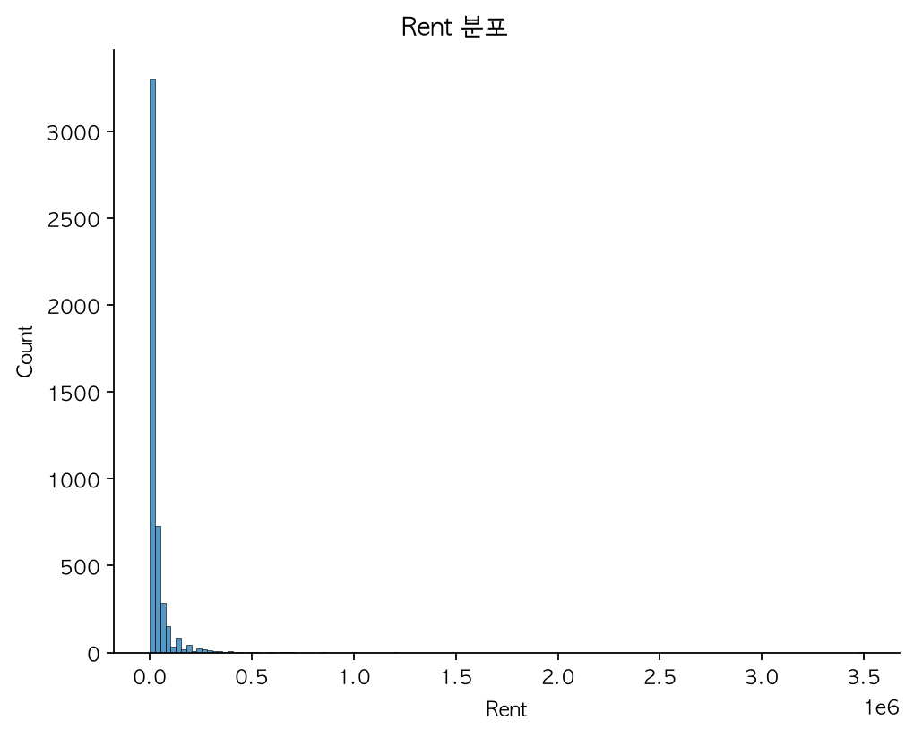
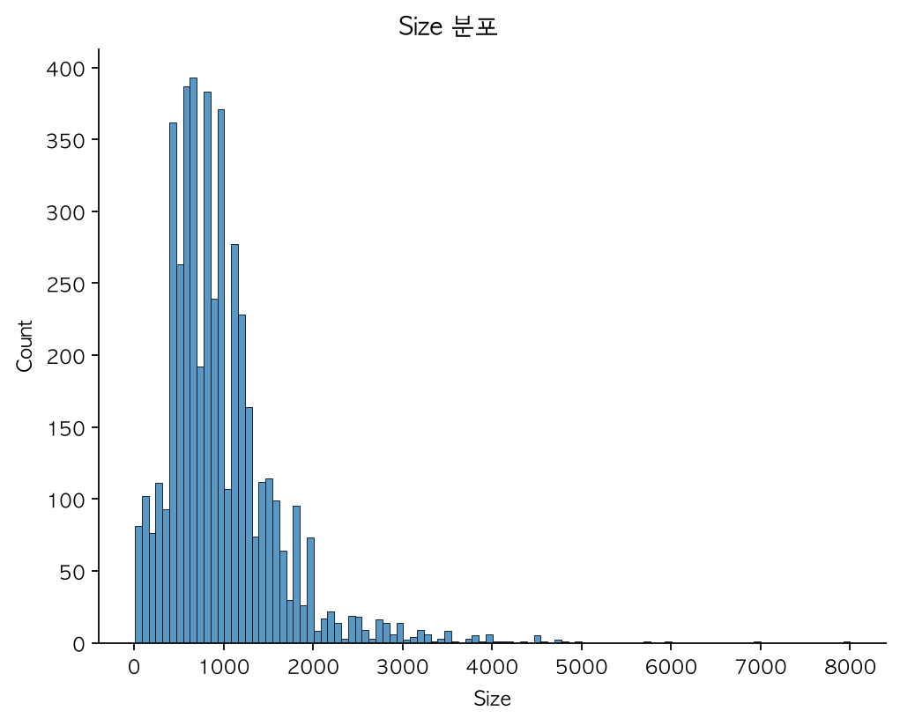
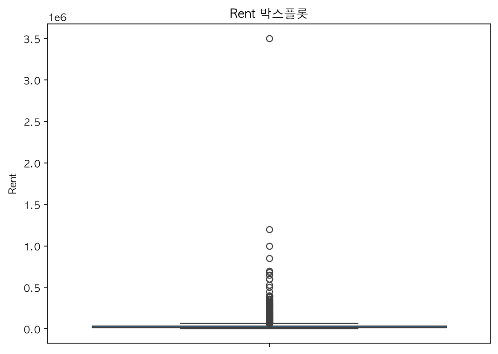
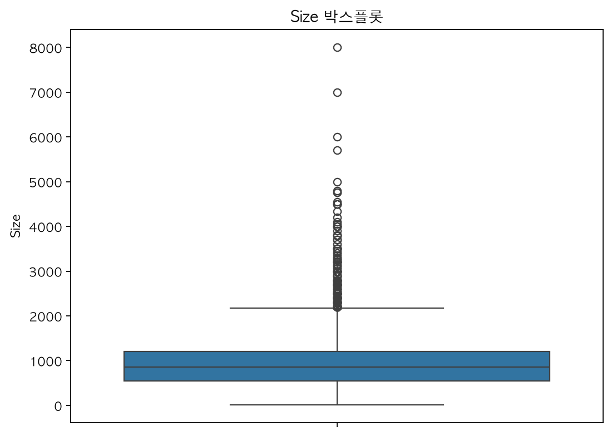
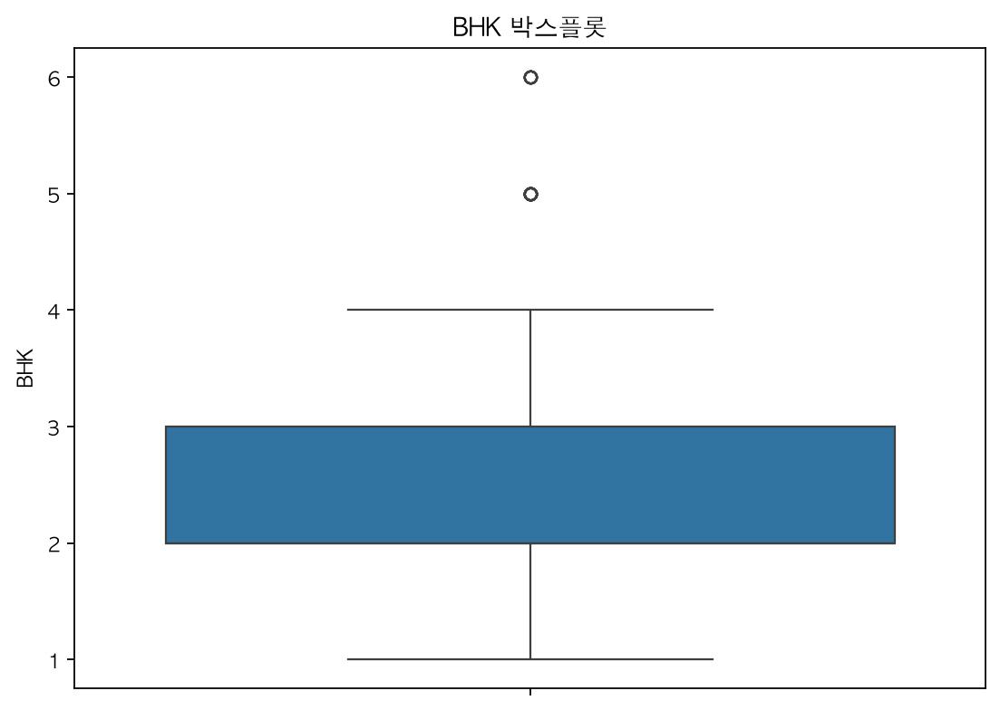

# [46일차] 사이킷런과 주택 임대료 데이터셋 탐색

## 1. 사이킷런(scikit-learn)

사이킷런은 Python에서 머신러닝 모델을 학습하고 평가할 때 널리 사용하는 오픈소스 라이브러리다. 분류, 회귀, 군집화, 차원 축소, 전처리, 데이터 분할, 모델 평가를 일관된 인터페이스로 제공한다.

```bash
python -m pip install scikit-learn
```

사이킷런에서 대부분의 모델은 다음 흐름으로 사용한다.

```text
데이터 준비 -> train_test_split() -> model.fit()
-> model.predict() -> 평가 지표 계산
```

| 메서드 | 역할 |
|---|---|
| `fit(X, y)` | 입력 피처 `X`와 정답 `y`로 모델을 학습한다. |
| `predict(X)` | 학습된 모델로 새 입력의 결과를 예측한다. |
| `score(X, y)` | 모델 종류에 맞는 기본 점수를 계산한다. 분류기에서는 보통 정확도다. |

---

## 2. Iris 데이터셋

Iris 데이터셋은 붓꽃의 품종을 분류하는 대표적인 샘플 데이터셋이다. 사이킷런에 포함되어 있어 별도 파일 없이 불러올 수 있다.

```python
from sklearn.datasets import load_iris

iris = load_iris()

print(iris.feature_names)
print(iris.target_names)
```

```text
['sepal length (cm)', 'sepal width (cm)',
 'petal length (cm)', 'petal width (cm)']

['setosa', 'versicolor', 'virginica']
```

| 항목 | 내용 |
|---|---|
| 샘플 수 | 150개 |
| 피처 수 | 4개 |
| 클래스 수 | 3개 |
| 클래스별 샘플 수 | 각 50개 |
| 문제 유형 | 다중 클래스 분류 |

피처는 꽃받침(sepal)과 꽃잎(petal)의 길이와 너비다. 타깃 숫자 `0`, `1`, `2`는 각각 `setosa`, `versicolor`, `virginica`를 의미한다.

### DataFrame으로 변환하기

```python
import pandas as pd

df_iris = pd.DataFrame(
    iris.data,
    columns=iris.feature_names,
)

df_iris["target"] = iris.target
df_iris.head()
```

`iris.data`는 2차원 NumPy 배열이고 `iris.target`은 정답 레이블 배열이다. DataFrame으로 바꾸면 컬럼 이름을 보면서 탐색과 전처리를 진행할 수 있다.

---

## 3. 학습·테스트 데이터 분리와 Stratify

모델의 일반화 성능을 확인하려면 전체 데이터를 학습에 모두 사용하지 않고, 일부를 테스트 데이터로 남겨야 한다.

```python
from sklearn.model_selection import train_test_split

X = df_iris.drop(columns="target")
y = df_iris["target"]

X_train, X_test, y_train, y_test = train_test_split(
    X,
    y,
    test_size=0.2,
    random_state=2026,
    stratify=y,
)

print(X_train.shape, X_test.shape)
print(y_train.value_counts().sort_index())
print(y_test.value_counts().sort_index())
```

```text
(120, 4) (30, 4)

target
0    40
1    40
2    40

target
0    10
1    10
2    10
```

`stratify=y`는 원본 클래스 비율을 학습·테스트 데이터에 비슷하게 유지한다. Iris처럼 원본 클래스가 균형인 데이터에서는 각 클래스가 학습 데이터에 40개, 테스트 데이터에 10개씩 포함된다.

표본 수가 적거나 클래스 불균형이 심한 데이터에서 `stratify`를 사용하지 않으면, 특정 클래스가 테스트 데이터에 너무 적게 포함되거나 빠질 수 있다.

---

## 4. SVM과 SVC 분류

서포트 벡터 머신(SVM)은 클래스 사이의 경계를 가장 잘 나누는 초평면(hyperplane)을 찾는 지도학습 알고리즘이다. 경계와 가장 가까운 데이터 포인트를 서포트 벡터(support vector)라고 하며, 이 포인트들이 경계 위치를 결정하는 데 중요한 역할을 한다.



사이킷런의 `SVC`는 SVM 기반 분류기다.

```python
from sklearn.svm import SVC

svc = SVC()
svc.fit(X_train, y_train)

y_pred = svc.predict(X_test)
print(y_pred)
```

### 정확도 평가

정확도(accuracy)는 전체 예측 중 정답을 맞힌 비율이다.



```python
from sklearn.metrics import accuracy_score

accuracy = accuracy_score(y_test, y_pred)
print(accuracy)

# 0.9666666666666667
```

노트북 실행 결과는 약 `96.67%`이며, 30개 테스트 샘플 중 29개를 올바르게 분류한 값이다.

Iris 데이터셋은 클래스 수가 같은 균형 데이터라 정확도가 비교적 직관적이다. 실제 서비스처럼 클래스 비율이 불균형한 문제에서는 정확도만으로 모델을 판단하지 않고 정밀도, 재현율, F1 점수, 혼동 행렬도 함께 확인해야 한다.

### 새 데이터 예측

```python
new_data = pd.DataFrame(
    [[6.2, 2.4, 5.1, 2.0]],
    columns=iris.feature_names,
)

new_target = svc.predict(new_data)
print(new_target)  # [2]
print(iris.target_names[new_target][0])  # virginica
```

새 입력의 컬럼 순서와 이름은 학습 때 사용한 피처와 동일해야 한다.

---

## 5. 주택 임대료 데이터셋 탐색

`House Rent Prediction Dataset`은 주택의 구조, 면적, 위치, 가구 상태 같은 정보를 바탕으로 월 임대료를 예측하기 위해 사용되는 데이터셋이다.

이번 단계에서는 모델을 바로 학습하지 않고 다음 내용을 중심으로 데이터를 탐색한다.

- 데이터의 크기와 자료형을 확인한다.
- 수치형 변수의 통계량과 분포를 확인한다.
- 박스플롯으로 이상치와 데이터 범위를 살펴본다.
- 결측치와 범주형 변수의 종류를 확인한다.

이 문서는 노트북의 `8월 5일 수업` 구분선 이전 내용만 정리한 탐색적 데이터 분석(EDA) 기록이다.

---

## 6. 데이터 불러오기

```python
import pandas as pd

rent_df = pd.read_csv(
    "./data/House_Rent_Dataset.csv"
)

rent_df.head()
```

노트북 실행 결과 데이터셋은 `4,746행`, `12개 컬럼`으로 구성되어 있다.

| 구분 | 개수 |
|---|---:|
| 행 | 4,746 |
| 컬럼 | 12 |
| 수치형 컬럼 | 4 |
| 문자열 컬럼 | 8 |

---

## 7. 데이터셋 컬럼

| 컬럼 | 설명 | 자료형 |
|---|---|---|
| `Posted On` | 매물 등록일 | 문자열 |
| `BHK` | 침실·거실·주방(Bedroom-Hall-Kitchen) 구성 유형 | 정수 |
| `Rent` | 월 임대료 | 정수 |
| `Size` | 면적(제곱피트) | 정수 |
| `Floor` | 현재 층과 전체 층수 정보 | 문자열 |
| `Area Type` | 면적 산정 방식 | 문자열 |
| `Area Locality` | 세부 지역 또는 동네 | 문자열 |
| `City` | 도시 | 문자열 |
| `Furnishing Status` | 가구 제공 상태 | 문자열 |
| `Tenant Preferred` | 선호 임차인 유형 | 문자열 |
| `Bathroom` | 욕실 수 | 정수 |
| `Point of Contact` | 연락 담당자 유형 | 문자열 |

`Rent`는 나중에 예측하려는 목표값(target)이 된다. 나머지 컬럼은 임대료를 설명하는 입력 변수(feature) 후보가 된다.

---

## 8. 데이터 구조 확인

`info()`는 행 수, 결측치 수, 컬럼 자료형을 한 번에 확인할 수 있는 메서드다.

```python
rent_df.info()
```

실행 결과는 다음과 같다.

```text
RangeIndex: 4746 entries, 0 to 4745
Data columns (total 12 columns):

int64(4): BHK, Rent, Size, Bathroom
str(8): Posted On, Floor, Area Type, Area Locality,
        City, Furnishing Status, Tenant Preferred,
        Point of Contact
```

수치형 변수와 문자열 변수가 함께 있으므로, 이후 분석이나 모델 학습에서 두 종류의 데이터를 서로 다른 방식으로 처리해야 한다.

---

## 9. 기술 통계량 확인

`describe()`는 수치형 컬럼의 개수, 평균, 표준편차, 사분위수, 최솟값, 최댓값을 보여준다.

```python
summary = rent_df.describe()
print(round(summary, 2))
```

| 통계량 | BHK | Rent | Size | Bathroom |
|---|---:|---:|---:|---:|
| 평균 | 2.08 | 34,993.45 | 967.49 | 1.97 |
| 중앙값 | 2 | 16,000 | 850 | 2 |
| 25% | 2 | 10,000 | 550 | 1 |
| 75% | 3 | 33,000 | 1,200 | 2 |
| 최솟값 | 1 | 1,200 | 10 | 1 |
| 최댓값 | 6 | 3,500,000 | 8,000 | 10 |

### 평균과 중앙값을 함께 봐야 하는 이유

임대료 평균은 약 `34,993`이지만 중앙값은 `16,000`이다. 평균이 중앙값보다 크게 높다는 것은 일부 고가 임대료가 평균을 위로 끌어올렸을 가능성을 보여준다.

특히 최대 임대료는 `3,500,000`으로 75% 지점인 `33,000`보다 매우 크다. 임대료 분포가 오른쪽으로 긴 꼬리를 가진다는 점을 그래프와 박스플롯으로 추가 확인해야 한다.

---

## 10. 분포 확인

Seaborn의 `displot()`은 변수 값이 어느 구간에 얼마나 자주 등장하는지 히스토그램 형태로 보여준다.

```python
import matplotlib.pyplot as plt
import seaborn as sns

plt.rcParams["font.family"] = "AppleGothic"
plt.rcParams["axes.unicode_minus"] = False
```

### 6.1 BHK 분포

`BHK`는 연속형 수치가 아니라 방 구성 수를 나타내는 이산형 변수다. 따라서 막대 구분이 뚜렷하게 보이도록 `discrete=True`를 사용한다.

```python
sns.displot(
    data=rent_df,
    x="BHK",
    discrete=True,
)

plt.title("BHK 분포")
plt.show()
```



| BHK | 매물 수 |
|---:|---:|
| 1 | 1,167 |
| 2 | 2,265 |
| 3 | 1,098 |
| 4 | 189 |
| 5 | 19 |
| 6 | 8 |

`2 BHK` 매물이 가장 많고, BHK 수가 커질수록 관측치 수가 급격히 줄어든다. 5~6 BHK는 표본 수가 매우 적으므로 분석과 모델 평가 시 주의가 필요하다.

### 6.2 임대료 분포

```python
sns.displot(
    data=rent_df,
    x="Rent",
)

plt.title("Rent 분포")
plt.show()
```



대부분의 임대료는 낮은 구간에 밀집되어 있고, 일부 고가 매물이 오른쪽 꼬리를 길게 만든다. 원본 단위 그대로 그리면 고가 매물 때문에 낮은 구간의 차이가 잘 보이지 않을 수 있다.

### 6.3 면적 분포

```python
sns.displot(
    data=rent_df,
    x="Size",
)

plt.title("Size 분포")
plt.show()
```



면적도 임대료와 비슷하게 오른쪽으로 치우친 분포를 보인다. 중앙값은 `850`, 평균은 약 `967.49`이며 최대값은 `8,000`이다.

---

## 11. 박스플롯으로 이상치 확인

박스플롯(Boxplot)은 중앙값, 사분위수, 이상치를 한 번에 보여주는 그래프다.

| 요소 | 의미 |
|---|---|
| 중앙값(Q2) | 정렬한 값의 가운데에 위치한 값이다. |
| Q1 | 하위 25% 지점의 값이다. |
| Q3 | 하위 75% 지점의 값이다. |
| IQR | `Q3 - Q1`이며 데이터 가운데 50%의 범위다. |
| 수염(whisker) | 일반적으로 `Q1 - 1.5 × IQR`부터 `Q3 + 1.5 × IQR` 범위의 값이다. |
| 이상치 | 수염 범위를 벗어난 관측치다. |

박스플롯의 이상치는 반드시 오류를 뜻하지 않는다. 고가 주택처럼 실제로 드문 값일 수 있으므로, 제거하기 전에 데이터 오류인지 분석상 중요한 사례인지 확인해야 한다.

### 7.1 임대료 박스플롯

```python
sns.boxplot(
    data=rent_df,
    y="Rent",
)

plt.title("Rent 박스플롯")
plt.show()
```



상단에 이상치가 많이 표시된다. 임대료에는 극단적으로 높은 값이 존재하며, 평균이나 평균 제곱 오차처럼 큰 값에 민감한 지표를 해석할 때 영향을 줄 수 있다.

### 7.2 면적 박스플롯

```python
sns.boxplot(
    data=rent_df,
    y="Size",
)

plt.title("Size 박스플롯")
plt.show()
```



큰 면적의 주택이 일부 존재한다. 면적이 `10`처럼 매우 작은 값도 있으므로, 단위 오류나 입력 오류 여부를 별도로 확인할 필요가 있다.

### 7.3 BHK 박스플롯

```python
sns.boxplot(
    data=rent_df,
    y="BHK",
)

plt.title("BHK 박스플롯")
plt.show()
```



BHK의 5~6은 IQR 기준으로 이상치처럼 표시될 수 있다. 하지만 BHK는 이산형 주거 구조 정보이므로, 통계적 이상치라는 이유만으로 제거하지 않는다.

---

## 12. 결측치 확인

```python
rent_df.isna().sum()
```

노트북 실행 결과 모든 컬럼의 결측치 수는 `0`이다.

```python
rent_df.isna().mean()
```

결측 비율도 모든 컬럼에서 `0.0`이다. 따라서 이 단계에서는 결측치 대체나 행 삭제가 필요하지 않다.

다만 결측치가 없다고 해서 전처리가 끝난 것은 아니다. 자료형 변환, 범주형 변수 인코딩, 이상치 검토, 날짜와 층수 정보의 구조화 같은 작업은 이후에도 필요하다.

---

## 13. 범주형 변수의 값 종류 확인

범주형 변수는 고유값 개수를 확인하면 인코딩 방법과 변수의 복잡도를 판단하는 데 도움이 된다.

```python
columns = [
    "Posted On",
    "Floor",
    "Area Type",
    "Area Locality",
    "City",
    "Furnishing Status",
    "Tenant Preferred",
    "Point of Contact",
]

for column in columns:
    print(column, rent_df[column].nunique())
```

| 컬럼 | 고유값 수 |
|---|---:|
| `Posted On` | 81 |
| `Floor` | 480 |
| `Area Type` | 3 |
| `Area Locality` | 2,235 |
| `City` | 6 |
| `Furnishing Status` | 3 |
| `Tenant Preferred` | 3 |
| `Point of Contact` | 3 |

`Area Type`의 값은 다음 세 가지다.

```python
rent_df["Area Type"].unique()

# ['Super Area', 'Carpet Area', 'Built Area']
```

### 고유값 수가 중요한 이유

- `City`, `Area Type`처럼 고유값이 적은 변수는 원-핫 인코딩으로 처리하기 좋다.
- `Area Locality`는 고유값이 `2,235개`로 매우 많다. 단순 원-핫 인코딩을 적용하면 피처 수가 크게 늘어날 수 있다.
- `Floor`는 숫자와 문자열이 섞인 구조이므로, 현재 층과 전체 층수로 분리하는 전처리가 필요하다.
- `Posted On`은 날짜 자료형으로 변환한 뒤 연도, 월, 요일 같은 파생 변수를 만들 수 있다.

이 전처리 내용은 `8월 5일 수업` 이후 범위이므로 여기서는 데이터 탐색 관점에서만 확인한다.

---

## 14. 핵심 정리

- 사이킷런은 `fit()`, `predict()` 중심의 일관된 인터페이스로 데이터 분할, 모델 학습, 평가를 지원한다.
- Iris 데이터셋은 150개 샘플, 4개 피처, 3개 품종으로 구성된 균형 다중 분류 데이터셋이다.
- `stratify=y`를 사용하면 학습·테스트 데이터에 원본 클래스 비율을 유지할 수 있다.
- SVC는 Iris 테스트 데이터 30개 중 29개를 맞혀 정확도 `96.67%`를 기록했다.
- 데이터셋은 4,746행과 12개 컬럼으로 구성되며, 결측치는 없다.
- 수치형 변수는 `BHK`, `Rent`, `Size`, `Bathroom`이다.
- 2 BHK 매물이 2,265개로 가장 많다.
- 임대료와 면적은 오른쪽 꼬리가 긴 분포를 가지며, 큰 값이 평균과 모델 평가에 영향을 줄 수 있다.
- 박스플롯의 이상치는 곧바로 삭제 대상이 아니며, 실제 고가·대형 주택인지 오류 데이터인지 확인해야 한다.
- `Area Locality`, `Floor`, `Posted On`은 고유값 수와 데이터 구조를 고려한 전처리가 필요한 변수다.
