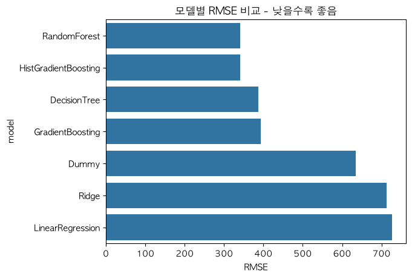
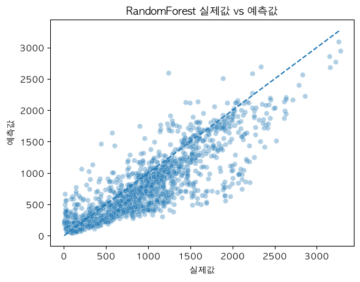
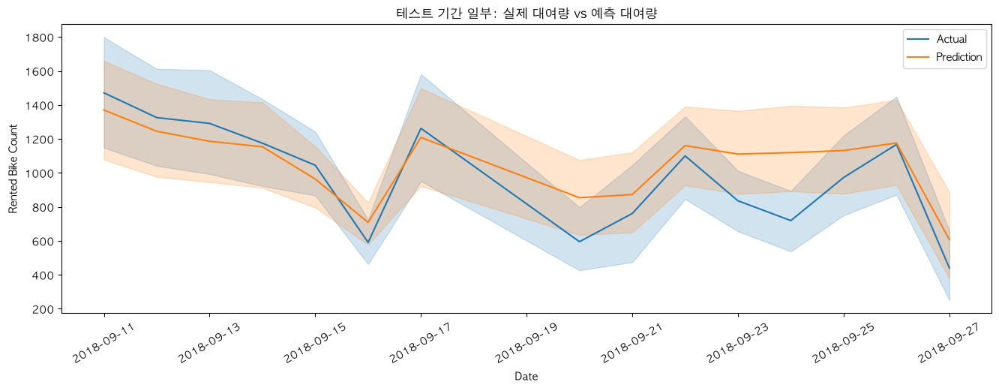
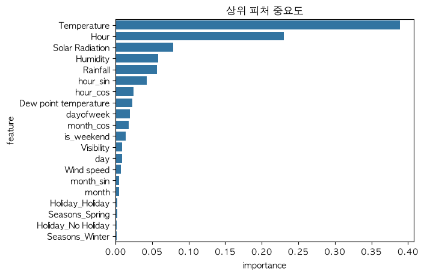
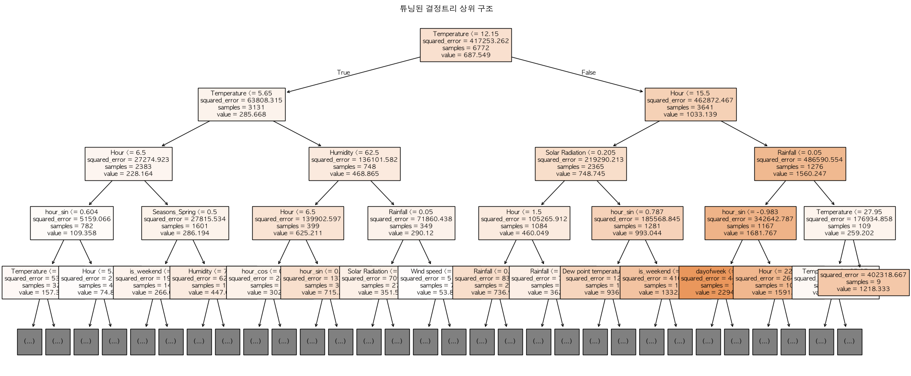

# [48일차] 자전거 수요 회귀 모델 평가와 해석

## 1. 정리 범위

47일차에서 서울 자전거 데이터의 날짜·순환 피처 생성, 운영일 필터링, 시간 순서 분할, 전처리 파이프라인을 구성했다. 여기서는 그 결과를 바탕으로 다음 내용을 다룬다.

- 기준 모델과 여러 회귀 모델을 비교하는 방법
- 결정트리 회귀의 분할 원리와 하이퍼파라미터 튜닝
- 실제값과 예측값을 시각화해 오차를 확인하는 방법
- 시간 흐름에 따른 예측 결과 비교
- 트리 계열 모델의 피처 중요도와 결정트리 구조 해석

---

## 2. 여러 회귀 모델을 비교하는 이유

하나의 모델만 사용하면 그 모델의 성능이 좋은지 판단하기 어렵다. 먼저 평균만 예측하는 기준 모델을 만들고, 선형 모델과 트리·앙상블 모델을 같은 학습·테스트 데이터에서 평가해야 한다.

```python
from sklearn.dummy import DummyRegressor
from sklearn.ensemble import (
    GradientBoostingRegressor,
    HistGradientBoostingRegressor,
    RandomForestRegressor,
)
from sklearn.linear_model import LinearRegression, Ridge
from sklearn.pipeline import Pipeline
from sklearn.tree import DecisionTreeRegressor

RANDOM_STATE = 2026

models = {
    "Dummy": Pipeline([
        ("preprocess", preprocess_for_tree),
        ("model", DummyRegressor(strategy="mean")),
    ]),
    "LinearRegression": Pipeline([
        ("preprocess", preprocess_for_linear),
        ("model", LinearRegression()),
    ]),
    "Ridge": Pipeline([
        ("preprocess", preprocess_for_linear),
        ("model", Ridge(alpha=1.0)),
    ]),
    "DecisionTree": Pipeline([
        ("preprocess", preprocess_for_tree),
        ("model", DecisionTreeRegressor(
            random_state=RANDOM_STATE,
        )),
    ]),
    "RandomForest": Pipeline([
        ("preprocess", preprocess_for_tree),
        ("model", RandomForestRegressor(
            random_state=RANDOM_STATE,
            n_estimators=300,
            n_jobs=-1,
        )),
    ]),
    "GradientBoosting": Pipeline([
        ("preprocess", preprocess_for_tree),
        ("model", GradientBoostingRegressor(
            random_state=RANDOM_STATE,
        )),
    ]),
    "HistGradientBoosting": Pipeline([
        ("preprocess", preprocess_for_tree),
        ("model", HistGradientBoostingRegressor(
            random_state=RANDOM_STATE,
        )),
    ]),
}
```

| 모델 | 역할과 특징 |
|---|---|
| `DummyRegressor` | 모든 행에 학습 데이터의 평균 대여량을 예측하는 기준선이다. |
| `LinearRegression` | 입력 변수와 대여량이 하나의 선형 관계라고 가정한다. |
| `Ridge` | 선형 회귀의 계수가 과도하게 커지지 않도록 규제를 적용한다. |
| `DecisionTreeRegressor` | 조건에 따라 데이터를 나누고, 리프의 평균값으로 예측한다. |
| `RandomForestRegressor` | 여러 트리의 예측을 평균내어 단일 트리의 불안정성을 줄인다. |
| `GradientBoostingRegressor` | 이전 트리의 오차를 다음 트리가 순차적으로 보완한다. |
| `HistGradientBoostingRegressor` | 연속형 값을 구간으로 묶어 부스팅 계산을 효율화한다. |

`RandomForest`는 여러 트리를 독립적으로 학습한 뒤 평균을 낸다. 반면 `GradientBoosting`은 앞 모델이 틀린 부분을 다음 모델이 학습하는 순차적인 방식이다.

---

## 3. 공통 평가와 모델 선택

각 모델은 같은 `X_train`, `y_train`으로 학습하고 같은 테스트 데이터로 평가한다. 47일차에서 만든 `evaluate_regression()` 함수는 MAE, MSE, RMSE, R2를 반환한다.

```python
results = []

for name, model in models.items():
    model.fit(X_train, y_train)
    results.append(
        evaluate_regression(model, X_test, y_test, name)
    )

result_df = (
    pd.DataFrame(results)
    .sort_values("RMSE")
    .reset_index(drop=True)
)

print(result_df)
```

### 실행 결과

| 모델 | MAE | MSE | RMSE | R2 |
|---|---:|---:|---:|---:|
| RandomForest | 248.69 | 116,676.96 | **341.58** | **0.6752** |
| HistGradientBoosting | 260.74 | 116,687.54 | 341.60 | 0.6751 |
| DecisionTree | 280.76 | 149,756.22 | 386.98 | 0.5831 |
| GradientBoosting | 291.46 | 154,978.54 | 393.67 | 0.5685 |
| Dummy | 491.51 | 402,474.39 | 634.41 | -0.1205 |
| Ridge | 593.57 | 508,831.06 | 713.32 | -0.4166 |
| LinearRegression | 606.01 | 527,109.85 | 726.02 | -0.4675 |



이번 실행에서는 `RandomForest`가 RMSE `341.58`로 가장 낮고 R2 `0.6752`로 가장 높다. 트리 계열 모델이 선형 모델보다 좋은 결과를 낸 이유는 시간, 기온, 습도, 강수량, 계절이 대여량에 미치는 관계가 단순한 직선 형태가 아닐 가능성과 연결해 볼 수 있다.

단, 모델 선택은 한 번의 테스트 결과만으로 확정하지 않는다. 다른 기간을 테스트 구간으로 두거나 시계열 교차 검증을 적용해 결과가 안정적인지 추가로 확인해야 한다.

---

## 4. 결정트리 회귀의 분할 원리

결정트리 회귀는 데이터를 조건에 따라 여러 구간으로 나누고, 각 리프 노드에 속한 목표값의 평균을 예측한다. 분류 트리에서 사용하는 Gini 불순도나 엔트로피와 달리 회귀 트리는 보통 분할 후 오차가 얼마나 줄어드는지를 기준으로 사용한다.

```text
전체 데이터
    |
    |-- Temperature <= 기준값?
    |       |
    |       |-- Yes: 이 구간의 평균 대여량 예측
    |       |
    |       |-- No: Hour <= 기준값?
    |                   |
    |                   |-- Yes: 다른 평균 대여량 예측
    |                   |-- No: 또 다른 평균 대여량 예측
```

분할 전후의 평균 제곱 오차(MSE)가 작아지는 방향을 찾는다.

```text
MSE = (실제값 - 해당 리프의 평균 예측값)^2의 평균
```

트리가 너무 깊어지면 학습 데이터를 거의 외워 테스트 데이터 성능이 떨어질 수 있다. 이를 과적합(overfitting)이라고 한다.

---

## 5. GridSearchCV로 결정트리 튜닝하기

결정트리의 복잡도를 조절하는 파라미터 조합을 교차 검증으로 비교한다.

```python
from sklearn.model_selection import GridSearchCV

dt_pipeline = Pipeline([
    ("preprocess", preprocess_for_tree),
    ("model", DecisionTreeRegressor(
        random_state=RANDOM_STATE,
    )),
])

param_grid = {
    "model__max_depth": [10, 15, 20, 25],
    "model__min_samples_split": [10, 30, 50, 70],
    "model__min_samples_leaf": [5, 10, 20, 50],
}

dt_grid = GridSearchCV(
    estimator=dt_pipeline,
    param_grid=param_grid,
    scoring="neg_root_mean_squared_error",
    cv=3,
    n_jobs=-1,
)

dt_grid.fit(X_train, y_train)

print("Best Params:", dt_grid.best_params_)
print("Best CV RMSE:", -dt_grid.best_score_)
```

| 하이퍼파라미터 | 의미 |
|---|---|
| `max_depth` | 트리가 자랄 수 있는 최대 깊이다. |
| `min_samples_split` | 노드를 나누기 위한 최소 샘플 수다. |
| `min_samples_leaf` | 하나의 리프에 남아야 하는 최소 샘플 수다. |

```text
Best Params:
{'model__max_depth': 15,
 'model__min_samples_leaf': 5,
 'model__min_samples_split': 70}

Best CV RMSE: 387.63
```

`neg_root_mean_squared_error`는 RMSE에 음수를 붙인 점수다. 사이킷런의 교차 검증 도구가 큰 점수를 더 좋은 결과로 취급하기 때문에, 작을수록 좋은 RMSE를 비교할 수 있도록 부호를 바꾼다. 출력할 때는 `-dt_grid.best_score_`로 다시 양수 RMSE를 확인한다.

```python
tuned_result = evaluate_regression(
    dt_grid.best_estimator_,
    X_test,
    y_test,
    "DecisionTree_Tuned",
)

print(tuned_result)
```

```text
{'model': 'DecisionTree_Tuned',
 'MAE': 318.51,
 'MSE': 192,031.88,
 'RMSE': 438.21,
 'R2': 0.4654}
```

이 실행에서는 튜닝된 트리의 테스트 RMSE가 기본 결정트리보다 높았다. 교차 검증에서 선택한 조합도 특정 테스트 기간에서는 더 나쁠 수 있으므로, 튜닝 결과 자체를 무조건 더 좋은 모델이라고 판단하면 안 된다.

---

## 6. 최적 모델 선택 시 이름을 정확히 맞추기

튜닝 결과를 기본 모델 결과와 합쳐 다시 정렬한 뒤, RMSE가 가장 낮은 모델을 선택할 수 있다.

```python
final_result_df = pd.concat(
    [result_df, pd.DataFrame([tuned_result])],
    ignore_index=True,
).sort_values("RMSE").reset_index(drop=True)

best_model_name = final_result_df.loc[0, "model"]

if best_model_name == "DecisionTree_Tuned":
    best_model = dt_grid.best_estimator_
else:
    best_model = models[best_model_name]

print("가장 RMSE가 낮은 모델:", best_model_name)
```

```text
가장 RMSE가 낮은 모델: RandomForest
```

노트북 원본에는 `Decision_Tuned`라는 이름을 비교했지만, 평가 결과에 저장한 이름은 `DecisionTree_Tuned`다. 현재 실행에서는 `RandomForest`가 최적이라 오류가 드러나지 않지만, 튜닝된 트리가 1위인 경우에는 키 이름이 맞지 않아 `models[best_model_name]`에서 오류가 발생할 수 있다. 문자열 이름은 결과 테이블과 조건문에서 동일하게 관리해야 한다.

---

## 7. 실제값과 예측값을 산점도로 비교하기

모델의 숫자 점수만으로는 어떤 구간에서 오차가 큰지 알기 어렵다. 실제값을 x축, 예측값을 y축에 놓으면 예측 품질을 직관적으로 확인할 수 있다.

```python
def plot_actual_vs_pred(model, X_test, y_test, title):
    prediction = model.predict(X_test)

    sns.scatterplot(
        x=y_test,
        y=prediction,
        alpha=0.35,
    )

    min_value = min(y_test.min(), prediction.min())
    max_value = max(y_test.max(), prediction.max())

    plt.plot(
        [min_value, max_value],
        [min_value, max_value],
        linestyle="--",
    )
    plt.xlabel("실제값")
    plt.ylabel("예측값")
    plt.title(title)
    plt.show()


plot_actual_vs_pred(
    best_model,
    X_test,
    y_test,
    f"{best_model_name} 실제값 vs 예측값",
)
```



점선은 실제값과 예측값이 완전히 같은 경우를 나타낸다. 점이 점선에 가까울수록 예측이 정확하다. 그래프에서는 저·중간 대여량 구간에 점이 비교적 밀집하지만, 대여량이 큰 구간에서는 점선 주변으로 넓게 퍼진다. 즉, 피크 수요를 예측할 때 상대적으로 큰 오차가 발생할 수 있다.

---

## 8. 시간 흐름으로 실제값과 예측값 비교하기

테스트 데이터에 예측값을 추가하고, 앞부분 14일 분량의 시간별 행을 선 그래프로 비교한다.

```python
prediction = best_model.predict(X_test)

compare_df = model_df.iloc[split_index:].copy()
compare_df["prediction"] = prediction

sample_compare = compare_df.head(24 * 14)

plt.figure(figsize=(16, 5))
sns.lineplot(
    data=sample_compare,
    x="Date",
    y="Rented Bike Count",
    label="Actual",
)
sns.lineplot(
    data=sample_compare,
    x="Date",
    y="prediction",
    label="Prediction",
)
plt.title("테스트 기간 일부: 실제 대여량 vs 예측 대여량")
plt.xticks(rotation=30)
plt.show()
```



선 그래프는 날짜별 평균을 보여준다. 시간별 급격한 변화를 보려면 x축을 `Date`와 `Hour`를 합친 시각으로 바꾸는 방식도 활용할 수 있다. 이 그래프에서는 추세를 함께 따라가는지, 특정 날짜에 지속적으로 과대·과소 예측하는지를 확인한다.

---

## 9. 피처 중요도 확인하기

트리 기반 모델은 분할 과정에서 오차를 줄이는 데 기여한 정도를 `feature_importances_`로 제공한다. 원-핫 인코딩된 범주형 피처는 여러 컬럼으로 바뀌므로, 전처리 뒤의 피처 이름을 다시 가져와야 한다.

```python
def get_feature_names(preprocessor):
    names = []

    for name, transformer, columns in preprocessor.transformers_:
        if name == "remainder" and transformer == "drop":
            continue

        if (
            hasattr(transformer, "named_steps")
            and "onehot" in transformer.named_steps
        ):
            onehot = transformer.named_steps["onehot"]
            names.extend(onehot.get_feature_names_out(columns))
        else:
            names.extend(columns)

    return np.array(names)


preprocessor = best_model.named_steps["preprocess"]
feature_names = get_feature_names(preprocessor)
importances = best_model.named_steps["model"].feature_importances_

importance_df = pd.DataFrame(
    {"feature": feature_names, "importance": importances}
).sort_values("importance", ascending=False)

print(importance_df.head(10))
```

| 순위 | 피처 | 중요도 |
|---:|---|---:|
| 1 | `Temperature` | 0.3887 |
| 2 | `Hour` | 0.2300 |
| 3 | `Solar Radiation` | 0.0790 |
| 4 | `Humidity` | 0.0587 |
| 5 | `Rainfall` | 0.0565 |



피처 중요도는 모델 내부에서의 상대적인 기여도다. `Temperature`의 중요도가 높다고 해서 기온만 바꾸면 대여량이 반드시 변한다는 인과관계를 뜻하지는 않는다. 서로 강하게 관련된 피처는 중요도가 나뉘거나 한쪽 피처에 몰릴 수 있다.

---

## 10. 튜닝된 결정트리 구조 시각화

`plot_tree()`로 튜닝된 결정트리의 상위 분기 구조를 확인할 수 있다. 전체 트리를 모두 그리면 너무 복잡해지므로 `max_depth=4`로 상위 구조만 표시한다.

```python
from sklearn.tree import plot_tree

tree_model = dt_grid.best_estimator_.named_steps["model"]
feature_names = get_feature_names(
    dt_grid.best_estimator_.named_steps["preprocess"]
)

plt.figure(figsize=(24, 10))
plot_tree(
    tree_model,
    max_depth=4,
    feature_names=feature_names,
    filled=True,
    fontsize=9,
)
plt.title("튜닝된 결정트리 상위 구조")
plt.show()
```



회귀 트리의 각 노드에는 분할 조건, 해당 노드의 MSE, 샘플 수, 예측 평균값이 표시된다. `filled=True`는 예측값 크기에 따라 노드 색을 다르게 표시해 높은 수요와 낮은 수요 구간을 구분하기 쉽게 만든다.

---

## 11. 핵심 정리

- 평균만 예측하는 Dummy 모델을 기준선으로 두고 여러 회귀 모델을 비교해야 성능을 판단할 수 있다.
- 이번 테스트 구간에서는 RandomForest가 RMSE `341.58`, R2 `0.6752`로 가장 좋은 결과를 보였다.
- 결정트리는 비선형 관계를 학습할 수 있지만 과적합하기 쉬우므로 깊이와 리프의 최소 샘플 수를 조절해야 한다.
- 교차 검증에서 선택된 하이퍼파라미터가 특정 테스트 기간에서도 항상 최고 성능을 보장하지는 않는다.
- 산점도는 예측 오차가 어느 수요 구간에서 커지는지 보여주고, 시간 흐름 그래프는 날짜별 추세를 함께 따라가는지 보여준다.
- 피처 중요도는 모델의 분할 기여도이지 인과관계가 아니다.
