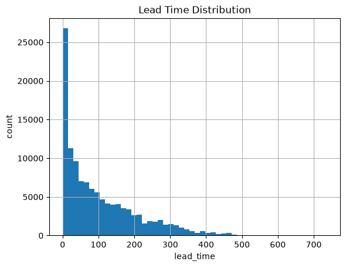
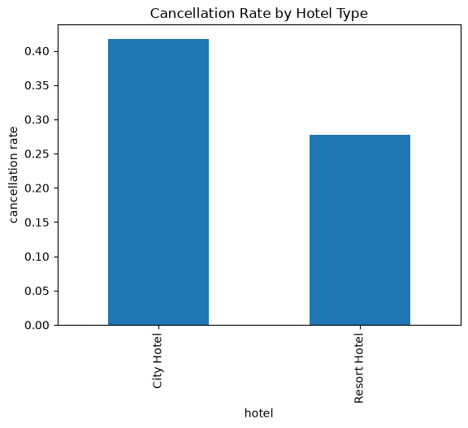
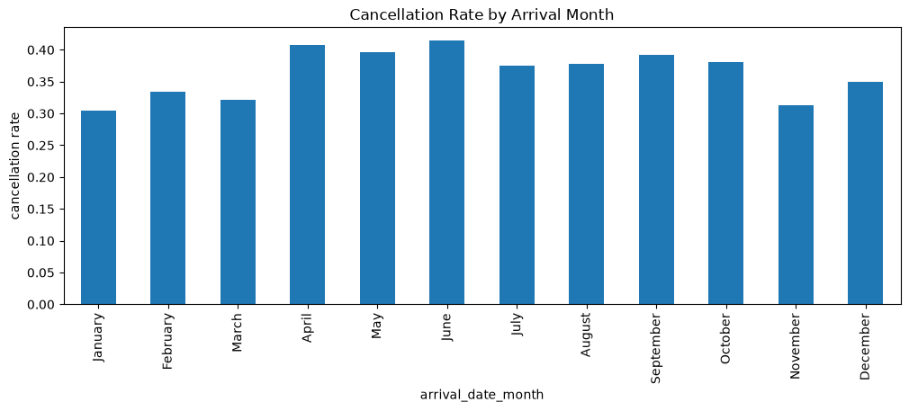
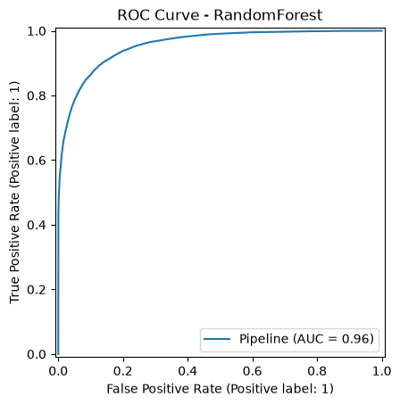

# [49일차] 호텔 예약 취소 예측과 분류 모델 평가

## 1. 문제 정의

호텔 예약 수요 데이터셋은 예약 정보와 고객 특성을 이용해 예약 취소 여부를 예측하는 데이터셋이다. 이 글에서는 `is_canceled`를 타깃으로 사용하는 이진 분류 문제를 다룬다.

| 타깃값 | 의미 |
|---:|---|
| `0` | 예약이 유지됐다. |
| `1` | 예약이 취소됐다. |

예약 취소를 미리 예측하면 호텔은 취소 가능성이 높은 고객에게 확인 안내를 보내거나, 객실 재판매·오버부킹 정책을 더 신중하게 운영하는 데 활용할 수 있다. 단, 모델의 예측 결과만으로 고객을 불리하게 대하면 안 되며, 운영 의사결정을 돕는 보조 신호로 사용해야 한다.

---

## 2. 데이터셋 구성

```python
import pandas as pd

DATA_PATH = "./data/hotel_bookings.csv"
hotel_raw = pd.read_csv(DATA_PATH)

print(hotel_raw.shape)
hotel_raw.head()
```

노트북 실행 결과 데이터는 `119,390행`, `32개 컬럼`으로 구성된다.

| 범주 | 주요 컬럼 |
|---|---|
| 호텔·예약 일정 | `hotel`, `lead_time`, 도착 연·월·주·일 |
| 숙박·투숙객 | 주말·주중 숙박일, `adults`, `children`, `babies` |
| 예약 경로 | `market_segment`, `distribution_channel`, `agent`, `company` |
| 예약 이력 | `is_repeated_guest`, 이전 취소·유지 예약 수, `booking_changes` |
| 요금·부가 요청 | `adr`, 주차 공간, 특별 요청 수 |
| 결과 관련 정보 | `reservation_status`, `reservation_status_date` |

### 타깃 분포

```python
print(hotel_raw["is_canceled"].value_counts())
print(
    hotel_raw["is_canceled"]
    .value_counts(normalize=True)
    .round(2)
)
```

| 예약 상태 | 건수 | 비율 |
|---|---:|---:|
| 유지 (`0`) | 75,166 | 0.63 |
| 취소 (`1`) | 44,224 | 0.37 |

클래스 비율이 완전히 균형은 아니지만 취소 예약도 전체의 약 37%를 차지한다. 따라서 정확도만 보지 않고 정밀도, 재현율, F1 점수, ROC-AUC를 함께 확인해야 한다.

---

## 3. 결측치와 탐색적 분석

### 결측치 확인

```python
missing_summary = pd.DataFrame(
    {
        "missing_count": hotel_raw.isna().sum(),
        "missing_ratio": hotel_raw.isna().mean(),
    }
).sort_values("missing_count", ascending=False)

print(missing_summary[missing_summary["missing_count"] > 0])
```

| 컬럼 | 결측치 수 | 결측 비율 |
|---|---:|---:|
| `company` | 112,593 | 94.31% |
| `agent` | 16,340 | 13.69% |
| `country` | 488 | 0.41% |
| `children` | 4 | 0.003% |

`company`는 결측 비율이 매우 높다. 단순 대체 후 사용할 수도 있지만, 대부분이 비어 있는 컬럼이 실제 예측에 도움이 되는지 확인해야 한다. `agent`, `company`는 숫자처럼 보이지만 크고 작음 자체에 순서 의미가 없는 식별자일 수 있으므로, 범주형으로 처리하거나 제외하는 방법도 비교할 수 있다.

### 리드 타임 분포

`lead_time`은 예약을 만든 날과 체크인 날짜 사이의 일수다.

```python
hotel_raw["lead_time"].hist(bins=50)
plt.title("Lead Time Distribution")
plt.xlabel("lead_time")
plt.ylabel("count")
plt.show()
```



대부분의 예약은 비교적 짧은 리드 타임 구간에 몰려 있고, 일부 예약은 매우 오래 전에 만들어졌다. 최대값이 `737일`이므로 평균만으로 데이터를 설명하기보다 분포와 이상치를 함께 살펴봐야 한다.

### 호텔 유형별 취소율

```python
cancel_by_hotel = (
    hotel_raw.groupby("hotel")["is_canceled"]
    .mean()
    .sort_values(ascending=False)
)

print(cancel_by_hotel)
```

```text
City Hotel      0.417270
Resort Hotel    0.277634
```



이번 데이터에서는 City Hotel의 취소율이 약 `41.7%`로 Resort Hotel의 약 `27.8%`보다 높다. 이는 호텔 유형이 취소 예측에 유의미한 피처가 될 수 있음을 보여주지만, 취소율 차이만으로 원인을 단정할 수는 없다.

### 도착 월별 취소율

```python
month_order = [
    "January", "February", "March", "April", "May", "June",
    "July", "August", "September", "October", "November", "December",
]

cancel_by_month = (
    hotel_raw.groupby("arrival_date_month")["is_canceled"]
    .mean()
    .reindex(month_order)
)

cancel_by_month.plot(kind="bar", figsize=(12, 4))
plt.title("Cancellation Rate by Arrival Month")
plt.ylabel("cancellation rate")
plt.show()
```



6월과 4월의 취소율이 상대적으로 높고, 1월과 11월은 낮게 나타난다. 월은 계절, 여행 목적, 성수기 여부 등 여러 요인을 간접적으로 담고 있으므로 계절 피처와 함께 비교할 수 있다.

---

## 4. 피처 엔지니어링

원본 컬럼을 그대로 사용하기보다, 예약 취소와 관련된 의미를 더 잘 표현하도록 새 피처를 만든다.

```python
import numpy as np

def add_basic_features(df):
    df = df.copy()

    # 결측치 4개를 0명으로 처리한다.
    df["children"] = df["children"].fillna(0)

    # 전체 투숙객 수
    df["people"] = (
        df["adults"] + df["children"] + df["babies"]
    )

    # 전체 숙박일 수
    df["total_nights"] = (
        df["stays_in_weekend_nights"]
        + df["stays_in_week_nights"]
    )

    season_map = {
        "December": "winter", "January": "winter", "February": "winter",
        "March": "spring", "April": "spring", "May": "spring",
        "June": "summer", "July": "summer", "August": "summer",
        "September": "fall", "October": "fall", "November": "fall",
    }
    df["season"] = df["arrival_date_month"].map(season_map)

    previous_total = (
        df["previous_cancellations"]
        + df["previous_bookings_not_canceled"]
    )

    # 이전 예약 이력이 없으면 -1로 구분한다.
    df["previous_cancel_rate"] = np.where(
        previous_total > 0,
        df["previous_cancellations"] / previous_total,
        -1,
    )

    return df


hotel = add_basic_features(hotel_raw)
hotel = hotel[hotel["people"] > 0].copy()
```

| 새 피처 | 의미 |
|---|---|
| `people` | 성인·어린이·유아를 합친 총 투숙객 수다. |
| `total_nights` | 주말·주중 숙박일을 합친 전체 숙박일 수다. |
| `season` | 도착 월을 봄·여름·가을·겨울로 묶은 범주형 피처다. |
| `previous_cancel_rate` | 이전 예약 이력 중 취소 비율이다. 이력이 없으면 `-1`이다. |

`people`이 0인 행은 실제 투숙객이 없는 비정상 예약으로 보고 제거한다. 이 처리 후 데이터는 `119,210행`이 된다.

---

## 5. 데이터 누수 방지

데이터 누수(data leakage)는 실제 예측 시점에는 알 수 없는 정보를 학습에 넣는 문제다. 누수가 있으면 테스트 성능은 높아 보이지만 실제 운영 환경에서는 같은 성능을 내지 못한다.

```python
leakage_or_post_booking_cols = [
    "reservation_status",
    "reservation_status_date",
    "assigned_room_type",
]

redundant_cols = [
    "adults",
    "children",
    "babies",
    "stays_in_weekend_nights",
    "stays_in_week_nights",
    "arrival_date_month",
    "previous_cancellations",
    "previous_bookings_not_canceled",
]

columns_to_drop = [
    column
    for column in leakage_or_post_booking_cols + redundant_cols
    if column in hotel.columns
]

hotel = hotel.drop(columns=columns_to_drop)
```

| 제거한 컬럼 | 이유 |
|---|---|
| `reservation_status` | 취소 여부와 직접 연결된 예약 결과 정보라 누수를 일으킨다. |
| `reservation_status_date` | 예약 상태가 마지막으로 갱신된 결과 시점의 정보다. |
| `assigned_room_type` | 예약 뒤 실제로 배정된 객실 정보라 예약 시점 예측에 부적절하다. |
| 인원·숙박일 원본 컬럼 | `people`, `total_nights`로 합쳐 중복 정보를 줄인다. |
| 이전 예약 횟수 원본 컬럼 | `previous_cancel_rate`로 비율 정보를 만든다. |
| `arrival_date_month` | `season`으로 묶어 계절 정보를 사용한다. |

데이터 누수 여부는 컬럼 이름만 보고 판단하지 않는다. 반드시 “예약 취소를 예측하려는 시점에 이 정보를 알 수 있는가?”라는 기준으로 확인해야 한다.

---

## 6. 학습·테스트 데이터 분리와 전처리

### 계층화 분할

```python
from sklearn.model_selection import train_test_split

X = hotel.drop(columns="is_canceled")
y = hotel["is_canceled"]

X_train, X_test, y_train, y_test = train_test_split(
    X,
    y,
    test_size=0.3,
    random_state=2026,
    stratify=y,
)

print(X_train.shape, X_test.shape)
print(y_train.value_counts(normalize=True).round(3))
print(y_test.value_counts(normalize=True).round(3))
```

```text
(83447, 24) (35763, 24)

학습 데이터 취소 비율: 0.371
테스트 데이터 취소 비율: 0.371
```

`stratify=y`를 지정하면 취소·유지 비율이 학습 데이터와 테스트 데이터에 비슷하게 유지된다.

### 숫자형·범주형 전처리

```python
from sklearn.compose import ColumnTransformer
from sklearn.impute import SimpleImputer
from sklearn.pipeline import Pipeline
from sklearn.preprocessing import OneHotEncoder, StandardScaler

numeric_features = X_train.select_dtypes(
    include="number"
).columns.tolist()

categorical_features = X_train.select_dtypes(
    exclude="number"
).columns.tolist()

numeric_transformer = Pipeline(
    steps=[
        ("imputer", SimpleImputer(strategy="median")),
        ("scaler", StandardScaler()),
    ]
)

categorical_transformer = Pipeline(
    steps=[
        ("imputer", SimpleImputer(strategy="most_frequent")),
        ("onehot", OneHotEncoder(handle_unknown="ignore")),
    ]
)

preprocessor = ColumnTransformer(
    transformers=[
        ("num", numeric_transformer, numeric_features),
        ("cat", categorical_transformer, categorical_features),
    ],
    remainder="drop",
)
```

노트북의 범주형 파이프라인 단계 이름은 `scaler`였지만 실제 작업은 스케일링이 아니라 원-핫 인코딩이다. 문서에서는 역할에 맞게 `onehot`으로 이름을 정리했다.

`handle_unknown="ignore"`는 학습 데이터에 없던 국가나 예약 경로가 테스트 데이터에 나타나도 오류 없이 처리하도록 한다.

---

## 7. Logistic Regression과 RandomForestClassifier

로지스틱 회귀는 각 클래스의 확률을 계산하는 선형 분류 모델이다. RandomForestClassifier는 여러 결정트리의 결과를 결합하는 앙상블 분류 모델이다.

```python
from sklearn.ensemble import RandomForestClassifier
from sklearn.linear_model import LogisticRegression

models = {
    "RandomForest": RandomForestClassifier(
        n_estimators=300,
        random_state=2026,
        n_jobs=-1,
    ),
    "LogisticRegression": LogisticRegression(max_iter=2000),
}
```

두 모델 모두 전처리와 묶어야 학습 데이터에서 만든 결측치 대체값, 표준화 기준, 범주 목록이 테스트 데이터에도 그대로 적용된다.

```python
from sklearn.metrics import (
    accuracy_score,
    f1_score,
    precision_score,
    recall_score,
    roc_auc_score,
)

results = []
fitted_models = {}

for name, model in models.items():
    clf = Pipeline([
        ("preprocess", preprocessor),
        ("model", model),
    ])

    clf.fit(X_train, y_train)
    prediction = clf.predict(X_test)
    probability = clf.predict_proba(X_test)[:, 1]

    results.append(
        {
            "model": name,
            "accuracy": accuracy_score(y_test, prediction),
            "precision": precision_score(y_test, prediction),
            "recall": recall_score(y_test, prediction),
            "f1_score": f1_score(y_test, prediction),
            "roc_auc": roc_auc_score(y_test, probability),
        }
    )
    fitted_models[name] = clf

result_df = pd.DataFrame(results).sort_values(
    "roc_auc",
    ascending=False,
)
print(result_df)
```

### 모델 성능 비교

| 모델 | Accuracy | Precision | Recall | F1 | ROC-AUC |
|---|---:|---:|---:|---:|---:|
| RandomForest | **0.8905** | **0.8842** | **0.8109** | **0.8459** | **0.9566** |
| LogisticRegression | 0.8092 | 0.8021 | 0.6445 | 0.7147 | 0.8872 |

이번 실행에서는 RandomForest가 모든 지표에서 더 높은 결과를 보였다. 특히 실제 취소 예약을 찾아낸 비율인 재현율이 약 `81.1%`로, 로지스틱 회귀의 약 `64.4%`보다 높다.

---

## 8. 혼동 행렬로 오차 유형 확인하기

```python
from sklearn.metrics import (
    classification_report,
    confusion_matrix,
)

best_model = fitted_models["RandomForest"]
best_prediction = best_model.predict(X_test)

matrix = confusion_matrix(y_test, best_prediction)
print(matrix)
```

```text
[[21095  1408]
 [ 2508 10752]]
```

사이킷런의 이진 분류 혼동 행렬은 기본적으로 다음 순서다.

```text
[[TN, FP],
 [FN, TP]]
```

| 구분 | 건수 | 의미 |
|---|---:|---|
| TN | 21,095 | 유지 예약을 유지로 올바르게 예측했다. |
| FP | 1,408 | 유지 예약을 취소로 잘못 예측했다. |
| FN | 2,508 | 취소 예약을 유지로 놓쳤다. |
| TP | 10,752 | 취소 예약을 취소로 올바르게 예측했다. |

호텔이 취소 가능성이 높은 고객에게 사전 확인 메시지를 보내려는 상황이라면 FN을 줄이는 재현율이 중요할 수 있다. 반대로 불필요한 객실 확보나 과도한 오버부킹을 줄이려면 FP를 줄이는 정밀도도 중요하다.

`classification_report()`의 `macro avg`는 각 클래스를 같은 비중으로 평균내고, `weighted avg`는 클래스별 데이터 수를 반영해 평균낸다. 취소 예약이 소수 클래스가 되는 데이터에서는 두 평균을 함께 봐야 한다.

---

## 9. ROC 곡선과 ROC-AUC

분류 모델은 취소 확률을 계산한 뒤 임계값을 기준으로 `0` 또는 `1`을 결정한다. ROC 곡선은 임계값을 바꿔 가며 TPR(재현율)과 FPR(유지 예약을 취소로 잘못 판단한 비율)의 관계를 나타낸다.

```python
from sklearn.metrics import RocCurveDisplay

RocCurveDisplay.from_estimator(
    best_model,
    X_test,
    y_test,
)
plt.title("ROC Curve - RandomForest")
plt.show()
```



ROC-AUC는 ROC 곡선 아래 면적이다.

| ROC-AUC | 의미 |
|---:|---|
| 1.0 | 모든 양성과 음성을 완벽하게 구분한다. |
| 0.5 | 무작위 추측에 가깝다. |
| 0.5 미만 | 양성과 음성의 순위를 무작위보다 나쁘게 매긴다. |

RandomForest의 ROC-AUC는 약 `0.9566`으로 높다. 이는 무작위로 선택한 취소 예약이 유지 예약보다 더 높은 취소 확률을 받을 가능성이 높다는 뜻이다. 다만 AUC가 높아도 특정 임계값에서의 정밀도와 재현율이 운영 목적에 맞는지는 별도로 확인해야 한다.

---

## 10. 예측 임계값 조정

`predict()`는 보통 취소 확률이 `0.5` 이상이면 취소로 분류한다. 하지만 0.5가 모든 운영 목적에 가장 적합한 기준은 아니다.

```python
best_probability = best_model.predict_proba(X_test)[:, 1]

threshold_table = []

for threshold in np.arange(0.3, 0.71, 0.05):
    threshold_prediction = (
        best_probability >= threshold
    ).astype(int)

    threshold_table.append(
        {
            "threshold": round(threshold, 2),
            "precision": precision_score(
                y_test,
                threshold_prediction,
                zero_division=0,
            ),
            "recall": recall_score(
                y_test,
                threshold_prediction,
                zero_division=0,
            ),
            "f1_score": f1_score(
                y_test,
                threshold_prediction,
                zero_division=0,
            ),
        }
    )

threshold_df = pd.DataFrame(threshold_table)
print(threshold_df)
```

| 임계값 | Precision | Recall | F1 |
|---:|---:|---:|---:|
| 0.30 | 0.7712 | **0.9147** | 0.8369 |
| 0.40 | 0.8345 | 0.8645 | 0.8492 |
| 0.45 | 0.8620 | 0.8406 | **0.8511** |
| 0.50 | 0.8833 | 0.8124 | 0.8464 |
| 0.60 | 0.9226 | 0.7486 | 0.8266 |
| 0.70 | **0.9543** | 0.6724 | 0.7889 |

임계값을 낮추면 취소로 판단하는 예약이 늘어나 재현율은 높아지지만, 실제 유지 예약을 취소로 오판할 가능성도 커진다. 임계값을 높이면 정밀도는 높아지지만 실제 취소 예약을 더 많이 놓친다.

- 취소 가능 고객을 최대한 찾고 싶다면 낮은 임계값을 검토한다.
- 확인 메시지나 할인 쿠폰 비용이 크다면 높은 임계값을 검토한다.
- 정밀도와 재현율의 균형이 목표라면 F1 점수가 가장 높은 `0.45` 근처를 후보로 둘 수 있다.

임계값은 모델 자체의 고정값이 아니라, 오판 비용과 운영 가능한 대응 인원에 따라 정하는 정책값이다.

---

## 11. Stratified K-Fold 교차 검증

한 번의 학습·테스트 분할 결과는 우연히 쉬운 테스트 세트가 선택된 결과일 수 있다. `StratifiedKFold`는 각 폴드에 취소·유지 비율을 비슷하게 유지하며 여러 번 검증한다.

```python
from sklearn.model_selection import (
    StratifiedKFold,
    cross_validate,
)

cv = StratifiedKFold(
    n_splits=5,
    shuffle=True,
    random_state=2026,
)

cv_model = Pipeline([
    ("preprocess", preprocessor),
    ("model", RandomForestClassifier(
        n_estimators=300,
        random_state=2026,
        n_jobs=-1,
    )),
])

scoring = ["accuracy", "precision", "recall", "f1", "roc_auc"]

cv_result = cross_validate(
    cv_model,
    X,
    y,
    cv=cv,
    scoring=scoring,
    n_jobs=-1,
)

cv_summary = pd.DataFrame(
    {
        metric: [
            cv_result[f"test_{metric}"].mean(),
            cv_result[f"test_{metric}"].std(),
        ]
        for metric in scoring
    },
    index=["mean", "std"],
)

print(cv_summary)
```

| 구분 | Accuracy | Precision | Recall | F1 | ROC-AUC |
|---|---:|---:|---:|---:|---:|
| 평균 | 0.8935 | 0.8897 | 0.8137 | 0.8500 | 0.9593 |
| 표준편차 | 0.0030 | 0.0055 | 0.0057 | 0.0043 | 0.0009 |

평균 성능이 높고 표준편차가 작아 무작위 계층 분할 기준에서는 비교적 안정적인 결과를 보인다. 다만 실제 서비스처럼 미래 예약을 예측하는 상황이라면, 무작위 K-Fold보다 예약 생성 시점 기준의 시간 분할 검증을 추가로 고려해야 한다.

---

## 12. 핵심 정리

- 호텔 예약 취소 예측은 `is_canceled`를 타깃으로 하는 이진 분류 문제다.
- `reservation_status`, `reservation_status_date`, `assigned_room_type`처럼 예약 시점 이후에 알 수 있는 정보는 데이터 누수를 막기 위해 제거해야 한다.
- 총 투숙객 수, 전체 숙박일, 계절, 이전 취소율을 만들어 원본 정보를 더 의미 있는 피처로 표현할 수 있다.
- 이번 실행에서는 RandomForest가 Accuracy `0.8905`, F1 `0.8459`, ROC-AUC `0.9566`으로 LogisticRegression보다 좋은 성능을 보였다.
- 혼동 행렬은 취소 예약을 놓친 FN과 유지 예약을 취소로 잘못 판단한 FP를 구분해 운영 관점의 오차를 확인하게 해준다.
- 임계값을 낮추면 재현율이, 높이면 정밀도가 커지는 경향이 있으므로 실제 운영 비용과 목적에 맞게 선택해야 한다.
- 교차 검증은 한 번의 분할 결과에 의존하지 않고 모델 성능의 평균과 변동성을 확인하는 방법이다.
