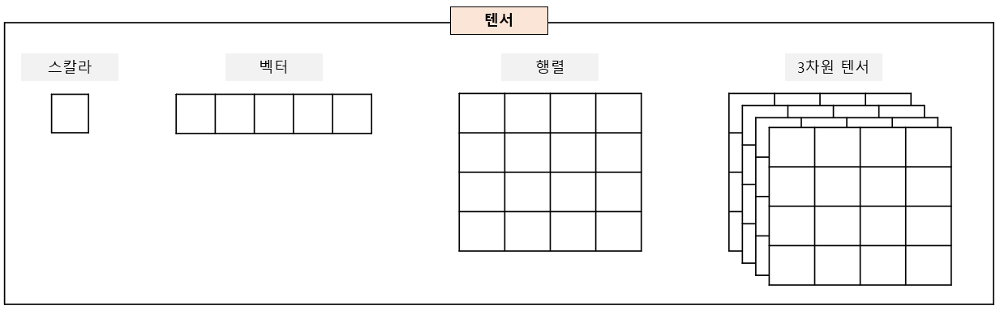
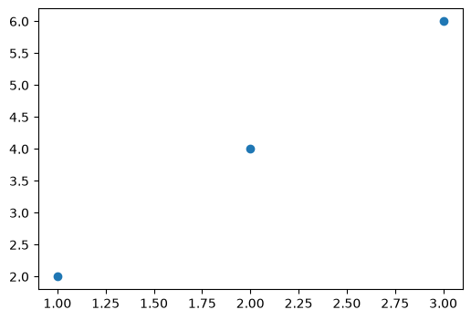
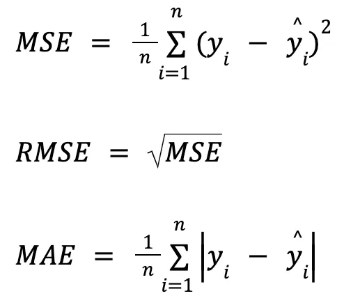
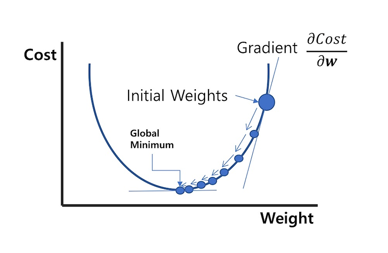
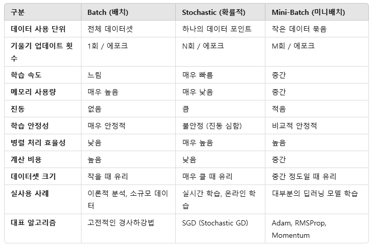

# [50일차] PyTorch 텐서와 자동 미분, 선형 회귀 구현

## 1. PyTorch란 무엇인가

PyTorch는 Python 기반의 오픈소스 딥러닝 프레임워크다. 다차원 배열인 텐서로 데이터를 표현하고, 자동 미분과 GPU 가속을 이용해 모델의 파라미터를 학습한다.

PyTorch는 코드를 실행하면서 계산 그래프를 만드는 동적 계산 그래프(dynamic computational graph) 방식을 사용한다. 따라서 일반적인 Python의 조건문·반복문을 모델 코드에 자연스럽게 사용할 수 있고, 실행 흐름을 확인하며 디버깅하기 좋다.

```bash
python -m pip install torch
```

딥러닝 학습의 기본 흐름은 다음과 같다.

```text
입력 텐서
  -> 모델의 순전파(forward)
  -> 예측값과 정답의 손실(loss) 계산
  -> 역전파(backward)로 기울기 계산
  -> 옵티마이저가 파라미터 업데이트
  -> 반복
```

---

## 2. 연산 장치 선택하기

딥러닝에서는 대량의 행렬 연산을 반복한다. GPU는 많은 연산을 병렬 처리할 수 있어 학습 속도를 높이는 데 유리하다.

```python
import torch

if torch.cuda.is_available():
    DEVICE = torch.device("cuda")
elif torch.backends.mps.is_available():
    DEVICE = torch.device("mps")
elif hasattr(torch, "xpu") and torch.xpu.is_available():
    DEVICE = torch.device("xpu")
else:
    DEVICE = torch.device("cpu")

print(DEVICE)
```

| 장치 | 주로 사용하는 환경 |
|---|---|
| `cuda` | NVIDIA GPU 환경 |
| `mps` | Apple Silicon Mac의 Metal GPU 환경 |
| `xpu` | 일부 Intel GPU 환경 |
| `cpu` | GPU를 사용할 수 없는 환경 |

노트북 실행 환경에서는 `mps`가 선택됐다.

```text
mps
```

텐서와 모델은 같은 장치에 있어야 연산할 수 있다.

```python
x = torch.tensor([[1.0, 2.0]])
x = x.to(DEVICE)

print(x.device)

# CPU로 다시 옮긴 뒤 NumPy 배열로 변환한다.
x_numpy = x.cpu().numpy()
```

GPU 텐서와 CPU 텐서를 그대로 더하거나 행렬 곱하면 장치 불일치 오류가 발생한다. 모델, 입력 텐서, 정답 텐서를 모두 같은 `DEVICE`로 옮기는 습관이 중요하다.

---

## 3. 텐서와 shape

텐서(tensor)는 PyTorch에서 사용하는 기본 데이터 구조다. NumPy 배열과 비슷하지만 GPU 연산과 자동 미분을 지원한다.

| 구분 | 예시 | shape | 의미 |
|---|---|---|---|
| 스칼라 | `torch.tensor(5)` | `[]` | 값 하나를 담는 0차원 텐서 |
| 벡터 | `torch.tensor([1, 2, 3])` | `[3]` | 원소 3개를 담는 1차원 텐서 |
| 행렬 | `torch.tensor([[1, 2], [3, 4]])` | `[2, 2]` | 2행 2열의 2차원 텐서 |
| 다차원 텐서 | 이미지·영상·배치 데이터 | 예: `[N, C, H, W]` | 축이 3개 이상인 데이터 |

```python
scalar = torch.tensor(5)
vector = torch.tensor([10, 20, 30])
matrix = torch.tensor([[1, 2], [3, 4]])

print(scalar.shape)  # torch.Size([])
print(vector.shape)  # torch.Size([3])
print(matrix.shape)  # torch.Size([2, 2])

print((scalar + torch.tensor(3)).item())  # 8
```

`torch.Size([3])`은 3차원이라는 뜻이 아니라, 길이 3인 **1차원** 텐서라는 뜻이다. 스칼라 텐서의 값을 Python 숫자로 꺼낼 때는 `item()`을 사용한다.



### 텐서와 NumPy 배열 변환

```python
import numpy as np

t1 = torch.tensor([5, 7])
array = t1.numpy()

print(array)        # [5 7]
print(type(array))  # <class 'numpy.ndarray'>

t2 = torch.from_numpy(array * 10)
print(t2)           # tensor([50, 70])
```

GPU 텐서는 바로 NumPy 배열로 바꿀 수 없다. 먼저 `cpu()`로 CPU에 옮겨야 한다.

```python
array = gpu_tensor.detach().cpu().numpy()
```

`detach()`는 자동 미분 계산 그래프에서 분리할 때 사용한다. 학습 중간 결과를 시각화하거나 NumPy·Pandas로 넘길 때 자주 사용한다.

---

## 4. 인덱싱과 기본 연산

PyTorch 텐서는 NumPy와 비슷한 방식으로 인덱싱과 슬라이싱을 지원한다.

```python
t1 = torch.tensor([
    [1, 2, 3, 4],
    [5, 6, 7, 8],
    [9, 10, 11, 12],
])

print(t1[0])       # 첫 번째 행
print(t1[:, 0])    # 첫 번째 열
print(t1[:, -1])   # 마지막 열
print(t1[..., -1]) # 앞의 모든 축을 유지한 마지막 축의 마지막 원소
```

```text
tensor([1, 2, 3, 4])
tensor([1, 5, 9])
tensor([ 4,  8, 12])
tensor([ 4,  8, 12])
```

`...`(ellipsis)는 앞쪽 축을 모두 포함한다는 뜻이다. 축 개수가 많은 텐서에서 마지막 축 또는 특정 축을 간결하게 선택할 때 유용하다.

### 원소별 연산과 행렬 곱

```python
a = torch.tensor([[1, 2], [3, 4]])
b = torch.tensor([[5, 6], [7, 8]])

print(a + b)
print(a * b)       # 같은 위치 원소끼리 곱한다.
print(a @ b)       # 행렬 곱이다.
print(torch.mm(a, b))
```

```text
a * b
tensor([[ 5, 12],
        [21, 32]])

a @ b
tensor([[19, 22],
        [43, 50]])
```

`*`는 원소별 곱이고 `@`, `torch.matmul()`, `torch.mm()`은 행렬 곱이다. 행렬 곱에서는 앞 행렬의 열 수와 뒤 행렬의 행 수가 같아야 한다.

### 축을 지정한 집계 연산

```python
t = torch.tensor([
    [1.0, 2.0, 3.0, 4.0],
    [5.0, 6.0, 7.0, 8.0],
])

print(t.mean())        # tensor(4.5000)
print(t.mean(dim=0))   # tensor([3., 4., 5., 6.])
print(t.mean(dim=1))   # tensor([2.5000, 6.5000])

print(t.sum(dim=0))    # 각 열의 합
print(t.argmax(dim=1)) # 각 행의 최댓값 인덱스
```

`dim=0`은 행 방향으로 값을 모아 열별 결과를 만들고, `dim=1`은 열 방향으로 값을 모아 행별 결과를 만든다.

---

## 5. dtype과 텐서 형태 변경

### dtype

딥러닝 모델의 가중치와 입력값은 보통 `float32`를 사용한다. 정수 텐서와 실수 텐서를 함께 연산하면 PyTorch는 필요한 경우 더 넓은 타입으로 변환한다.

```python
t1 = torch.tensor([2], dtype=torch.int32)
t2 = torch.tensor([5.0])

print(t1.dtype)  # torch.int32
print(t2.dtype)  # torch.float32
print(t1 + t2)   # tensor([7.])

print(t2.to(torch.int32))
```

### `view()`, `clone()`, `permute()`

```python
t1 = torch.tensor([1, 2, 3, 4, 5, 6, 7, 8])
t2 = t1.view(4, 2)

t1[0] = 7
print(t2)
```

```text
tensor([[7, 2],
        [3, 4],
        [5, 6],
        [7, 8]])
```

`view()`는 원소 순서를 유지한 채 모양만 바꾸며, 보통 원본 텐서와 메모리를 공유한다. 원본과 독립된 복사본이 필요하면 `clone()`을 사용한다.

```python
t3 = t1.clone().view(4, 2)
```

`permute()`는 축의 순서를 바꾼다.

```python
image_like = torch.rand((64, 32, 3))
changed = image_like.permute(2, 1, 0)

print(image_like.shape)  # torch.Size([64, 32, 3])
print(changed.shape)     # torch.Size([3, 32, 64])
```

이미지 데이터는 라이브러리에 따라 `[높이, 너비, 채널]` 또는 `[채널, 높이, 너비]` 형식을 요구하므로 `permute()`가 자주 필요하다.

### `unsqueeze()`와 `squeeze()`

```python
t = torch.tensor([
    [1.0, 2.0, 3.0, 4.0],
    [5.0, 6.0, 7.0, 8.0],
])

print(t.shape)                 # torch.Size([2, 4])
print(t.unsqueeze(0).shape)    # torch.Size([1, 2, 4])
print(t.unsqueeze(-1).shape)   # torch.Size([2, 4, 1])
```

`unsqueeze(dim)`은 크기가 1인 축을 추가한다. 반대로 `squeeze(dim)`은 해당 축의 크기가 1일 때만 제거한다. 배치 축을 하나 추가하거나 모델 입력 형태를 맞출 때 사용한다.

---

## 6. 자동 미분과 역전파

PyTorch의 `autograd`는 연산 과정을 기록하고 미분값을 자동으로 계산한다. 미분이 필요한 텐서는 `requires_grad=True`로 만든다.

```python
x = torch.tensor(3.0, requires_grad=True)
y = x ** 2

y.backward()

print("x:", x)
print("y:", y)
print("dy/dx:", x.grad)
```

```text
x: tensor(3., requires_grad=True)
y: tensor(9., grad_fn=<PowBackward0>)
dy/dx: tensor(6.)
```

수식 `y = x^2`의 미분은 `dy/dx = 2x`다. `x=3`에서 기울기는 6이므로 `x.grad`에 `tensor(6.)`이 저장된다.

```text
순전파: x = 3 -> y = x^2 = 9
역전파: y -> dy/dx = 2x -> x = 3에서 6
```

`backward()`를 여러 번 호출하면 기본적으로 기울기가 누적된다. 학습 루프에서는 다음 반복 전에 `optimizer.zero_grad()`로 기존 기울기를 비워야 한다.

---

## 7. 단항 선형 회귀 모델 만들기

단항 선형 회귀는 입력 `x` 하나로 결과 `y` 하나를 예측한다. 모델은 다음 직선 식을 학습한다.

```text
y = Wx + b
```

| 기호 | 의미 |
|---|---|
| `W` | 기울기(weight) |
| `b` | 절편(bias) |
| `x` | 입력값 |
| `y` | 예측값 또는 정답값 |

예제 데이터는 `y = 2x` 관계를 가진다.

```python
import torch
import torch.nn as nn
import torch.optim as optim
import matplotlib.pyplot as plt

torch.manual_seed(2026)

x_train = torch.tensor([[1.0], [2.0], [3.0]])
y_train = torch.tensor([[2.0], [4.0], [6.0]])

print(x_train.shape)  # torch.Size([3, 1])
print(y_train.shape)  # torch.Size([3, 1])
```

각 행은 샘플 하나를 의미한다. `[3, 1]`은 샘플 3개와 입력 피처 1개라는 뜻이다.



### `nn.Linear(1, 1)`

```python
model = nn.Linear(1, 1)

prediction = model(x_train)

print(model)
print(list(model.parameters()))
```

```text
Linear(in_features=1, out_features=1, bias=True)
```

`nn.Linear(1, 1)`은 입력 피처 수가 1개이고 출력 피처 수가 1개인 선형 레이어다. 내부적으로 학습 가능한 `weight`와 `bias`, 즉 `W`와 `b`를 자동으로 만든다. 초기 파라미터는 무작위이므로 학습 전 예측값은 정답과 다르다.

---

## 8. 손실 함수와 경사 하강법

### 평균 제곱 오차(MSE)

회귀 문제에서는 실제값과 예측값 차이의 제곱 평균인 평균 제곱 오차(Mean Squared Error)를 자주 사용한다.

```text
MSE = ((예측값 - 실제값)^2)의 평균
```

```python
prediction = model(x_train)

# 직접 계산
manual_loss = ((prediction - y_train) ** 2).mean()

# PyTorch 손실 함수 사용
criterion = nn.MSELoss()
loss = criterion(prediction, y_train)

print(manual_loss)
print(loss)
```

노트북 초기 실행에서는 손실이 약 `39.49`였다. 모델은 이 손실을 작게 만드는 `W`, `b`를 찾아야 한다.



### SGD 옵티마이저

확률적 경사 하강법(SGD)은 손실의 기울기 반대 방향으로 파라미터를 갱신한다.

```text
새 파라미터 = 기존 파라미터 - 학습률 x 기울기
```

```python
optimizer = optim.SGD(
    model.parameters(),
    lr=0.01,
)
```

`lr`은 학습률(learning rate)이다. 학습률이 너무 크면 최솟값 주변에서 진동하거나 발산할 수 있고, 너무 작으면 학습이 지나치게 느려진다.





| 방식 | 한 번의 업데이트에 사용하는 데이터 |
|---|---|
| Batch Gradient Descent | 전체 데이터 |
| Stochastic Gradient Descent | 샘플 1개 |
| Mini-batch Gradient Descent | 작은 묶음(batch) |

실무 딥러닝에서는 메모리 사용량과 학습 안정성을 고려해 미니배치 방식을 가장 많이 사용한다.

---

## 9. 학습 루프: zero_grad, backward, step

PyTorch의 기본 학습 루프는 다음 순서를 따른다.

```python
epochs = 1000
criterion = nn.MSELoss()
optimizer = optim.SGD(model.parameters(), lr=0.01)

for epoch in range(epochs + 1):
    # 1. 순전파: 현재 W, b로 예측한다.
    prediction = model(x_train)

    # 2. 정답과 비교해 손실을 계산한다.
    loss = criterion(prediction, y_train)

    # 3. 이전 반복에서 누적된 기울기를 비운다.
    optimizer.zero_grad()

    # 4. 손실을 W, b에 대해 미분한다.
    loss.backward()

    # 5. 기울기와 학습률을 이용해 W, b를 갱신한다.
    optimizer.step()

    if epoch % 100 == 0:
        print(
            f"Epoch: {epoch}/{epochs} "
            f"Loss: {loss.item():.6f}"
        )
```

### 실행 결과

```text
Epoch: 0/1000 Loss: 31.224558
Epoch: 100/1000 Loss: 0.029433
Epoch: 200/1000 Loss: 0.018188
Epoch: 500/1000 Loss: 0.004292
Epoch: 1000/1000 Loss: 0.000387
```

손실이 반복할수록 거의 0에 가까워진다. 이는 모델이 `y = 2x` 관계에 가까운 직선을 찾고 있다는 뜻이다.

학습이 끝난 파라미터는 다음과 같았다.

```text
weight: 1.9772
bias:   0.0518
```

정답 식의 `W=2`, `b=0`에 매우 가까워졌다. 데이터가 적고 학습 횟수가 유한하므로 정확히 같은 값이 아닌 것은 자연스럽다.

---

## 10. 학습한 모델로 예측하기

학습한 모델에 `x=5`를 넣으면 결과는 약 10이 되어야 한다.

```python
model.eval()

with torch.no_grad():
    x_test = torch.tensor([[5.0]])
    y_prediction = model(x_test)

print(y_prediction)
```

```text
tensor([[9.9379]])
```

`model.eval()`은 Dropout, Batch Normalization처럼 학습과 추론 동작이 다른 레이어를 평가 모드로 전환한다. 이 단순 선형 모델에서는 동작 차이가 없지만, 추론 전에 호출하는 습관이 좋다.

`torch.no_grad()`는 예측 과정에서 기울기를 계산하지 않도록 해 메모리 사용량을 줄이고 불필요한 계산 그래프 생성을 막는다.

입력 shape도 학습 때와 동일하게 맞춰야 한다. 이 모델은 `[샘플 수, 1]` 형태를 기대하므로 `[[5.0]]`처럼 2차원 텐서를 전달하는 방식이 가장 명확하다.

---

## 11. 핵심 정리

- 텐서는 PyTorch의 기본 데이터 구조이며, `shape`, `dtype`, `device`를 함께 확인해야 한다.
- GPU를 사용할 때는 모델·입력·정답 텐서를 모두 같은 장치로 옮겨야 한다.
- `requires_grad=True`와 `backward()`를 사용하면 PyTorch가 계산 그래프를 따라 기울기를 자동으로 계산한다.
- `nn.Linear(1, 1)`은 `y = Wx + b` 형태의 단항 선형 회귀 모델을 만든다.
- 회귀 문제에서는 MSE 손실을 사용해 예측값과 실제값의 차이를 측정할 수 있다.
- 학습 루프는 `forward -> loss -> zero_grad -> backward -> step` 순서로 구성한다.
- SGD는 기울기와 학습률을 이용해 파라미터를 조금씩 업데이트한다.
- 학습이 끝난 뒤에는 `model.eval()`과 `torch.no_grad()`로 추론 모드에서 예측한다.
