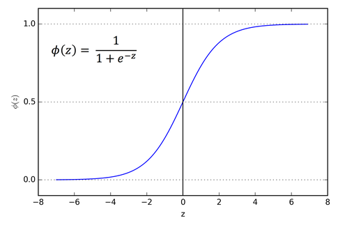
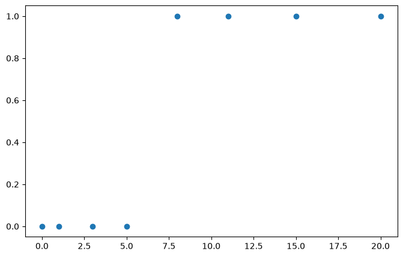
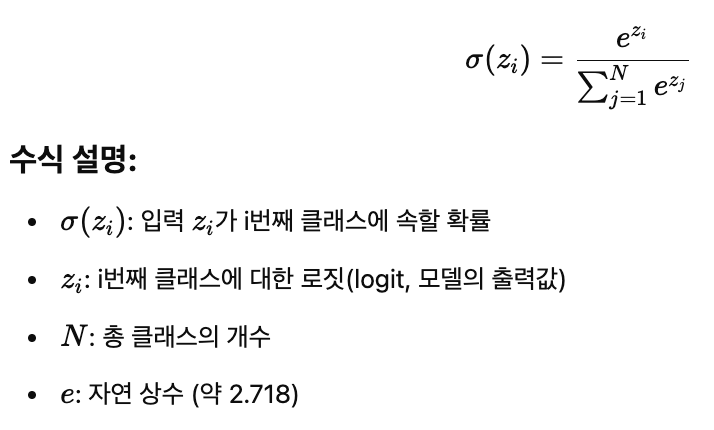
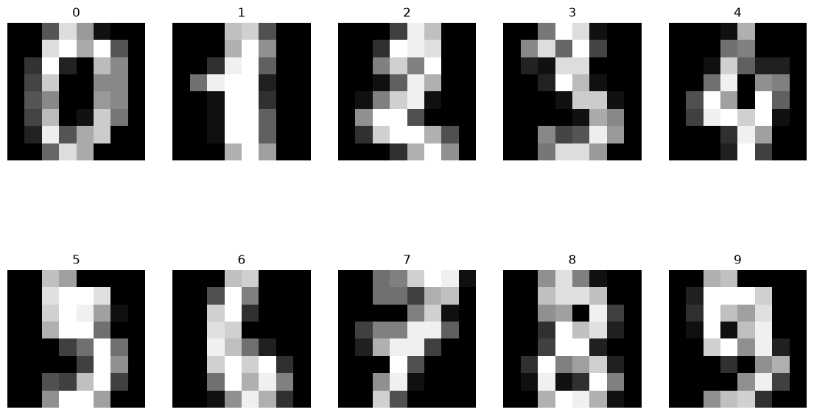
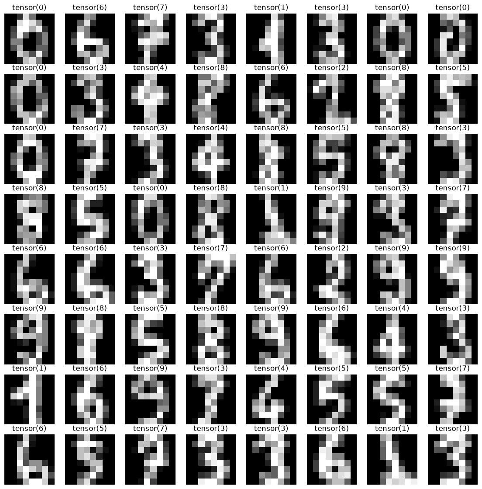

# [51일차] PyTorch 논리 회귀와 손글씨 숫자 데이터셋

## 1. 분류 문제와 논리 회귀

논리 회귀(Logistic Regression)는 입력값을 바탕으로 클래스에 속할 확률을 예측하는 지도학습 모델이다. 이름에 회귀가 들어가지만, 주로 분류 문제에 사용한다.

| 문제 유형 | 예측 대상 | 예시 |
|---|---|---|
| 이진 분류 | 두 클래스 중 하나 | 합격/불합격, 스팸/정상, 취소/유지 |
| 다중 분류 | 세 클래스 이상 중 하나 | A/B/C 등급, 숫자 0~9, 이미지 종류 |

선형 회귀는 연속적인 값을 예측하지만, 논리 회귀는 선형 결합 결과를 확률로 바꾼 뒤 클래스를 결정한다.

```text
선형 결합(logit) -> 활성화 함수 -> 확률 또는 클래스 점수 -> 예측 클래스
```

---

## 2. logit과 시그모이드 함수

이진 분류 모델은 먼저 입력값의 가중합인 logit을 계산한다.

```text
z = W1x1 + W2x2 + ... + Wnxn + b
```

```python
import torch
import torch.nn as nn

x = torch.tensor([1.0, 2.0, 3.0])
w = torch.tensor([0.1, 0.2, 0.3])
b = torch.tensor(0.5)

z = torch.dot(w, x) + b
print(z)  # tensor(1.9000)
```

logit은 음의 무한대부터 양의 무한대까지 어떤 값이든 될 수 있다. 따라서 그대로는 클래스 1일 확률로 해석하기 어렵다. 시그모이드(sigmoid) 함수로 `0`과 `1` 사이의 값으로 변환한다.

```text
sigmoid(z) = 1 / (1 + e^(-z))
```

```python
probability = torch.sigmoid(z)
print(probability)  # tensor(0.8699)
```



| logit | sigmoid 결과 | 해석 |
|---:|---:|---|
| -3.0 | 0.0474 | 클래스 1일 가능성이 매우 낮다. |
| 0.0 | 0.5000 | 두 클래스 경계에 가깝다. |
| 2.0 | 0.8808 | 클래스 1일 가능성이 높다. |
| 5.0 | 0.9933 | 클래스 1일 가능성이 매우 높다. |

시그모이드는 단순히 수의 범위를 줄이는 함수가 아니다. 이진 분류의 logit을 클래스 1에 대한 확률처럼 해석할 수 있는 값으로 바꿔준다.

---

## 3. 단항 논리 회귀 구현


```python
import torch.optim as optim
import matplotlib.pyplot as plt

torch.manual_seed(2026)

x_train = torch.tensor([
    [0.0], [1.0], [3.0], [5.0],
    [8.0], [11.0], [15.0], [20.0],
])
y_train = torch.tensor([
    [0.0], [0.0], [0.0], [0.0],
    [1.0], [1.0], [1.0], [1.0],
])

print(x_train.shape)  # torch.Size([8, 1])
print(y_train.shape)  # torch.Size([8, 1])
```



모델은 `Linear` 레이어로 logit을 만든 뒤 `Sigmoid`로 확률을 만든다.

```python
model = nn.Sequential(
    nn.Linear(1, 1),
    nn.Sigmoid(),
)

prediction = model(x_train)
print(prediction)
```

```text
입력 [N, 1]
  -> Linear(1, 1)
  -> logit [N, 1]
  -> Sigmoid()
  -> 확률 [N, 1]
```

---

## 4. BCE 손실 함수와 학습

이진 분류에서는 예측 확률과 실제 레이블의 차이를 Binary Cross Entropy(BCE)로 계산한다.

```text
BCE = -[y log(p) + (1 - y) log(1 - p)]의 평균
```

- 실제값이 1일 때 예측 확률 `p`가 1에 가까우면 손실이 작아진다.
- 실제값이 0일 때 예측 확률 `p`가 0에 가까우면 손실이 작아진다.
- 확신을 갖고 틀린 예측을 하면 손실이 크게 증가한다.


```python
criterion = nn.BCELoss()
optimizer = optim.SGD(model.parameters(), lr=0.01)

epochs = 1000

for epoch in range(epochs + 1):
    # 순전파: 확률 예측
    prediction = model(x_train)

    # BCE 손실 계산
    loss = criterion(prediction, y_train)

    # 이전 기울기를 비우고 역전파한다.
    optimizer.zero_grad()
    loss.backward()
    optimizer.step()

    if epoch % 100 == 0:
        print(
            f"Epoch: {epoch}/{epochs} "
            f"Loss: {loss.item():.6f}"
        )
```

### 실행 결과

```text
Epoch: 0/1000 Loss: 5.043980
Epoch: 100/1000 Loss: 0.395748
Epoch: 500/1000 Loss: 0.303868
Epoch: 1000/1000 Loss: 0.240065
```

손실이 감소하면서 모델이 0과 1의 경계를 학습한다. 학습 뒤 `x=10`의 예측 확률은 약 `0.8531`이다.

```python
x_test = torch.tensor([[10.0]])
probability = model(x_test)

print(probability)  # tensor([[0.8531]])
```

### 확률을 클래스로 바꾸는 임계값

```python
prediction_class = (probability >= 0.5).float()
print(prediction_class)  # tensor([[1.]])
```

기본 임계값은 0.5지만 항상 최선은 아니다. 클래스 1을 놓치는 비용이 크면 임계값을 낮춰 재현율을 높이고, 잘못된 클래스 1 예측의 비용이 크면 임계값을 높여 정밀도를 높이는 방향을 검토한다.

### `BCELoss`와 `BCEWithLogitsLoss`

노트북 코드는 `Sigmoid`를 모델 안에 넣고 `BCELoss`를 사용한다. 학습 목적에는 올바른 조합이다.

실무에서는 수치 안정성을 위해 `Sigmoid`를 모델에서 빼고 `BCEWithLogitsLoss`를 사용하는 경우가 많다. 이 손실 함수는 내부에서 안정적인 방식으로 sigmoid와 BCE 계산을 처리한다.

```python
model = nn.Linear(1, 1)  # Sigmoid를 넣지 않는다.
criterion = nn.BCEWithLogitsLoss()

logit = model(x_train)
loss = criterion(logit, y_train)

# 확률이 필요할 때만 sigmoid를 적용한다.
probability = torch.sigmoid(logit)
```

---

## 5. 다중 분류와 softmax

다중 클래스 분류에서는 각 클래스마다 하나의 logit을 계산한다. 예를 들어 성적과 출석 정보를 바탕으로 C·B·A 등급을 예측한다면 클래스 수는 3개다.

```python
x_train = torch.tensor([
    [55, 58, 60, 70],
    [60, 62, 65, 75],
    [63, 65, 67, 78],
    [72, 74, 75, 85],
    [75, 78, 80, 88],
    [80, 82, 81, 90],
    [88, 90, 91, 95],
    [92, 94, 93, 97],
    [95, 96, 98, 98],
    [98, 99, 100, 100],
], dtype=torch.float32)

# 0: C, 1: B, 2: A
y_train = torch.tensor(
    [0, 0, 0, 1, 1, 1, 2, 2, 2, 2],
    dtype=torch.long,
)

print(x_train.shape)  # torch.Size([10, 4])
print(y_train.shape)  # torch.Size([10])
```

모델 출력은 클래스 3개에 대한 logit이다.

```python
model = nn.Linear(4, 3)
logits = model(x_train)

print(logits.shape)  # torch.Size([10, 3])
```

softmax는 3개 logit을 합이 1인 확률 분포로 바꾼다.

```text
softmax(zi) = exp(zi) / Σ exp(zj)
```



```python
probabilities = torch.softmax(logits, dim=1)
print(probabilities.sum(dim=1))
```

각 행은 샘플 하나이고, 각 행의 세 확률 합은 1이다.

---

## 6. CrossEntropyLoss 사용법

다중 분류에서는 `nn.CrossEntropyLoss()`를 사용한다. 이 함수는 내부적으로 softmax와 로그 연산을 포함하므로, 모델 출력에 별도로 `Softmax`를 붙이면 안 된다.

```python
model = nn.Linear(4, 3)
criterion = nn.CrossEntropyLoss()
optimizer = optim.SGD(model.parameters(), lr=0.01)

for epoch in range(10_001):
    # 확률이 아닌 logit을 그대로 전달한다.
    logits = model(x_train)
    loss = criterion(logits, y_train)

    optimizer.zero_grad()
    loss.backward()
    optimizer.step()
```

| 항목 | 이진 분류 | 다중 분류 |
|---|---|---|
| 모델의 마지막 출력 | logit 1개 | 클래스 수만큼의 logit |
| 일반적인 손실 | `BCEWithLogitsLoss` | `CrossEntropyLoss` |
| 타깃 dtype | `float32` | `long` |
| 타깃 shape | 보통 `[N, 1]` | 보통 `[N]` |
| 예측 확률 변환 | `sigmoid()` | `softmax(dim=1)` |

노트북의 작은 성적 데이터는 10,000회 학습 후 손실 약 `0.000296`까지 감소했다. 그러나 샘플이 10개뿐인 예제이므로 일반화 성능을 의미하지 않으며, 학습 데이터를 거의 외운 결과일 수 있다.

### 다중 분류 예측

```python
x_test = torch.tensor(
    [[90.0, 91.0, 92.0, 93.0]]
)

logits = model(x_test)
probabilities = torch.softmax(logits, dim=1)
prediction_class = torch.argmax(probabilities, dim=1)

print(probabilities)
print(prediction_class)
```

```text
tensor([[0.00, 0.00, 1.00]])
tensor([2])
```

클래스 `2`는 A 등급을 뜻한다. `argmax(dim=1)`은 각 샘플 행에서 가장 큰 확률의 인덱스를 찾는다.

---

## 7. 손글씨 숫자 데이터셋: scikit-learn Digits

`load_digits()`는 scikit-learn에 포함된 손글씨 숫자 데이터셋이다. MNIST와 달리 이미지 크기가 `8 x 8`이고, 총 1,797개 샘플을 가진다.

```python
from sklearn.datasets import load_digits

digits = load_digits()

X_data = digits["data"]
y_data = digits["target"]

print(X_data.shape)  # (1797, 64)
print(y_data.shape)  # (1797,)
```

| 항목 | 값 |
|---|---|
| 샘플 수 | 1,797개 |
| 클래스 | 0~9, 총 10개 |
| 원본 이미지 크기 | `8 x 8` 픽셀 |
| 모델 입력 형태 | 이미지 1장을 펼친 64개 피처 |
| 픽셀 명암값 | 0~16 |

`digits.data`는 각 `8 x 8` 이미지를 64개 숫자로 펼친 2차원 배열이다. 시각화할 때는 다시 `8 x 8`로 바꾼다.

```python
import matplotlib.pyplot as plt

fig, axes = plt.subplots(2, 5, figsize=(14, 8))

for index, ax in enumerate(axes.flatten()):
    ax.imshow(
        X_data[index].reshape(8, 8),
        cmap="gray",
    )
    ax.set_title(y_data[index])
    ax.axis("off")
```



`axes.flatten()`은 2차원으로 만든 subplot 배열을 1차원으로 펼친다. 따라서 행과 열을 따로 계산하지 않고 각 축을 반복문에서 순서대로 사용할 수 있다.

---

## 8. 텐서 변환과 학습·테스트 분할

PyTorch 모델에 넣기 위해 입력 데이터는 `float32`, 다중 분류 레이블은 `long` 텐서로 변환한다.

```python
import torch
from sklearn.model_selection import train_test_split

X_data = torch.tensor(X_data, dtype=torch.float32)
y_data = torch.tensor(y_data, dtype=torch.long)

x_train, x_test, y_train, y_test = train_test_split(
    X_data,
    y_data,
    test_size=0.2,
    random_state=2026,
)

print(x_train.shape, y_train.shape)
print(x_test.shape, y_test.shape)
```

```text
torch.Size([1437, 64]) torch.Size([1437])
torch.Size([360, 64]) torch.Size([360])
```

`CrossEntropyLoss`는 클래스 번호 레이블을 `long` 타입으로 받는다. 이미지 픽셀은 계산에 사용하는 값이므로 `float32` 타입으로 변환한다.

분류 문제에서 클래스 비율을 학습·테스트 데이터에 비슷하게 유지하려면 `train_test_split(..., stratify=y_data)`를 추가로 고려할 수 있다.

---

## 9. DataLoader로 미니배치 만들기

전체 1,437개 학습 샘플을 한 번에 모델에 넣는 대신, `DataLoader`로 64개씩 묶어 전달한다.

```python
from torch.utils.data import DataLoader

train_dataset = list(zip(x_train, y_train))

loader = DataLoader(
    dataset=train_dataset,
    batch_size=64,
    shuffle=True,
    drop_last=False,
)

images, labels = next(iter(loader))

print(images.shape)  # torch.Size([64, 64])
print(labels.shape)  # torch.Size([64])
```

| 옵션 | 역할 |
|---|---|
| `batch_size=64` | 한 번의 학습 단계에서 샘플 64개를 사용한다. |
| `shuffle=True` | 매 epoch마다 학습 데이터 순서를 섞어 순서 편향을 줄인다. |
| `drop_last=False` | 마지막 배치가 64개보다 작아도 버리지 않는다. |



`next(iter(loader))`는 DataLoader에서 첫 번째 배치를 꺼낸다. 실제 학습에서는 다음처럼 전체 배치를 반복한다.

```python
for images, labels in loader:
    # images: [batch_size, 64]
    # labels: [batch_size]
    # 모델 예측, 손실 계산, 역전파, 업데이트를 수행한다.
    pass
```

데이터가 커질수록 리스트와 `zip()` 대신 `TensorDataset` 또는 사용자 정의 `Dataset` 클래스를 사용해 데이터를 관리하는 방식이 더 적합하다.

---

## 10. 핵심 정리

- 이진 논리 회귀는 logit에 sigmoid를 적용해 클래스 1의 확률을 구한다.
- 이진 분류에서는 `BCELoss` 또는 수치적으로 더 안정적인 `BCEWithLogitsLoss`를 사용한다.
- 다중 분류 모델은 클래스 수만큼의 logit을 출력하고, `CrossEntropyLoss`에는 softmax 전의 logit을 전달한다.
- `softmax`는 예측 결과를 확률로 확인할 때 사용하며, `argmax(dim=1)`은 가장 높은 확률의 클래스를 선택한다.
- 손글씨 숫자 데이터셋은 1,797개의 `8 x 8` 이미지이며, 모델 입력에는 각 이미지를 펼친 64개 피처를 사용한다.
- PyTorch의 DataLoader는 데이터를 미니배치로 나누고, 셔플과 반복 처리를 담당한다.
