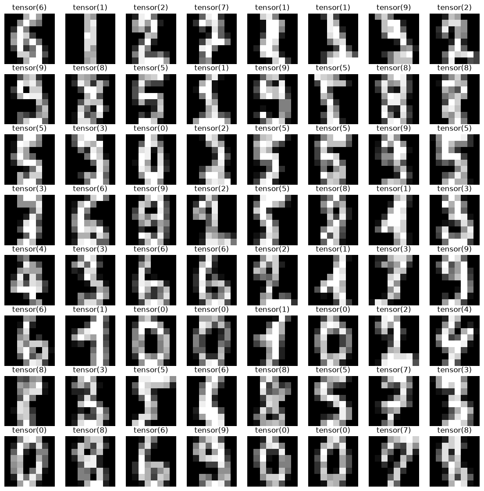
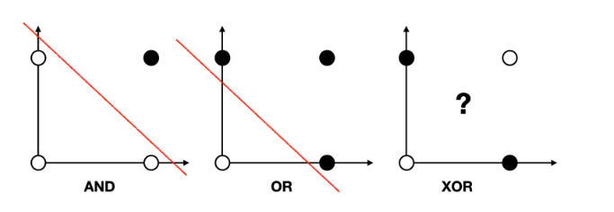
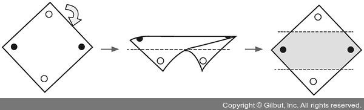
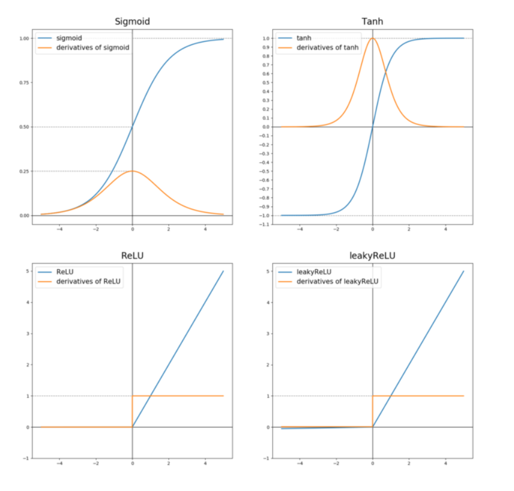
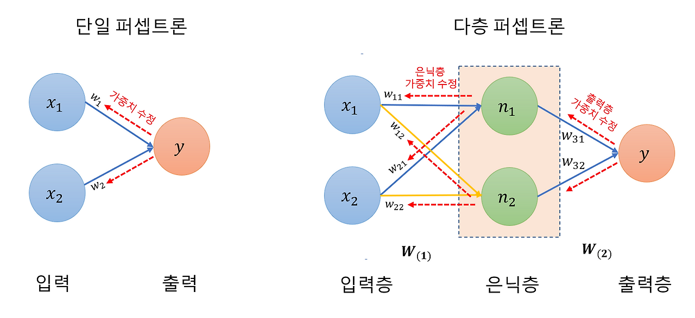

# [52일차] 데이터 증강과 퍼셉트론, 다층 퍼셉트론

---

## 1. 데이터 증강이 필요한 이유

데이터 증강(Data Augmentation)은 기존 학습 데이터를 조금씩 변형하여, 모델이 더 다양한 입력을 경험하도록 만드는 방법이다. 새 레이블을 만들지 않아도 회전, 이동, 확대·축소, 밝기 변화 같은 변형으로 학습 데이터의 다양성을 높일 수 있다.

손글씨 숫자 `3`은 사람마다 기울기와 크기가 다르다. 원본 모양만 학습한 모델은 약간 기울어진 숫자를 낯선 데이터로 받아들일 수 있다. 학습 단계에서 비슷한 변형을 보여주면 모델은 특정 픽셀 모양을 외우는 대신 숫자의 공통 특징을 학습하는 데 도움을 받는다.

```text
원본 숫자 이미지
  -> 작은 회전 / 기울임 / 확대·축소
  -> 다양한 모양의 학습 샘플
  -> 처음 보는 입력에도 더 잘 예측하는 모델
```

> 데이터 증강은 **학습 데이터에만** 적용한다. 테스트 데이터까지 변형하면 실제 성능을 공정하게 측정하기 어렵다.

---

## 2. TensorDataset으로 데이터 묶기

`TensorDataset`은 입력 텐서와 정답 텐서를 하나의 데이터셋처럼 관리하는 도구다. 같은 인덱스의 `X_train[i]`와 `y_train[i]`를 한 쌍으로 꺼낼 수 있다.

```python
from sklearn.model_selection import train_test_split
from torch.utils.data import TensorDataset

X_train, X_test, y_train, y_test = train_test_split(
    X_data,
    y_data,
    test_size=0.2,
    random_state=2026,
)

train_dataset = TensorDataset(X_train, y_train)
test_dataset = TensorDataset(X_test, y_test)

image, label = train_dataset[0]
print(image.shape)  # torch.Size([64])
print(label)        # 예: tensor(0)
```

`digits` 데이터셋의 한 이미지는 원래 `8 x 8` 픽셀이지만, 선형 레이어에 넣기 위해 64개 값으로 펼친 상태다. 증강을 적용하려면 잠시 다시 이미지 형태로 바꿔야 한다.

---

## 3. `transforms.Compose`로 변환 연결하기

`torchvision.transforms.Compose`는 여러 변환을 작성한 순서대로 적용한다. 아래 설정은 이미지를 무작위로 최대 10도 회전하고, 기울임과 확대·축소를 적용한다.

```python
from torchvision import transforms

transform = transforms.Compose([
    transforms.RandomRotation(10),
    transforms.RandomAffine(0, shear=5, scale=(0.9, 1.1)),
])
```

| 변환 | 역할 |
|---|---|
| `RandomRotation(10)` | 매번 `-10`도부터 `+10`도 사이로 무작위 회전한다. |
| `RandomAffine(0, shear=5, scale=(0.9, 1.1))` | 회전 없이 최대 5도 기울이고, 0.9배~1.1배 크기로 바꾼다. |
| `Compose([...])` | 여러 변환을 하나의 변환 파이프라인으로 묶는다. |

변환의 강도를 지나치게 높이면 숫자 자체가 알아보기 어렵게 변할 수 있다. 따라서 실제 데이터에서 자연스럽게 발생할 수 있는 범위를 정해 적용해야 한다.

---

## 4. 사용자 정의 `Dataset`으로 증강 적용하기

`Dataset`을 상속하면 데이터를 꺼내는 순간마다 원하는 전처리나 증강을 적용할 수 있다. 아래 클래스는 64개 값으로 펼쳐진 숫자를 `8 x 8` 이미지로 되돌리고, 채널 차원을 추가한 뒤 변환을 적용한다. 이후 모델 입력에 맞게 다시 64개 값으로 펼친다.

```python
from torch.utils.data import Dataset


class AugmentedDataset(Dataset):
    def __init__(self, dataset, transform):
        self.dataset = dataset
        self.transform = transform

    def __len__(self):
        # 데이터셋의 전체 샘플 수를 반환한다.
        return len(self.dataset)

    def __getitem__(self, index):
        # index 위치의 입력 이미지와 레이블을 가져온다.
        x, y = self.dataset[index]

        # [64] -> [1, 8, 8]
        # 1은 흑백 이미지의 채널 수다.
        x = x.view(8, 8).unsqueeze(0)

        # 학습 데이터를 꺼낼 때마다 증강을 적용한다.
        x = self.transform(x)

        # 선형 레이어 입력 형태인 [64]로 다시 펼친다.
        return x.flatten(), y


augmented_train_dataset = AugmentedDataset(
    train_dataset,
    transform,
)
```

| 메서드 | 역할 |
|---|---|
| `__len__()` | `len(dataset)` 호출 시 전체 샘플 수를 반환한다. |
| `__getitem__(index)` | `dataset[index]` 호출 시 입력과 레이블 한 쌍을 반환한다. |
| `view(8, 8)` | 64개 픽셀을 8행 8열 이미지로 바꾼다. |
| `unsqueeze(0)` | 변환 함수가 기대하는 채널 축을 추가해 `[1, 8, 8]`로 만든다. |
| `flatten()` | 선형 레이어 입력을 위해 다시 1차원 64개 값으로 만든다. |

```python
from torch.utils.data import DataLoader

train_loader = DataLoader(
    augmented_train_dataset,
    batch_size=64,
    shuffle=True,
)

test_loader = DataLoader(
    test_dataset,
    batch_size=64,
    shuffle=False,
)

images, labels = next(iter(train_loader))

print(images.shape)  # torch.Size([64, 64])
print(labels.shape)  # torch.Size([64])
```



같은 인덱스의 데이터라도 학습 중 다시 꺼낼 때마다 무작위 변형 결과가 달라질 수 있다. 이 점이 파일을 복사해 데이터를 고정적으로 늘리는 방식과 다른 특징이다.

---

## 5. 퍼셉트론: 가장 단순한 인공 뉴런

퍼셉트론(Perceptron)은 입력값에 가중치를 곱해 더한 뒤 편향을 더하고, 활성화 함수로 결과를 출력하는 가장 기본적인 신경망 모델이다.

```text
입력 x1, x2
  -> 가중합 z = w1x1 + w2x2 + b
  -> 활성화 함수
  -> 예측값
```

PyTorch에서는 아래처럼 `nn.Linear(2, 1)`과 `nn.Sigmoid()`를 결합해 이진 분류용 단층 퍼셉트론을 표현할 수 있다.

```python
import torch
import torch.nn as nn
import torch.optim as optim

model = nn.Sequential(
    nn.Linear(2, 1),
    nn.Sigmoid(),
)
```

`nn.Linear(2, 1)`은 입력 2개를 받아 하나의 logit을 계산한다. `Sigmoid`는 이를 0~1 사이의 확률 형태로 바꾼다. 이 구조는 51일차의 이진 논리 회귀와 같은 형태이며, 단층 퍼셉트론으로 볼 수 있다.



---

## 6. AND와 OR: 선형 분리가 가능한 문제

AND와 OR의 입력·정답은 다음과 같다.

| x1 | x2 | AND | OR |
|---:|---:|---:|---:|
| 0 | 0 | 0 | 0 |
| 0 | 1 | 0 | 1 |
| 1 | 0 | 0 | 1 |
| 1 | 1 | 1 | 1 |

두 문제는 2차원 평면에서 직선 하나로 0과 1을 나눌 수 있다. 이런 문제를 **선형 분리 가능(linearly separable)** 하다고 한다. 따라서 단층 퍼셉트론으로 학습할 수 있다.

```python
# AND 문제
X = torch.FloatTensor([
    [0, 0], [0, 1], [1, 0], [1, 1],
])
y = torch.FloatTensor([
    [0], [0], [0], [1],
])

model = nn.Sequential(
    nn.Linear(2, 1),
    nn.Sigmoid(),
)

criterion = nn.BCELoss()
optimizer = optim.SGD(model.parameters(), lr=1)

for epoch in range(1_001):
    y_pred = model(X)
    loss = criterion(y_pred, y)

    optimizer.zero_grad()
    loss.backward()
    optimizer.step()

    if epoch % 100 == 0:
        predicted = (y_pred >= 0.5).float()
        accuracy = (predicted == y).float().mean() * 100
        print(
            f"Epoch {epoch:4d}/1000 "
            f"Loss: {loss.item():.6f} "
            f"Accuracy: {accuracy:.2f}%"
        )
```

```text
Epoch    0/1000 Loss: ... Accuracy: ...%
...
Epoch 1000/1000 Loss: ... Accuracy: 100.00%
```

초기 가중치가 무작위이므로 첫 손실값은 실행마다 달라질 수 있다. 다만 충분히 학습되면 AND와 OR는 보통 100% 정확도로 분류한다.

---

## 7. XOR: 단층 퍼셉트론의 한계

XOR은 두 입력이 서로 다를 때만 1을 출력한다.

| x1 | x2 | XOR |
|---:|---:|---:|
| 0 | 0 | 0 |
| 0 | 1 | 1 |
| 1 | 0 | 1 |
| 1 | 1 | 0 |

XOR에서는 1인 점이 대각선 방향으로 떨어져 있다. 직선 하나만으로 두 클래스 전체를 나눌 수 없으므로 단층 퍼셉트론은 XOR을 완벽하게 학습할 수 없다.

```python
# XOR 문제를 단층 퍼셉트론으로 학습한다.
X = torch.FloatTensor([
    [0, 0], [0, 1], [1, 0], [1, 1],
])
y = torch.FloatTensor([
    [0], [1], [1], [0],
])

model = nn.Sequential(
    nn.Linear(2, 1),
    nn.Sigmoid(),
)
```

이 코드는 실행은 되지만, 단층 구조는 직선 하나의 결정 경계만 만들 수 있으므로 정확도가 100%에 도달하지 못한다. 이 문제가 은닉층과 비선형 활성화 함수가 필요한 이유를 잘 보여준다.

---

## 8. 다층 퍼셉트론(MLP)으로 XOR 해결하기

다층 퍼셉트론(Multi-Layer Perceptron, MLP)은 입력층과 출력층 사이에 하나 이상 은닉층을 둔 신경망이다. 은닉층의 뉴런들은 입력을 서로 다른 방식으로 변환해 새로운 특징을 만들고, 출력층은 이 특징을 조합해 최종 예측을 수행한다.

```text
입력층 [x1, x2]
    -> 은닉층 Linear(2, 2) + Sigmoid
    -> 출력층 Linear(2, 1) + Sigmoid
    -> 이진 예측값
```

```python
model = nn.Sequential(
    nn.Linear(2, 2),  # 입력 2개 -> 은닉 뉴런 2개
    nn.Sigmoid(),     # 비선형 변환
    nn.Linear(2, 1),  # 은닉 뉴런 2개 -> 출력 1개
    nn.Sigmoid(),     # 이진 분류 확률
)

print(model)
```

```text
Sequential(
  (0): Linear(in_features=2, out_features=2, bias=True)
  (1): Sigmoid()
  (2): Linear(in_features=2, out_features=1, bias=True)
  (3): Sigmoid()
)
```

이제 같은 XOR 데이터를 학습한다.

```python
X = torch.FloatTensor([
    [0, 0], [0, 1], [1, 0], [1, 1],
])
y = torch.FloatTensor([
    [0], [1], [1], [0],
])

criterion = nn.BCELoss()
optimizer = optim.SGD(model.parameters(), lr=1)

for epoch in range(1_001):
    y_pred = model(X)
    loss = criterion(y_pred, y)

    optimizer.zero_grad()
    loss.backward()
    optimizer.step()

    if epoch % 100 == 0:
        predicted = (y_pred >= 0.5).float()
        accuracy = (predicted == y).float().mean() * 100
        print(
            f"Epoch {epoch:4d}/1000 "
            f"Loss: {loss.item():.6f} "
            f"Accuracy: {accuracy:.2f}%"
        )
```

은닉층과 활성화 함수 덕분에 모델은 하나의 직선으로는 만들 수 없던 비선형 결정 경계를 학습할 수 있다.



---

## 9. 활성화 함수가 필요한 이유

선형 레이어만 여러 번 쌓아도 전체 계산은 결국 하나의 선형 변환으로 합칠 수 있다.

```text
Linear -> Linear -> Linear
              =
하나의 Linear
```

레이어 사이에 Sigmoid, Tanh, ReLU 같은 **비선형 활성화 함수**를 넣어야 신경망이 곡선 형태의 복잡한 관계를 표현할 수 있다.

| 함수 | 출력 범위 | 특징 | 주의점 |
|---|---|---|---|
| Sigmoid | 0~1 | 이진 분류 출력 확률에 적합하다. | 깊은 층에서는 기울기 소실이 생길 수 있다. |
| Tanh | -1~1 | 출력이 0을 중심으로 한다. | 큰 입력에서 기울기가 작아질 수 있다. |
| ReLU | 0 이상 | 양수 영역 기울기가 1이라 학습이 빠르고 널리 쓰인다. | 음수 영역의 기울기가 0이 되는 죽은 ReLU 문제가 있다. |
| LeakyReLU | 음수의 작은 값~양수 | 음수 영역에도 작은 기울기를 남긴다. | 기울기 비율을 정해야 한다. |



일반적으로 은닉층에서는 ReLU 계열을 자주 사용한다. 반면 출력층의 활성화 함수는 문제 유형에 맞춰 정한다.

| 문제 | 출력층 예시 | 손실 함수 예시 |
|---|---|---|
| 이진 분류 | `Sigmoid` | `BCELoss` 또는 `BCEWithLogitsLoss` |
| 다중 분류 | logit 그대로 | `CrossEntropyLoss` |
| 회귀 | 보통 활성화 함수 없음 | `MSELoss` |

---

## 10. 역전파로 가중치 학습하기

신경망 학습은 크게 네 단계가 반복된다.

```text
1. 순전파: 입력을 모델에 넣어 예측값을 계산한다.
2. 손실 계산: 예측값과 정답의 차이를 수치로 계산한다.
3. 역전파: 각 가중치가 손실에 미친 영향을 기울기로 계산한다.
4. 업데이트: optimizer가 기울기를 이용해 가중치를 수정한다.
```

```python
y_pred = model(X)             # 1. 순전파
loss = criterion(y_pred, y)    # 2. 손실 계산

optimizer.zero_grad()          # 이전 기울기 제거
loss.backward()                # 3. 역전파
optimizer.step()               # 4. 가중치 업데이트
```

`loss.backward()`는 PyTorch의 자동 미분 기능을 이용해 각 파라미터의 기울기를 계산한다. `optimizer.step()`은 그 기울기를 바탕으로 손실이 작아지는 방향으로 가중치와 편향을 한 번 수정한다.



### 기울기 소실과 죽은 ReLU

Sigmoid와 Tanh는 입력값의 절댓값이 커지면 그래프가 평평해지고 미분값이 0에 가까워진다. 이런 층을 많이 통과하면 앞쪽 레이어까지 전달되는 기울기가 매우 작아져 학습이 느려질 수 있다. 이를 **기울기 소실(vanishing gradient)** 이라 한다.

ReLU는 양수 영역에서 기울기가 1이므로 이 문제를 완화한다. 다만 어떤 뉴런의 입력이 계속 음수가 되면 출력과 기울기가 모두 0이 되어 업데이트되지 않을 수 있는데, 이를 **죽은 ReLU(dead ReLU)** 라고 한다. LeakyReLU는 음수 영역에 작은 기울기를 남겨 이 문제를 줄이는 변형이다.

---

## 11. 핵심 정리

- 데이터 증강은 학습 데이터를 회전, 기울임, 확대·축소 등으로 변형해 모델의 일반화 성능을 높이는 방법이다.
- 증강은 학습 데이터에 적용하고, 테스트 데이터는 원본 상태로 유지한다.
- `Dataset`의 `__len__()`은 데이터 수를, `__getitem__()`은 특정 위치의 샘플을 반환한다.
- 단층 퍼셉트론은 선형 분리가 가능한 AND, OR 문제를 해결할 수 있다.
- XOR은 직선 하나로 분리할 수 없는 비선형 문제이므로 단층 퍼셉트론만으로는 해결할 수 없다.
- 은닉층과 비선형 활성화 함수를 추가한 MLP는 XOR 같은 비선형 패턴을 학습할 수 있다.
- 학습은 순전파, 손실 계산, 역전파, 파라미터 업데이트를 반복하는 과정이다.

