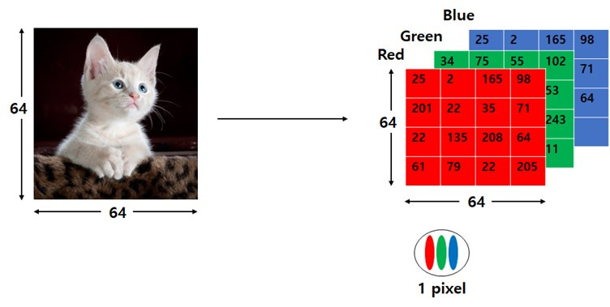
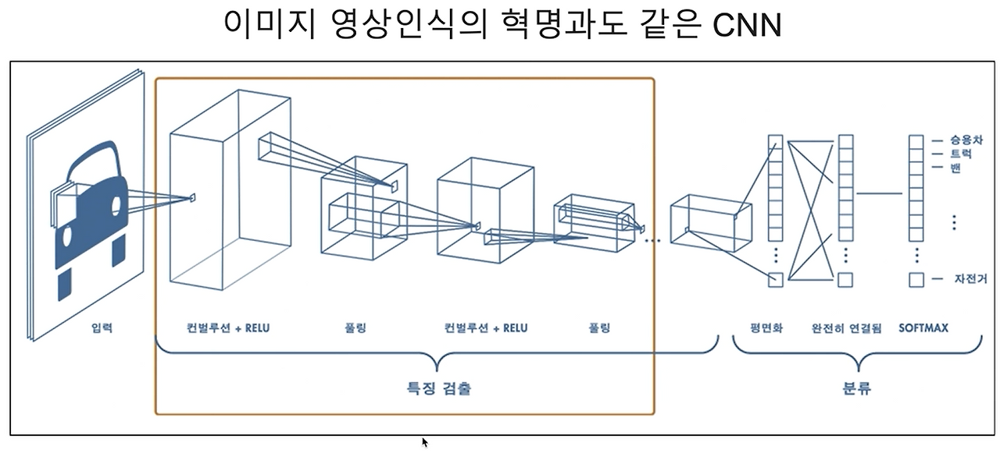
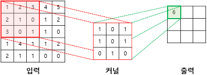
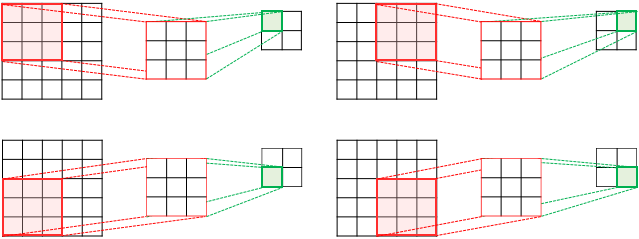
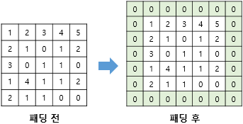
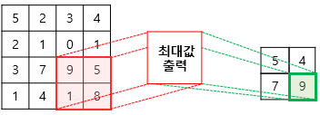
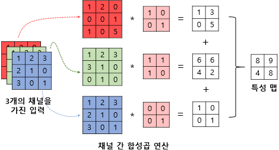
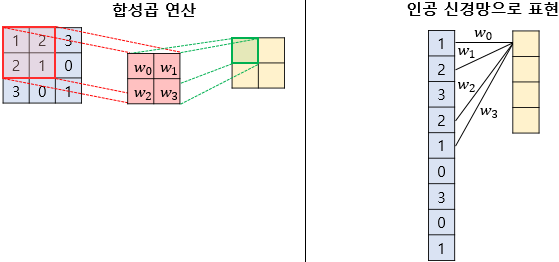

# [53일차] CNN의 구조와 합성곱, 풀링

CNN(Convolutional Neural Network, 합성곱 신경망)은 이미지처럼 가로·세로 위치 관계가 중요한 데이터를 처리하기 위한 신경망이다. 이전의 완전 연결 신경망(DNN)은 이미지를 한 줄로 펼쳐 모든 픽셀을 연결하지만, CNN은 작은 필터를 이미지 위로 움직이며 선, 모서리, 질감 같은 특징을 찾아낸다.

이번 내용은 CNN이 이미지에 적합한 이유와 합성곱, 스트라이드, 패딩, 풀링의 동작, 그리고 PyTorch의 `Conv2d`와 `MaxPool2d` 사용법을 정리한다.

---

## 1. 이미지 데이터의 형태

컴퓨터에게 이미지는 숫자로 이루어진 배열이다. 흑백 이미지는 픽셀 밝기 하나만 사용하므로 채널 수가 1이고, 컬러 이미지는 빨강(R)·초록(G)·파랑(B) 값이 있으므로 채널 수가 3이다.

```text
흑백 이미지: [높이, 너비]
컬러 이미지: [채널, 높이, 너비] = [3, H, W]
PyTorch 배치 입력: [배치 크기, 채널, 높이, 너비] = [N, C, H, W]
```

예를 들어 `28 x 28` 크기의 흑백 숫자 이미지 1장을 PyTorch CNN에 넣는 형태는 `[1, 1, 28, 28]`이다.

```python
import torch

# 배치 크기 1, 흑백 채널 1, 높이 28, 너비 28
inputs = torch.Tensor(1, 1, 28, 28)

print(inputs.shape)
# torch.Size([1, 1, 28, 28])
```

| 축 | 의미 | 예시 값 |
|---|---|---:|
| `N` | 한 번에 처리하는 이미지 수(배치 크기) | 1 |
| `C` | 채널 수 | 1: 흑백, 3: RGB |
| `H` | 이미지 높이 | 28 |
| `W` | 이미지 너비 | 28 |



---

## 2. CNN이 DNN보다 이미지에 적합한 이유

이미지를 DNN에 넣으려면 `28 x 28` 이미지를 784개 숫자로 펼친다. 이 방식은 모든 픽셀의 위치 관계를 직접 보존하지 못하고, 입력 노드와 다음 레이어의 모든 노드를 연결하므로 파라미터가 빠르게 늘어난다.

CNN은 작은 필터를 이미지 전체 위치에 반복 사용한다. 따라서 가까운 픽셀의 관계를 살리면서 파라미터 수를 줄일 수 있다.

| 구분 | DNN(완전 연결) | CNN(합성곱 신경망) |
|---|---|---|
| 입력 처리 | 이미지를 1차원으로 펼친다. | 2차원 공간 구조를 유지한다. |
| 연결 방식 | 모든 입력과 출력이 연결된다. | 작은 영역만 보고 필터를 이동한다. |
| 가중치 | 위치마다 별도의 가중치를 둔다. | 같은 필터를 모든 위치에서 공유한다. |
| 장점 | 구조가 단순하다. | 이미지 특징 추출에 효율적이다. |

### 파라미터 수 비교

`28 x 28` 흑백 이미지에서 32개 특징을 만들 때를 생각해 보자.

```text
DNN: Linear(784, 32)
가중치 784 x 32 + 편향 32 = 25,120개

CNN: Conv2d(1, 32, kernel_size=3)
가중치 3 x 3 x 1 x 32 + 편향 32 = 320개
```

CNN이 적은 수의 파라미터로 이미지를 처리하는 핵심 이유는 **지역 연결(local connectivity)** 과 **가중치 공유(weight sharing)** 다.



---

## 3. 합성곱(Convolution): 필터로 특징 찾기

합성곱은 작은 행렬인 필터 또는 커널(kernel)을 입력 이미지의 일부 영역에 겹친 뒤, 같은 위치끼리 곱해서 모두 더하는 연산이다. 이렇게 나온 값들이 모여 **특징 맵(feature map)** 을 만든다.

```text
입력 이미지의 작은 영역
    x
필터(커널)
    -> 원소별 곱
    -> 모두 더함
    -> 특징 맵의 한 칸
```

노트북의 예시는 다음과 같은 계산이다.

```text
(1 x 1) + (2 x 0) + (3 x 1)
+ (2 x 1) + (1 x 0) + (0 x 1)
+ (3 x 0) + (0 x 1) + (1 x 0)
= 6
```

필터는 처음부터 에지를 잘 찾는 값으로 고정하지 않는다. 학습 과정에서 손실을 줄이는 방향으로 필터의 가중치가 업데이트되며, 앞쪽 레이어는 단순한 선·모서리를, 뒤쪽 레이어는 더 복잡한 모양을 학습한다.



### `Conv2d`의 핵심 인자

```python
import torch.nn as nn

conv = nn.Conv2d(
    in_channels=1,
    out_channels=32,
    kernel_size=3,
    stride=1,
    padding="same",
)
```

| 인자 | 의미 |
|---|---|
| `in_channels=1` | 입력이 흑백 이미지이므로 채널 수는 1이다. RGB 이미지라면 3을 사용한다. |
| `out_channels=32` | 서로 다른 특징을 찾는 필터 32개를 사용한다. 출력 특징 맵도 32개가 된다. |
| `kernel_size=3` | `3 x 3` 크기의 필터를 사용한다. |
| `stride=1` | 필터를 한 칸씩 이동한다. |
| `padding="same"` | 출력의 높이와 너비가 입력과 같도록 패딩을 넣는다. |

---

## 4. 스트라이드(Stride): 필터의 이동 간격

스트라이드는 필터가 한 번 연산한 후 이동하는 칸 수다.

- `stride=1`: 한 칸씩 이동한다. 세부 정보를 많이 보존하지만 연산량이 많다.
- `stride=2`: 두 칸씩 이동한다. 출력 크기와 연산량이 줄어들지만 일부 정보가 사라질 수 있다.



출력 크기는 아래 식으로 계산한다. 나누어떨어지지 않는 경우 소수점 이하는 버린다.

```text
출력 크기 = floor((입력 크기 + 2 x 패딩 - 커널 크기) / 스트라이드) + 1
```

예를 들어 입력 크기 28, 커널 크기 3, 패딩 1일 때는 다음과 같다.

```text
stride=1: floor((28 + 2 - 3) / 1) + 1 = 28
stride=2: floor((28 + 2 - 3) / 2) + 1 = 14
```

---

## 5. 패딩(Padding): 가장자리 정보 보존하기

패딩은 합성곱 전에 이미지 가장자리에 값을 덧붙이는 작업이다. 보통 0을 추가하므로 **제로 패딩(zero padding)** 이라고 한다.

패딩이 없다면 `3 x 3` 필터로 `28 x 28` 이미지를 합성곱했을 때 출력 크기는 `26 x 26`이 된다. 합성곱 레이어를 여러 번 통과하면 이미지 크기가 너무 빠르게 작아지고 가장자리 정보도 덜 활용된다.

| 방식 | 설명 |
|---|---|
| `padding=0` | 패딩이 없다. `valid` 합성곱이라고도 부른다. |
| `padding=1` + `kernel_size=3` | 입력과 출력의 높이·너비를 같게 만들 수 있다. |
| `padding="same"` | stride 조건에 맞춰 입력과 비슷한 크기의 출력을 유지한다. |



---

## 6. 풀링(Pooling): 특징 맵을 압축하기

풀링은 특징 맵의 작은 영역을 하나의 값으로 요약해 공간 크기를 줄이는 연산이다. 풀링 레이어는 보통 학습할 가중치가 없으며, 계산량을 줄이고 작은 위치 변화에 덜 민감하도록 돕는다.

### 최대 풀링과 평균 풀링

| 방식 | 동작 | 특징 |
|---|---|---|
| Max Pooling | 영역 안에서 가장 큰 값을 선택한다. | 강하게 반응한 특징을 남긴다. |
| Average Pooling | 영역 안의 평균을 계산한다. | 영역 전체 정보를 부드럽게 요약한다. |

`2 x 2` 최대 풀링은 네 값 중 하나를 선택하므로, stride가 2라면 높이와 너비가 보통 절반으로 줄어든다.

```python
pool = nn.MaxPool2d(kernel_size=2)
```



---

## 7. 다중 채널 합성곱

컬러 이미지는 RGB 세 채널을 가진다. 이때 필터도 입력 채널 수에 맞춰 깊이를 가진다. 즉, RGB 입력에 `3 x 3` 커널을 사용하면 실제 필터 크기는 `3 x 3 x 3`이다.

```text
RGB 입력 [3, H, W]
  -> 각 채널(R/G/B)에서 합성곱 계산
  -> 세 결과를 더하고 편향을 더함
  -> 특징 맵 1개 생성
```

필터가 32개라면 서로 다른 특징 맵 32개가 만들어져 출력 형태는 `[배치 크기, 32, H, W]`가 된다.



---

## 8. CNN 레이어의 일반적인 흐름

CNN은 보통 합성곱과 활성화 함수, 풀링을 반복하면서 이미지에서 점점 추상적인 특징을 만들고, 마지막에는 분류 결과를 낸다.

```text
입력 이미지
  -> Conv2d: 선·모서리·질감 같은 특징 추출
  -> ReLU: 비선형성 추가
  -> MaxPool2d: 특징 맵 크기 축소
  -> Conv2d / ReLU / Pooling 반복
  -> Flatten: 2차원 특징 맵을 1차원 벡터로 변환
  -> Linear: 클래스별 점수(logit) 출력
```

| 레이어 | 역할 |
|---|---|
| `Conv2d` | 필터로 공간적 특징을 추출한다. |
| `ReLU` | 음수 값을 0으로 바꿔 비선형성을 추가한다. |
| `MaxPool2d` | 특징 맵을 줄이며 강한 특징을 남긴다. |
| `Flatten` | `[C, H, W]` 형태를 완전 연결 레이어가 받을 수 있는 1차원 벡터로 바꾼다. |
| `Linear` | 특징을 바탕으로 클래스별 logit을 계산한다. |

다중 분류에서 마지막 레이어는 클래스 수만큼의 logit을 출력한다. 학습 시 `CrossEntropyLoss`를 사용한다면 모델 안에 `Softmax`를 따로 넣지 않는다. `CrossEntropyLoss`가 내부적으로 필요한 계산을 처리하기 때문이다.

---

## 9. PyTorch로 첫 번째 CNN 블록 만들기

노트북의 코드는 `28 x 28` 흑백 이미지에 합성곱과 ReLU를 적용하고, 최대 풀링으로 크기를 절반으로 줄인다.

```python
import torch
import torch.nn as nn

inputs = torch.Tensor(1, 1, 28, 28)

# 1 x 28 x 28 -> 32 x 28 x 28
conv1 = nn.Sequential(
    nn.Conv2d(
        in_channels=1,
        out_channels=32,
        kernel_size=3,
        padding="same",
    ),
    nn.ReLU(),
)

out = conv1(inputs)
print(out.shape)
# torch.Size([1, 32, 28, 28])

# 32 x 28 x 28 -> 32 x 14 x 14
pool1 = nn.MaxPool2d(kernel_size=2)
out = pool1(out)
print(out.shape)
# torch.Size([1, 32, 14, 14])
```

### 형태가 바뀌는 이유

```text
[1, 1, 28, 28]
  -> Conv2d(1, 32, kernel_size=3, padding="same")
[1, 32, 28, 28]
  -> MaxPool2d(kernel_size=2)
[1, 32, 14, 14]
```

- 합성곱의 `out_channels=32`는 32개의 필터를 사용한다는 뜻이므로 채널 수가 1에서 32로 바뀐다.
- `padding="same"`과 기본 `stride=1` 덕분에 높이와 너비는 `28 x 28`로 유지된다.
- `MaxPool2d(kernel_size=2)`의 기본 stride는 2이므로 높이와 너비가 절반인 `14 x 14`가 된다.

---

## 10. 가중치 공유와 편향

CNN의 필터는 이미지 한 곳에서만 사용되는 가중치가 아니다. 같은 `3 x 3` 필터 하나가 이미지 전체 위치를 이동하며 반복 사용된다. 이를 가중치 공유라고 하며, 이미지의 어느 위치에 선이나 모서리가 나타나도 같은 특징으로 감지할 수 있게 한다.

또한 `Conv2d`의 필터마다 편향이 하나씩 있다. 예를 들어 `out_channels=32`이면 필터 32개와 편향 32개를 학습한다. 각 필터가 만든 특징 맵의 모든 위치에 해당 필터의 편향이 더해진다.



---

## 11. 핵심 정리

- CNN은 이미지의 가로·세로 공간 구조를 유지하며 특징을 추출하는 신경망이다.
- 입력 텐서의 기본 형태는 `[배치 크기, 채널, 높이, 너비]`다.
- 합성곱은 필터를 이미지 위로 이동하며 특징 맵을 만든다.
- 스트라이드는 필터의 이동 간격이며, 값이 커질수록 출력 크기와 연산량이 줄어든다.
- 패딩은 가장자리 정보를 보존하고 출력 크기를 조절한다.
- 풀링은 특징 맵을 요약해 크기를 줄이고 계산량을 낮춘다.
- CNN은 작은 필터를 전체 위치에서 공유하므로 DNN보다 적은 파라미터로 이미지 특징을 학습할 수 있다.
- `Conv2d → ReLU → MaxPool2d`는 CNN의 기본 블록이다.

