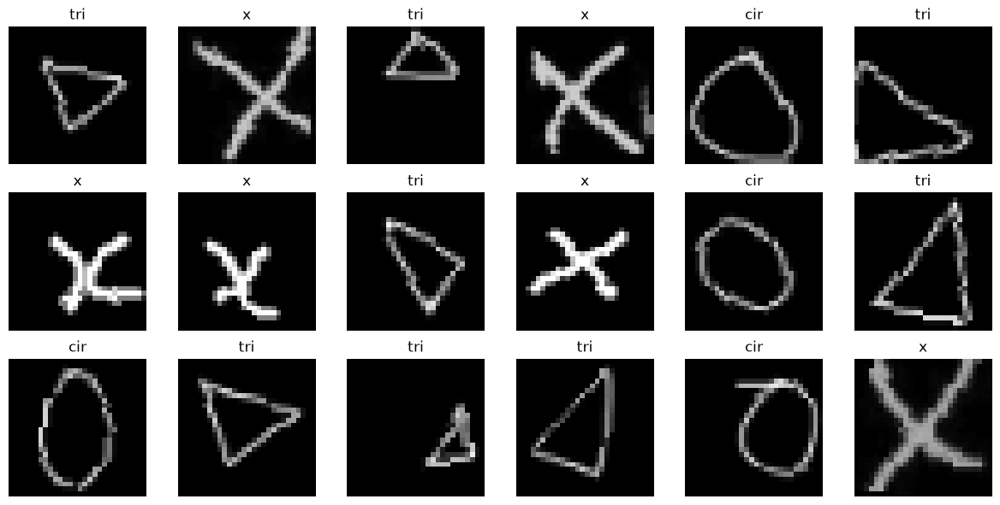

# [54일차] 손글씨 도형 분류와 CNN 학습 과정

이번 예제는 사람이 손으로 그린 **원(`cir`)**, **삼각형(`tri`)**, **X(`x`)** 이미지를 CNN으로 분류한다. 학습 데이터는 240장, 테스트 데이터는 60장이며 세 클래스가 같은 수만큼 포함되어 있다.

전체 흐름 : 

```text
이미지 폴더 읽기 -> 이미지 전처리·증강 -> 학습/검증/테스트 분리
-> DataLoader로 배치 구성 -> CNN 예측 -> 손실 계산 -> 가중치 업데이트 -> 최종 평가
```

---

## 1. 문제와 데이터 구성

이 문제는 세 가지 중 하나를 고르는 **다중 분류(multi-class classification)** 문제다.

| 폴더 이름 | 클래스 번호 | 의미 |
|---|---:|---|
| `cir` | 0 | 원 |
| `tri` | 1 | 삼각형 |
| `x` | 2 | X |

이미지 분류 모델은 그림을 눈으로 보지 못한다. 각 픽셀의 밝기를 숫자로 받아, 원·삼각형·X에서 반복되는 모양을 찾아 학습한다.

```text
손글씨 이미지
  -> 픽셀 숫자 배열
  -> CNN이 선과 모서리 같은 특징 추출
  -> 원 / 삼각형 / X 중 가장 가능성 높은 클래스 선택
```

---

## 2. 재현 가능한 실행 환경 만들기

난수 시드를 고정하면 데이터 섞기, 이미지 증강, 가중치 초기화처럼 무작위가 들어가는 작업의 결과를 가능한 한 다시 재현할 수 있다.

```python
import random
import numpy as np
import torch

SEED = 2026

random.seed(SEED)
np.random.seed(SEED)
torch.manual_seed(SEED)
```

완전히 같은 결과가 항상 보장되는 것은 아니다. GPU 연산이나 라이브러리 버전에 따라 결과가 조금 달라질 수 있지만, 시드 고정은 실험 결과를 비교하고 오류를 찾는 데 매우 중요하다.

---

## 3. `ImageFolder`로 이미지와 레이블 읽기

`torchvision.datasets.ImageFolder`는 폴더 구조를 이용해 이미지와 정답 레이블을 만드는 데이터셋 도구다. 하위 폴더 이름을 클래스 이름으로 사용하고, **알파벳순**으로 클래스 번호를 부여한다.

```text
data/
└── shape/
    ├── train/
    │   ├── cir/
    │   ├── tri/
    │   └── x/
    └── test/
        ├── cir/
        ├── tri/
        └── x/
```

```python
from pathlib import Path
from torchvision import datasets

shape_root = Path("./data/shape")
train_dir = shape_root / "train"
test_dir = shape_root / "test"

raw_train = datasets.ImageFolder(train_dir)
raw_test = datasets.ImageFolder(test_dir)

print("클래스:", raw_train.classes)
print("클래스 번호:", raw_train.class_to_idx)
print("학습 이미지 수:", len(raw_train))
print("테스트 이미지 수:", len(raw_test))
```

```text
클래스: ['cir', 'tri', 'x']
클래스 번호: {'cir': 0, 'tri': 1, 'x': 2}
학습 이미지 수: 240
테스트 이미지 수: 60
```

`ImageFolder`는 이미지 파일 하나와 해당 폴더의 클래스 번호를 쌍으로 제공한다. 예를 들어 `cir` 폴더의 그림은 `(이미지, 0)` 형태로, `x` 폴더의 그림은 `(이미지, 2)` 형태로 관리한다.

---

## 4. 전처리와 데이터 증강

이미지는 크기, 색상, 밝기가 제각각일 수 있다. CNN에 넣기 전에는 모든 입력을 같은 규칙으로 바꿔야 한다. 이 예제는 입력을 `28 x 28` 크기의 흑백 이미지로 통일한다.

### 학습 데이터용 변환

```python
from torchvision import transforms

train_transform = transforms.Compose([
    transforms.Resize((28, 28)),
    transforms.Grayscale(num_output_channels=1),
    transforms.RandomInvert(p=1.0),
    transforms.RandomAffine(
        degrees=12,
        translate=(0.08, 0.08),
        scale=(0.90, 1.10),
    ),
    transforms.ToTensor(),
    transforms.Normalize(mean=(0.5,), std=(0.5,)),
])
```

### 검증·테스트 데이터용 변환

```python
eval_transform = transforms.Compose([
    transforms.Resize((28, 28)),
    transforms.Grayscale(num_output_channels=1),
    transforms.RandomInvert(p=1.0),
    transforms.ToTensor(),
    transforms.Normalize(mean=(0.5,), std=(0.5,)),
])
```

| 변환 | 역할 | 학습/평가 |
|---|---|---|
| `Resize((28, 28))` | 모든 이미지의 높이와 너비를 28픽셀로 통일한다. | 모두 |
| `Grayscale(1)` | 흑백 채널 하나로 바꾼다. | 모두 |
| `RandomInvert(p=1.0)` | 흰 배경·검은 선을 반전해 선 부분이 큰 값이 되게 한다. `p=1.0`이므로 항상 적용한다. | 모두 |
| `RandomAffine(...)` | 회전, 이동, 확대·축소를 무작위로 적용한다. | 학습만 |
| `ToTensor()` | 일반적인 8비트 이미지의 픽셀값을 `float32` 텐서로 바꾸고 `0~255` 범위를 `0~1`로 스케일한다. | 모두 |
| `Normalize((0.5,), (0.5,))` | `(x - 0.5) / 0.5`를 적용한다. `0.5`는 `0`이 되고, 값은 대략 `-1~1` 범위가 된다. | 모두 |

### 왜 증강은 학습 데이터에만 적용할까?

`RandomAffine`은 그림을 조금 회전하거나 움직여 매번 다른 학습 입력을 만든다. 모델이 특정 위치나 모양을 외우지 않고, 도형의 공통적인 특징을 학습하도록 돕는다.

검증·테스트 데이터까지 무작위로 바꾸면 매 평가마다 입력이 달라진다. 그러면 모델의 실제 성능을 공정하게 비교하기 어렵다. 그래서 평가용 변환에는 무작위 증강을 넣지 않는다.

---

## 5. 학습·검증·테스트 데이터의 역할

모델이 잘 작동하는지 확인하려면 데이터를 세 역할로 나눠야 한다.

| 데이터 | 사용 시점 | 목적 |
|---|---|---|
| 학습 데이터(train) | 매 epoch | 손실을 계산하고 가중치를 업데이트한다. |
| 검증 데이터(validation) | 매 epoch 뒤 | 과적합을 확인하고 모델·학습률 등을 선택한다. |
| 테스트 데이터(test) | 모든 결정이 끝난 뒤 | 최종 성능을 한 번 확인한다. |

원본 학습 데이터 240장은 각 클래스별로 섞은 뒤 80%와 20%로 나눈다. 클래스별로 따로 나누므로 원·삼각형·X의 비율이 학습과 검증 데이터에 비슷하게 유지된다.

```python
import numpy as np
from torch.utils.data import Subset
from torchvision import datasets

base_dataset = datasets.ImageFolder(train_dir)
class_names = base_dataset.classes
num_classes = len(class_names)

train_indices = []
val_indices = []
rng = np.random.default_rng(SEED)

for class_idx in range(num_classes):
    # 현재 클래스에 해당하는 원본 인덱스만 찾는다.
    indices = np.where(
        np.array(base_dataset.targets) == class_idx
    )[0]

    rng.shuffle(indices)
    split = int(len(indices) * 0.8)

    train_indices.extend(indices[:split].tolist())
    val_indices.extend(indices[split:].tolist())

train_full = datasets.ImageFolder(
    train_dir,
    transform=train_transform,
)
val_full = datasets.ImageFolder(
    train_dir,
    transform=eval_transform,
)
test_dataset = datasets.ImageFolder(
    test_dir,
    transform=eval_transform,
)

train_dataset = Subset(train_full, train_indices)
val_dataset = Subset(val_full, val_indices)

print("학습:", len(train_dataset))
print("검증:", len(val_dataset))
print("테스트:", len(test_dataset))
```

```text
학습: 192
검증: 48
테스트: 60
```

여기서 `Subset`은 원본 데이터셋 전체를 복사하지 않는다. 선택한 인덱스 목록을 기준으로 필요한 데이터만 가져오는 가벼운 뷰다.

---

## 6. DataLoader와 배치

`DataLoader`는 데이터셋에서 이미지를 일정한 묶음인 **배치(batch)** 로 꺼내 준다. 모델은 이미지 한 장씩이 아니라 보통 여러 장을 한 번에 처리한다.

```python
from torch.utils.data import DataLoader

BATCH_SIZE = 32

train_loader = DataLoader(
    train_dataset,
    batch_size=BATCH_SIZE,
    shuffle=True,
    num_workers=0,
    pin_memory=True,
)

val_loader = DataLoader(
    val_dataset,
    batch_size=BATCH_SIZE,
    shuffle=False,
    num_workers=0,
    pin_memory=True,
)

test_loader = DataLoader(
    test_dataset,
    batch_size=BATCH_SIZE,
    shuffle=False,
    num_workers=0,
    pin_memory=True,
)
```

```python
images, labels = next(iter(train_loader))

print("이미지 배치:", images.shape)
print("레이블 배치:", labels.shape)
```

```text
이미지 배치: torch.Size([32, 1, 28, 28])
레이블 배치: torch.Size([32])
```

`[32, 1, 28, 28]`은 이미지 32장, 흑백 채널 1개, 높이 28, 너비 28을 뜻한다. `shuffle=True`는 학습할 때만 사용한다. 데이터 순서에 모델이 치우치는 일을 줄이기 위해서다.

> `pin_memory=True`는 CUDA GPU로 텐서를 옮길 때 전송에 도움이 될 수 있다. 현재 코드처럼 모든 환경에서 `True`로 설정해도 모델의 예측 결과는 바뀌지 않는다. 다만 CPU나 MPS 환경에서는 성능 이점이 크지 않을 수 있다.

### 정규화된 이미지를 다시 보여주기

정규화한 이미지는 `-1~1` 범위를 가진다. 화면에 원래 밝기로 출력하려면 정규화의 반대 연산을 적용한다.

```python
import matplotlib.pyplot as plt


def denormalize(image):
    # Normalize(mean=0.5, std=0.5)의 역연산이다.
    return image * 0.5 + 0.5


fig, axes = plt.subplots(3, 6, figsize=(12, 6))

for ax, image, label in zip(axes.flat, images[:18], labels[:18]):
    ax.imshow(
        denormalize(image).squeeze(0),
        cmap="gray",
        vmin=0,
        vmax=1,
    )
    ax.set_title(class_names[label.item()])
    ax.axis("off")

plt.tight_layout()
plt.show()
```



---

## 7. CNN 모델 구조 한눈에 보기

이 모델은 합성곱 블록 두 개로 특징을 추출하고, 마지막 분류기가 세 클래스의 점수(logit)를 출력한다.

```text
[N, 1, 28, 28]
  -> Conv(1 -> 32) + BatchNorm + ReLU
  -> Conv(32 -> 32) + BatchNorm + ReLU
  -> MaxPool
  -> Conv(32 -> 64) + BatchNorm + ReLU
  -> Conv(64 -> 64) + BatchNorm + ReLU
  -> MaxPool
  -> AdaptiveAvgPool(1, 1)
  -> Flatten + Dropout
  -> Linear(64 -> 3)
  -> 원, 삼각형, X의 logit
```

```python
import torch.nn as nn


class ShapeCNN(nn.Module):
    def __init__(self, num_classes=3):
        super().__init__()

        self.features = nn.Sequential(
            nn.Conv2d(1, 32, kernel_size=3, padding=1, bias=False),
            nn.BatchNorm2d(32),
            nn.ReLU(inplace=True),
            nn.Conv2d(32, 32, kernel_size=3, padding=1, bias=False),
            nn.BatchNorm2d(32),
            nn.ReLU(inplace=True),
            nn.MaxPool2d(kernel_size=2),

            nn.Conv2d(32, 64, kernel_size=3, padding=1, bias=False),
            nn.BatchNorm2d(64),
            nn.ReLU(inplace=True),
            nn.Conv2d(64, 64, kernel_size=3, padding=1, bias=False),
            nn.BatchNorm2d(64),
            nn.ReLU(inplace=True),
            nn.MaxPool2d(kernel_size=2),
        )

        self.classifier = nn.Sequential(
            nn.AdaptiveAvgPool2d((1, 1)),
            nn.Flatten(),
            nn.Dropout(p=0.25),
            nn.Linear(64, num_classes),
        )

    def forward(self, x):
        x = self.features(x)
        return self.classifier(x)
```

### 레이어마다 텐서 형태가 어떻게 바뀔까?

`padding=1`인 `3 x 3` 합성곱은 이미지의 높이와 너비를 유지한다. `MaxPool2d(2)`는 높이와 너비를 절반으로 줄인다.

| 단계 | 텐서 형태 | 의미 |
|---|---|---|
| 입력 | `[N, 1, 28, 28]` | 흑백 이미지 N장 |
| 첫 합성곱 블록 | `[N, 32, 28, 28]` | 특징 맵 32개 |
| 첫 최대 풀링 | `[N, 32, 14, 14]` | 가로·세로 절반 |
| 두 번째 합성곱 블록 | `[N, 64, 14, 14]` | 특징 맵 64개 |
| 두 번째 최대 풀링 | `[N, 64, 7, 7]` | 가로·세로 다시 절반 |
| 적응형 평균 풀링 | `[N, 64, 1, 1]` | 채널마다 대표값 하나 |
| `Flatten` | `[N, 64]` | 완전 연결 레이어 입력 |
| `Linear(64, 3)` | `[N, 3]` | 세 클래스의 logit |

---

## 8. 모델을 안정적으로 학습시키는 레이어

### `BatchNorm2d`: 채널별 값 정돈하기

합성곱을 통과한 특징 맵은 레이어·채널마다 값의 분포가 크게 달라질 수 있다. `BatchNorm2d(32)`는 32개 채널 각각의 값을 정규화해 다음 레이어가 더 안정적으로 학습하도록 돕는다.

```python
nn.Conv2d(1, 32, kernel_size=3, padding=1, bias=False),
nn.BatchNorm2d(32),
nn.ReLU(),
```

`BatchNorm2d`가 있는 합성곱 레이어에서는 편향이 중복되는 경우가 많으므로, 이 예제처럼 `bias=False`로 두는 방식을 자주 사용한다.

### `ReLU(inplace=True)`: 메모리를 재사용하는 ReLU

`inplace=True`는 ReLU 결과를 별도의 텐서에 복사하지 않고, 입력 활성화 텐서에 바로 기록하도록 요청하는 옵션이다. 이 예제처럼 단순히 앞에서 뒤로 이어지는 구조에서는 메모리를 조금 줄이는 데 도움을 줄 수 있다.

다만 잔차 연결처럼 같은 텐서를 다른 경로에서도 사용해야 하는 복잡한 모델에서는 원본 값이 필요할 수 있다. 그런 경우에는 기본값인 `inplace=False`가 더 안전하다.

### `AdaptiveAvgPool2d((1, 1))`: 크기와 무관하게 대표값 만들기

일반 평균 풀링은 커널 크기를 직접 정해야 한다. 반면 `AdaptiveAvgPool2d((1, 1))`는 입력 특징 맵의 크기가 달라도 각 채널을 항상 `1 x 1`로 줄인다.

```text
[N, 64, 7, 7]
  -> AdaptiveAvgPool2d((1, 1))
[N, 64, 1, 1]
```

채널 수 64개를 1개로 합치는 것이 아니다. **64개 채널은 유지한 채**, 각 채널의 공간 정보(`7 x 7`)를 평균 하나로 요약한다.

### `Dropout`: 과적합 줄이기

`Dropout(p=0.25)`는 학습 중 일부 뉴런의 출력을 무작위로 0으로 만든다. 특정 뉴런에만 지나치게 의존하는 것을 줄여 일반화에 도움을 준다.

- `model.train()` 상태에서는 Dropout이 작동한다.
- `model.eval()` 상태에서는 Dropout이 꺼진다.
- 뉴런을 영구 삭제하는 것이 아니라 학습 단계에서만 일시적으로 끈다.

---

## 9. 장치(Device), 손실 함수, 옵티마이저

### 가능한 가속 장치 선택하기

학습은 CPU에서도 가능하지만, CUDA GPU 또는 Apple Silicon의 MPS를 사용할 수 있으면 더 빠를 수 있다.

```python
import torch

if torch.cuda.is_available():
    DEVICE = torch.device("cuda")
elif torch.backends.mps.is_available():
    DEVICE = torch.device("mps")
elif hasattr(torch, "xpu") and torch.xpu.is_available():
    DEVICE = torch.device("xpu")
else:
    DEVICE = torch.device("cpu")

model = ShapeCNN(num_classes=num_classes).to(DEVICE)
print(DEVICE)
```

### 손실 함수: `CrossEntropyLoss`

세 클래스 중 하나를 고르는 문제이므로 `CrossEntropyLoss`를 사용한다. 모델이 출력한 `[N, 3]` 형태의 logit과 정답 번호 `[N]`을 전달한다.

```python
criterion = nn.CrossEntropyLoss()
```

`CrossEntropyLoss`에는 `Softmax`를 적용하기 전의 logit을 전달한다. 이 손실 함수가 내부적으로 필요한 softmax 계산을 처리한다.

### 옵티마이저: `AdamW`

`AdamW`는 Adam의 적응형 학습률 방식에 가중치 감쇠(weight decay)를 더한 옵티마이저다. 가중치가 지나치게 커지는 것을 억제해 과적합을 줄이는 데 도움을 준다.

```python
import torch.optim as optim

optimizer = optim.AdamW(
    model.parameters(),
    lr=1e-3,
    weight_decay=1e-4,
)
```

### Scheduler: 성능이 정체되면 학습률 낮추기

`ReduceLROnPlateau`는 검증 손실이 더 이상 좋아지지 않으면 학습률을 줄인다. 학습 초반에는 비교적 크게 이동하고, 성능이 정체된 뒤에는 더 작은 보폭으로 세밀하게 학습하도록 돕는다.

```python
scheduler = optim.lr_scheduler.ReduceLROnPlateau(
    optimizer,
    mode="min",
    factor=0.5,
    patience=3,
)
```

- `mode="min"`: 검증 손실은 작을수록 좋다고 판단한다.
- `factor=0.5`: 학습률을 절반으로 줄인다.
- `patience=3`: 3회 동안 개선이 없으면 학습률을 조정한다.

---

## 10. 학습과 평가를 하나의 함수로 만들기

학습과 검증은 거의 같은 과정을 거친다. 차이는 학습에서는 역전파와 가중치 업데이트를 하고, 검증에서는 하지 않는다는 점이다.

아래 함수는 옵티마이저가 전달되면 학습 모드, 전달되지 않으면 평가 모드로 동작한다.

```python
def run_epoch(model, loader, criterion, device, optimizer=None):
    is_training = optimizer is not None

    if is_training:
        model.train()
        context = torch.enable_grad()
    else:
        model.eval()
        context = torch.inference_mode()

    total_loss = 0.0
    total_correct = 0
    total_samples = 0

    with context:
        for images, labels in loader:
            images = images.to(device, non_blocking=True)
            labels = labels.to(device, non_blocking=True)

            if is_training:
                optimizer.zero_grad(set_to_none=True)

            logits = model(images)
            loss = criterion(logits, labels)

            if is_training:
                loss.backward()
                optimizer.step()

            batch_size = labels.size(0)
            total_loss += loss.item() * batch_size
            total_correct += (
                logits.argmax(dim=1) == labels
            ).sum().item()
            total_samples += batch_size

    average_loss = total_loss / total_samples
    accuracy = total_correct / total_samples
    return average_loss, accuracy
```

> 노트북 코드도 `for images, labels in loader:`로 수정되어 있다. 모델은 생성 직후 `model.to(DEVICE)`로 한 번만 장치에 옮기며, 배치 반복문 안에서 같은 작업을 반복하지 않는다.

| 코드 | 의미 |
|---|---|
| `model.train()` | BatchNorm과 Dropout을 학습 방식으로 설정한다. |
| `model.eval()` | BatchNorm과 Dropout을 평가 방식으로 설정한다. |
| `torch.inference_mode()` | 평가 시 기울기 추적을 끄고 메모리 사용과 연산을 줄인다. |
| `images.to(device, non_blocking=True)` | 가능하면 CPU에서 가속 장치로 데이터를 비동기 전송한다. CUDA와 pinned memory 조합에서 주로 의미가 있다. |
| `optimizer.zero_grad(set_to_none=True)` | 이전 기울기를 `None`으로 초기화해 불필요한 0 텐서 생성을 줄일 수 있다. |
| `logits.argmax(dim=1)` | 세 클래스 점수 중 가장 큰 값의 인덱스를 예측 클래스로 선택한다. |
| `loss.item() * batch_size` | 배치 크기가 달라도 전체 평균 손실을 올바르게 계산한다. |

---

## 11. 모델 학습, Scheduler, Early Stopping

**Early Stopping(조기 종료)** 은 검증 손실이 더 이상 좋아지지 않으면 학습을 멈추는 방법이다. 불필요한 학습 시간과 과적합을 줄이고, 가장 성능이 좋았던 시점의 가중치를 남길 수 있다.

```python
EPOCHS = 50
EARLY_STOPPING_PATIENCE = 8

best_val_loss = float("inf")
wait = 0
best_model_path = "best_shape_cnn.pth"

history = {
    "train_loss": [],
    "val_loss": [],
    "train_acc": [],
    "val_acc": [],
}

for epoch in range(1, EPOCHS + 1):
    train_loss, train_acc = run_epoch(
        model,
        train_loader,
        criterion,
        DEVICE,
        optimizer,
    )
    val_loss, val_acc = run_epoch(
        model,
        val_loader,
        criterion,
        DEVICE,
    )

    scheduler.step(val_loss)

    history["train_loss"].append(train_loss)
    history["val_loss"].append(val_loss)
    history["train_acc"].append(train_acc)
    history["val_acc"].append(val_acc)

    print(
        f"Epoch {epoch:02d}/{EPOCHS} | "
        f"Train Loss: {train_loss:.4f}, Acc: {train_acc:.2%} | "
        f"Val Loss: {val_loss:.4f}, Acc: {val_acc:.2%}"
    )

    if val_loss < best_val_loss:
        best_val_loss = val_loss
        wait = 0
        torch.save(model.state_dict(), best_model_path)
    else:
        wait += 1

        if wait >= EARLY_STOPPING_PATIENCE:
            print("검증 손실이 개선되지 않아 학습을 종료한다.")
            break

# 가장 검증 손실이 낮았던 가중치로 되돌린다.
model.load_state_dict(torch.load(best_model_path, map_location=DEVICE))
```

검증 정확도가 높아져도 검증 손실이 나빠질 수 있다. 예측이 맞았는지뿐 아니라 모델이 얼마나 확신하는지도 손실에 반영되므로, 이 예제는 `val_loss`를 기준으로 최적 모델을 저장한다.

---

## 12. 테스트 데이터로 최종 평가하기

테스트 데이터는 학습률, epoch 수, 모델 구조처럼 여러 선택이 끝난 다음 마지막에 사용한다.

```python
test_loss, test_acc = run_epoch(
    model,
    test_loader,
    criterion,
    DEVICE,
)

print(f"Test Loss: {test_loss:.4f}")
print(f"Test Accuracy: {test_acc:.2%}")
```

개별 이미지의 예측을 확인할 때는 logit에서 가장 큰 인덱스를 찾고, 그 번호를 `class_names`로 바꾼다.

```python
images, labels = next(iter(test_loader))
images = images.to(DEVICE)

model.eval()
with torch.inference_mode():
    logits = model(images)
    predictions = logits.argmax(dim=1).cpu()

for prediction, label in zip(predictions[:5], labels[:5]):
    print(
        f"예측: {class_names[prediction.item()]} | "
        f"정답: {class_names[label.item()]}"
    )
```

---

## 13. 핵심 정리

- `ImageFolder`는 하위 폴더 이름을 이용해 이미지 분류 레이블을 자동으로 만든다.
- 학습 이미지는 `28 x 28` 흑백 텐서로 통일하고, 회전·이동·확대 같은 증강을 적용할 수 있다.
- 증강은 학습 데이터에만 적용하고, 검증·테스트 데이터는 고정된 변환만 사용한다.
- 학습 데이터는 가중치를 업데이트하고, 검증 데이터는 모델 선택과 과적합 확인에, 테스트 데이터는 최종 평가에 사용한다.
- CNN 입력 텐서 형태는 `[배치, 채널, 높이, 너비]`다.
- `BatchNorm2d`는 채널별 특징 맵의 분포를 정돈해 학습을 안정적으로 돕는다.
- `AdaptiveAvgPool2d((1, 1))`는 채널 수는 유지하면서 각 특징 맵을 대표값 하나로 압축한다.
- `Dropout`은 학습 중 일부 뉴런을 일시적으로 끄고, 평가 모드에서는 작동하지 않는다.
- `CrossEntropyLoss`에는 softmax 전의 logit을 전달한다.
- Early Stopping은 검증 성능이 개선되지 않을 때 학습을 멈추고, 가장 좋았던 모델 가중치를 남긴다.
